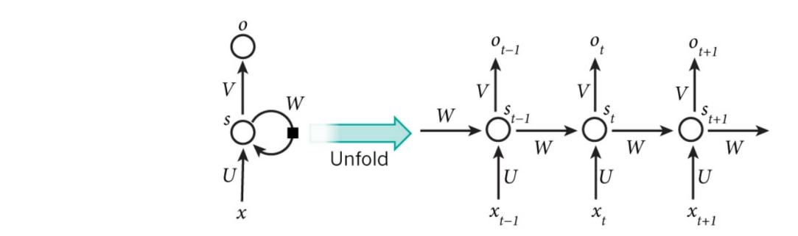
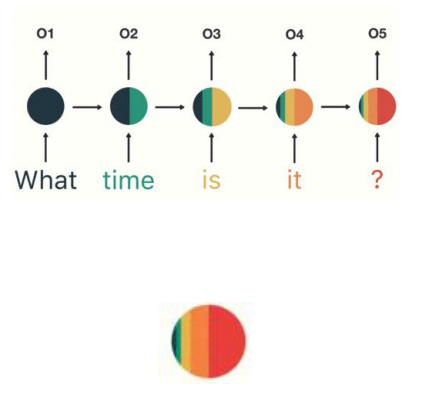
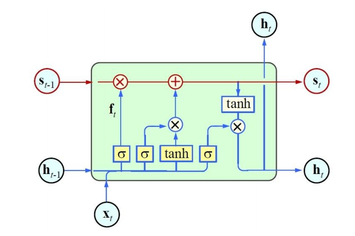
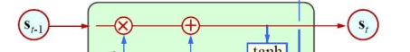
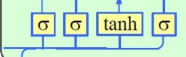
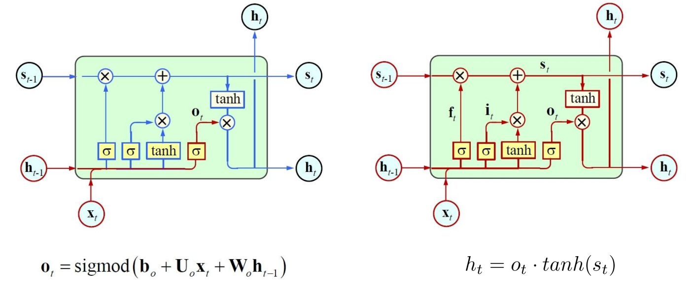
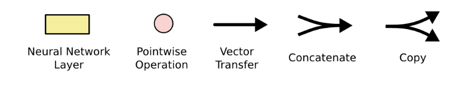

# Deep Learning Classic Model

## RNN - Recurrent Neural Network

>  中文名：循环神经网络 
>
>  PPT - page 78

RNN时间线展开图：

$$
t+1或t-1代表的就是时间步，中间（圆园）层信息S？， x_{t-1},x_t,t_{t+1}为输入层，O_{t-1},x_t,t_{t+1}为输出层。
$$

> 时序模型：参考人类思考的方式，按时序步（时间序）将文本（一个字或词）输入至模型里处理，比如”我想吃汉堡“
>
> 前一时间输入的中间层信息，会传递给下一时刻，参与下一时间输出的计算。公式如下

$$
O_t = g(V*S_t)
$$

$$
S_t = f(U * V_t + W * S_{t-1})
$$

具象化的中间信息层的传递图示：

RNN 跟传统神经网络最大的区别在于**每次都会将前一次的输出结果，带到下一次的隐藏层中，一起训练**。也就是说，RNN 前面所有的输入都会对未来的输出产生影响。如下图所示，RNN 中短期的记忆影响较大（如橙色区域），但是长期的记忆影响就很小（如黑色和绿色区域），这就是 RNN 存在的**短期记忆问题**。

> 当处理长文本时，RNN无法处理。

RNN**无法并行训练**，导致训练成本较高。

> RNN变体：将之前所有信息的整合在一块，再做融合和处理，用于解决RNN **短期记忆问题** 问题，来解决RNN的“长文本”问题。

## LSTM - Long Short-Term Memory - 接替RNN

> 长短期记忆网络    
>
> 在Bert出来之前，LP领域的任务都 不管是文本分类或NER(实体提取) 等都是用LSTM来完成。

### 什么是LSTM

由于RNN也有梯度消失的问题，因此很难处理长序列的数据。LSTM是对RNN的改进的特例（Long Short-Term Memory），它可以避免常规RNN的梯度消失，因此在工业界得到了广泛的应用。

Long Short Term Memory networks（以下简称LSTMs），一种特殊的RNN网络，该网络设计出来是为了解决长依赖问题。该网络由 Hochreiter & Schmidhuber (1997)引入，并有许多人对其进行了改进和普及。他们的工作被用来解决了各种各样的问题，直到目前还被广泛应用。

整体表征图（结构图） 

> 所有循环神经网络都具有神经网络的重复模块链的形式。在标准的RNN中，该重复模块将具有非常简单的结构，例如单个tanh层。LSTMs也具有这种链式结构，但它的重复单元不同于标准RNN网络里的单元只有一个网络层，它的内部有四个网络层。

上图：左侧为t-1的时间步，中间为t时刻的时间步，中侧为t+1时刻的时间步。

α (sigmoid，西格魔伊得）x不论取何况，所有的值都会被压缩0~1之间，当x1取值越大，α越接近于1，反之接近于0。

一般会把α做成一个门控机制 (见LSTM核心思想) 

### LSTM核心思路

#### 单元状态

LSTMs的核心是单元状态（Cell State），用贯穿单元的水平线表示。

单元状态有点像传送带。它沿着整个链一直走，只有一些微小的线性相互作用。信息很容易在不改变的情况下流动。单元状态如下图所示。

LSTM确实有能力将信息移除或添加到单元状态，并由称为gates的结构小心地进行调节。

#### 门控机制

门是一种选择性地让信息通过的方式。它们由一个Sigmod网络层和一个点乘运算组成。

因为sigmoid层的输出是0-1的值，这代表有多少信息能够流过sigmoid层。0表示都不能通过，1表示都能通过。

>  一个LSTM里面包含**三个门**来控制单元状态。

三个α (sigmoid），从左到右分别是： 遗忘门，输入门，输出门

> tanh：是对输同值的激活

三门公式如下图：

##### 输入门

$$
s_{t-1}：上一时刻的 s 和 遗忘门(α)的输出结果。
$$
遗忘门： 是上一个隐层信息 h(t-1) t  这一刻的

# 附录

##  神经网络中常见的符号含义

- 黄色的盒子是神经网络层 (Neural Network Layer)
- 粉红色的圆圈表示点操作 (Pointwise Operation)，如向量加法乘法，
- 单箭头表示数据流向 (Vector Transfer)
- 箭头合并表示向量的合并（concatenate）操作
- 箭头分叉表示向量的拷贝(Copy) 操作。

[参考]

[LSTM（长短期记忆网络](https://mp.weixin.qq.com/s?__biz=MzUyODk0Njc1NQ==&mid=2247483926&idx=1&sn=8cb4861ad6f4a56f8f233c322ebcc5b3&chksm=fa69c13acd1e482ca143d21d476c4f7242a1e438c3a9103fe0931ee18b528176e5c765fa8678&scene=27)