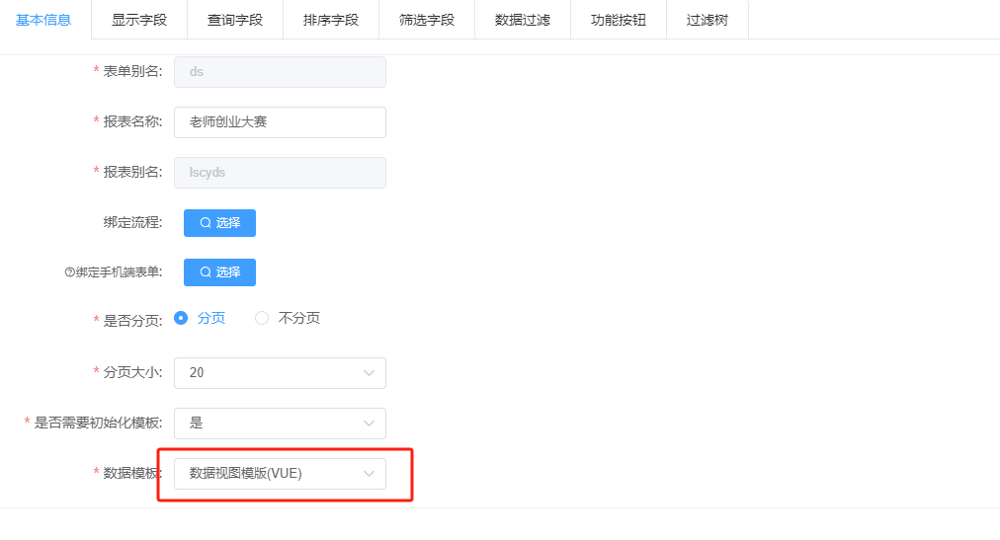
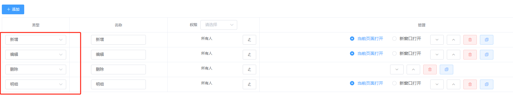
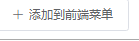
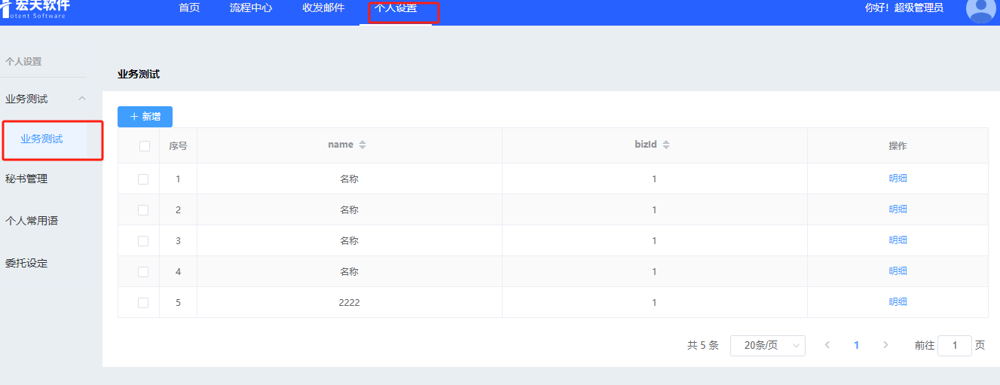

#  第一步：表单

1. 数据建模 
2. 创建表单

> 先别预览，现在demo环境的配置相对简单，需要调整
>
> 表单里的添加菜单是没有用的

# 第二步 ：创建报表 

> 数据报表即功能模块集合

1. 进入报表管理

2. 点“添加” -> 选择表单

   进入编辑详情况

   - 基本信息

- 操作按钮

将功能添加到指定的前端菜单中

# 第三步：进入前端页面

这是我当时挂在个人设置->业务测试下的功能模块 

