# 初识机器学习

## 机器学习所属领域

从外到内，从大到小的排列方式: 

**人工智能  —》 机器学习 —》深度学习 —》LM(Large Model)**

1. 机器学习与深度学习最大的区别在于后者引入的神经网络

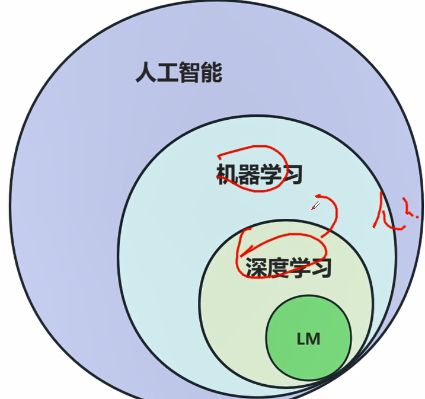

2. LM(Large Model) 

   是目前机器学习最重要和最关注的一个分支，又分为

   - LLM: Large  Language Model

   - LMM（Large Multi Model）或 称为 MLLM(Multi Large Language Model)  

     目前主流的大企业正在研究的多模型态，图片与视频等网站单纯文本已无法满足模型的需求，就需要通过多模态的方式支学习，即：即要理解文本，还有理解图片，甚至理解视频。—— 小红书、短视频、抖音等 （视频的几帧画面...）

##  机器学习的理解

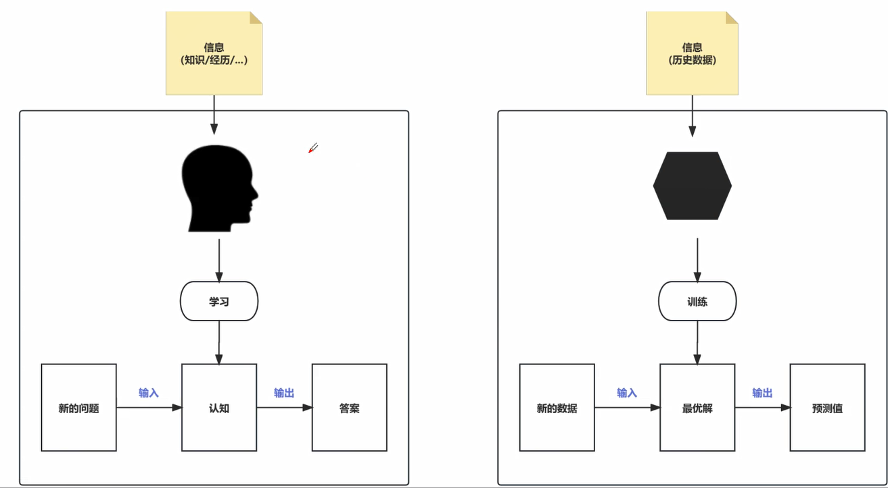

左侧是人类的认知过程，右侧为机器学习的过程

> 信息（知识/经历/...）: 短视频、信息、经历等

### 模型和训练的数学理解

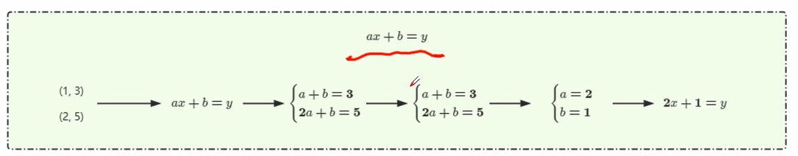

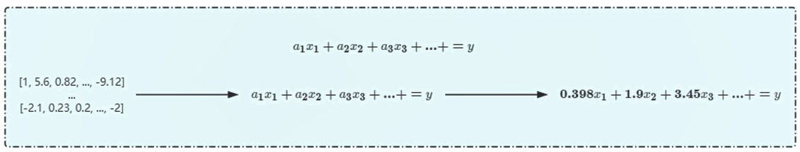

所谓的模型**就是一个包含了大量的未知参数的函数**; 所谓的训练，就是通过**大量的数据去迭代逼近这些未知参数的最优解**。

> 业务大部分情况下，解决问题的模型或方案都较成熟，难点或大量工作于数据组织

### 机器学习的定义

 是一个门专门研究**计算机怎么样模拟或实现人类的学习行为，以获取新的知识或技能，重新组织已有的知识结构使之不断改善自身的性能的学科**。简单的说，就是“从样本中学习的智能程序。

>  从数据中，学习数据背后的分布规律s

### 深度学习的定义

深度这习的要念**源于人工神经网络的研究**，是机器学习研究中的一个新的领域，其动机在于**建立、模拟人脑进行分析学习的神经网络，它模仿人脑的机制来解释数据，例如图像、声音和文本**。

> 机器学习一样，通过数据完成训练。之机器不同之处在于其应用了**神经网络**

### 机器学习的总结

不论是机器学习还是深度学习，都是通过**大量的数据学习**，掌握数据背后的分布规律，进而对符合该分布的其他数据进行准确预测。

## 深度学习的网络

| 人类神经元                                                   | 深度学习-神经网络                                            |
| ------------------------------------------------------------ | ------------------------------------------------------------ |
| 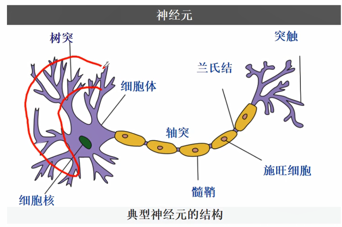 | 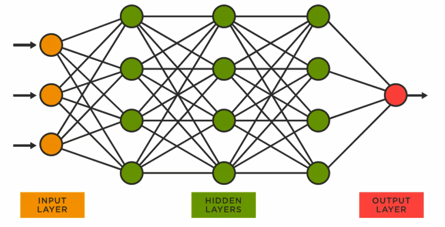 |
|                                                              |                                                              |

## 机器学习的两种典型任务

### 两种典型任务的理解

| 分类任务(Classification)                                     | 回归任务(Regression)                                         |
| ------------------------------------------------------------ | ------------------------------------------------------------ |
| 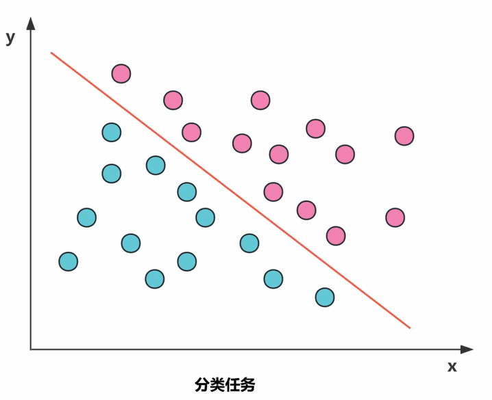 | 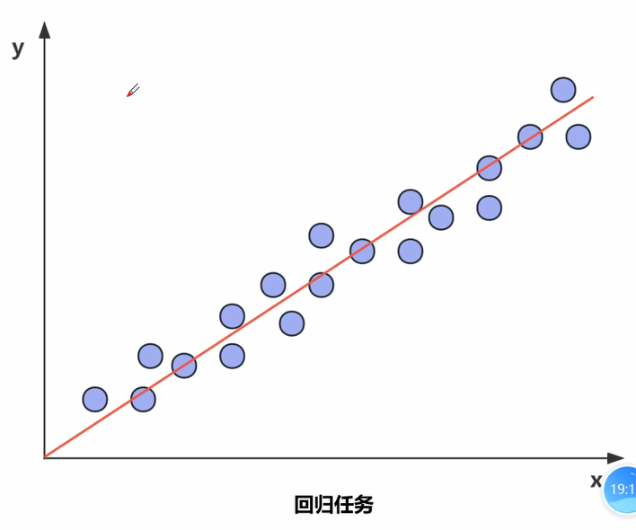 |
| 机器学习的本质是找到分类边界，把数据按类别划分开。 通俗理解是对输入的数据做类别的划分 - 比如垃圾邮件分类（二分类问题） - 意图理解：用户输入一句话，机器可以理解出意思  分类可以很复杂: 正负向、好坏等 分类任务输出是离散的， | 机器学习的本质是通过模型去拟合现有数据点的分布。 当来了一个新数据，把新数据带入拟合好的直线或典线内，机器会输出一个预测值。    输出的数据是连续的。 |
| 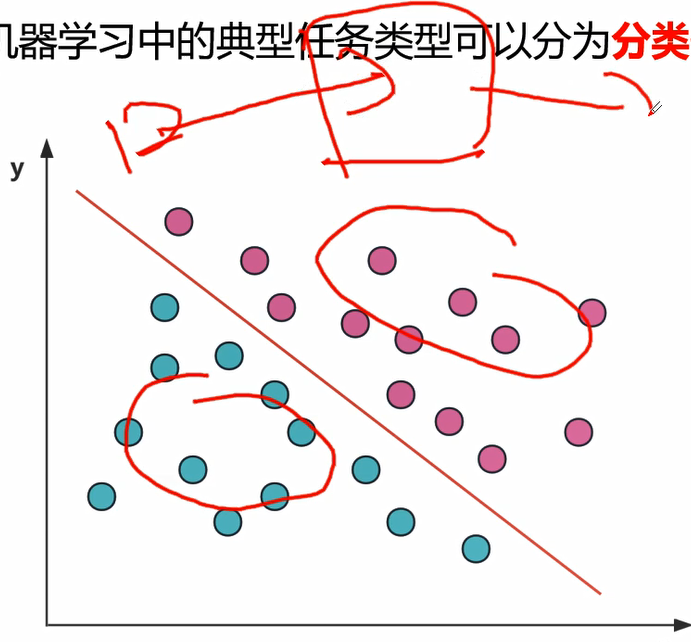 | 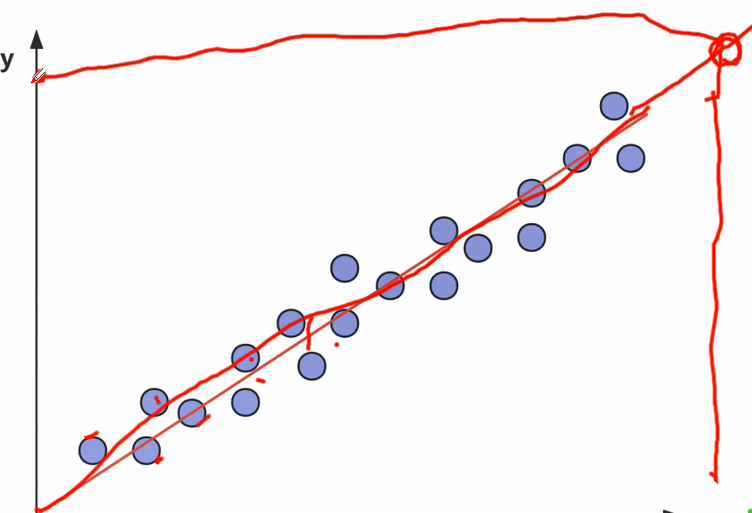 |

### 两种典型任务的定义

**分类任务定义** 

简单理解就是，分类任务是对”**离散值**"进行预测，根据每个样本的值/特征预测该样本属于类型A、类型B还是类型C，例如**情感分类**，**内容审核**，相当于学习了一个分类边界（决策边界），用分类边界把不同类别的数据区分开来。

**回归任务定义**

回归任务是对“**连续值**”进行预测，根据每个样本的值/特征预测该样本的具体数值，例如**房价预测，股票预测**等，相当于学习到了这一组数据背后的分布，能够根据数据的输入预测该数据的取值。

### 两种典型任务根本区别

  实际上，分类与回归的极据区别在于输出空间为一个**度量空间**：
$$
f(x) → Y，x  ε  A , y  ε  B
$$

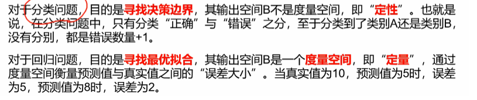

> 分类：定性
>
> 回归：定量

下图为预测值与实际值之间准确率的分析

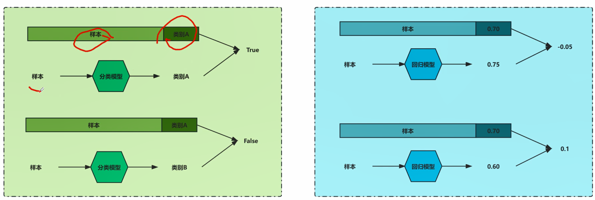

> 分类： （正误：正确...个，错误...个），分类任务的准确率： (预测正确的次数/总次数）* 100%  ()
>
> 回归：（误差）与正确答案之间的差距

## 机器学习的分类

### 有监督学习

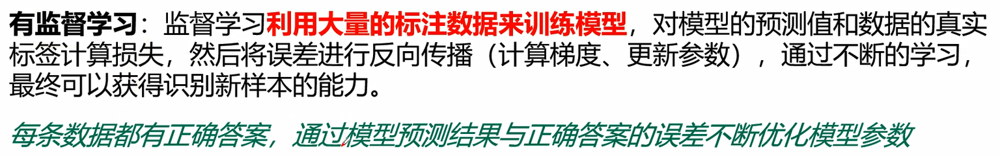

> **即有标签（标注的数据）又有正确答案，称之有监督学习。**
>
> 1. 每条样本，会有一个正确答案（真实标签，标注也是标签的一种？）—— 标签都是人工进行的。
>
> 2. 在训练时，将样本输入到模型里，输出的预测结果，将预测结果与给定的正确答案做比较，计算出模型的差异（误差）
>
> 4. 再用误差来优化模型。
>
> 
>
> **有大模型之后，有监监学习的标注成本与效率的改进**
>
> 之前有监督学习的工人标注成本很高，现在可以借助大模型(不用chatGPT，也可用*Baichuan2-13B*)做预标注，准确率高达80%或以上；再选1~2个人工，对预标注结果，再检查校验，其效率可提高50%以上。
>
> > 对于重要数据多个验证人员实现交叉验证，普通数据1~2人足够。
>
> 
>
> **举例：**
>
> **情感分类**
>
> 人工标签：拿到大量的评论区中的用户评价数据，让标注人员按条逐条标注。
>
> 大型模（chatGPT、百川或...):  通过请求其API，自动实现预标签，准确率有可能到达80%或以上。
>
> > chatGPT：可以用于企业非机密数据
> >
> > 自研模型：企业机密数据
>
> **健康领域** —— 数据挖掘 —— 目前常用的方式
>
> 获取健康领域的书籍，输入chatGPT，切成多个chunk，让chatGPT针对chunk提取问题，再由chatGPT针对问题生成结果。如此反复，可以获取大量标注好的数据。
>
> 
>
> **企业自研大模型的现实问题**
>
> 自研大模型：信息与数据安全；大厂的模型太多庞大，私有化部署成本过高；因此走自训练之路是最节省成本的做法（1~2个人，8块的A100，训练模型，再迭代更新优化）。
>
> 模型选型：7B模型就可以训练企业的模型但训练差点，13B正合适（起步）
>
> 文心一言：也只敢给外部提供一些 提效或文本提取 等基本功能，像类似借助文心一言的功能实现对话接口，文心一言目前并不敢提供。
>
> 

### 无监督学习

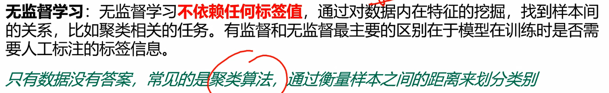

> **只有数据没有标签**
>
> 文本聚类：边界距离，LCS 直接衡量 文本内容之间的重合度，以此来衡量文本间的距离，得出文本聚类
>
> 现有模型：不对其做任何训练，直接生成embedding，即输入 一个词，输出一个向量，再去计算向量之间的距离，由此计算聚类
>
> 适用于：聚类、降维相关的场景

### 半监督学习

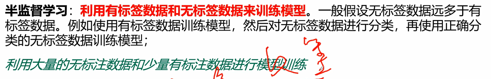

标签数据与无标签数据混合使用。

1. 先用有标签数据训练大模型
2. 用有标签数据训练过于（效果一般）关成品的模型，对所有的无标签数据做预标注
3. 得到预标注数据之后，再由人工校验订正，筛选出分类正确的数据扩充到已标注的数据中
4. 再迭代，以此类推，直接将数据都训练有标注的数据

### 自监控学习

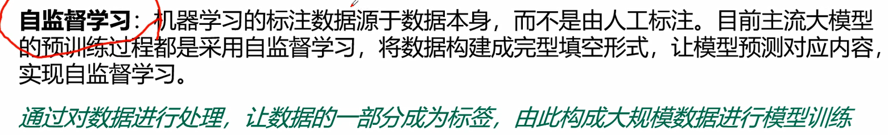

> 数据量高达几个T级，把现有的数据变成有标注的数据。

### 远程监督学习

### 强化学习

> 模型通过与环境交互，获取奖励值，再迭代化模型；在后面100次或10000次的交互过程中（比如汽车从A至B点过程中总的奖励值）。

---

> 算法工程师日常的工作内容：
>
> 大部分时间在处理数据 —》调参  —》生成模型  —》观测模型情况，如不好，再重新调参，...

# 附录

## 大模型数据训练的三个阶段：PreTrain_SFT_RLFH

1. 预训练（pretrain)  —— 海量数据，完成大模型对信息或知识的广域理解

2. SFT  —— 公司的垂直数据，进行领域训练

> 现在能用大模型，在信息提取与文本分类等方面效果并不理想（准确率50%左右，好点也就60%~70%），关键因素就是缺少 垂直数据 的训练

3. RLFH 

> 严谨问答的必经阶段
>
> 之前的训练虽然有一点效果，但回答时有可能过于生硬或错误率较高。这时需要构建一种数据集，一个输入的require变成require够成两条数据，一个是模型回签的好的，一个是回答的不好的。RLFH 就是让模型通过这种强化学习，让模型知道如何回答是好的，怎么回答是不好的；以此训练让模型回答的更符合人类的需求。

## AI与大模型

[AI大模型是“大数据+大算力+强算法结合的产物，凝聚了大数据内在精华的“隐式知识库”。包含了“预训练”和“大模型”两层含义，即模型在大规模数据集上完成了预训练后无需微调，或仅需要少量数据的微调，就能直接支撑各类应用。

## 目前主流的核心模型

llama/llama2、Baichuan

> https://zhuanlan.zhihu.com/p/651747035

## 大模型发展趋势

LLM —》  LMM (MLLM) 多模态

## Prompt

提示词学习

## 书籍推荐

周志华老师的《机器学习》 —— 俗称《西瓜书》

李航《统计学习方式》

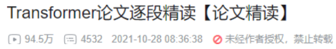

