#  模型训练的基本概念

## 基础名词解析

**样本**：一条数据；

**特征**：被观测对象的可测量特性，例如西瓜的颜色、瓜蒂、纹路、敲击声等；

**特征向量**：用一个 d 维向量表征一个样本的所有或部分特征；

**标签(label)/真实值**：样本特征对应的真实类型或者真实取值，即正确答案；

**数据集(dataset)**：多条样本组成的集合；

**训练集(train)**：用于训练模型的数据集合；

**评估集(eval)**：用于在训练过程中周期性评估模型效果的数据集合；

**测试集(test)**：用于在训练完成后评估最终模型效果的数据集合；

**模型**：可以从数据中学习到的，可以实现特定功能/映射的函数；

**误差/损失**：样本真实值与预测值之间的误差；

**预测值**：样本输入模型后输出的结果；

**模型训练**：使用训练数据集对模型参数进行迭代更新的过程；

**模型收敛**：任意输入样本对应的预测结果与真实标签之间的误差稳定；

**模型评估**：使用测试数据和评估指标对训练完成的模型的效果进行评估的过程；

**模型推理/预测**：使用训练好的模型对数据进行预测的过程；

**模型部署**：使用服务加载训练好的模型，对外提供推理服务；

**模型**：可以从数据中学习到的，可以实现特定功能/映射的函数；

> 含有大量参数的未知表达式

**误差/损失**：样本真实值与预测值之间的误差；

**预测值**：样本输入模型后输出的结果；

**模型训练**：使用训练数据集对模型参数进行迭代更新的过程；

**模型收敛**：任意输入样本对应的预测结果与真实标签之间的误差稳定；

**模型评估**：使用测试数据和评估指标对训练完成的模型的效果进行评估的过程；

**模型推理/预测**：使用训练好的模型对数据进行预测的过程；

**模型部署**：使用服务加载训练好的模型，对外提供推理服务；

## 机器学习的任务流程

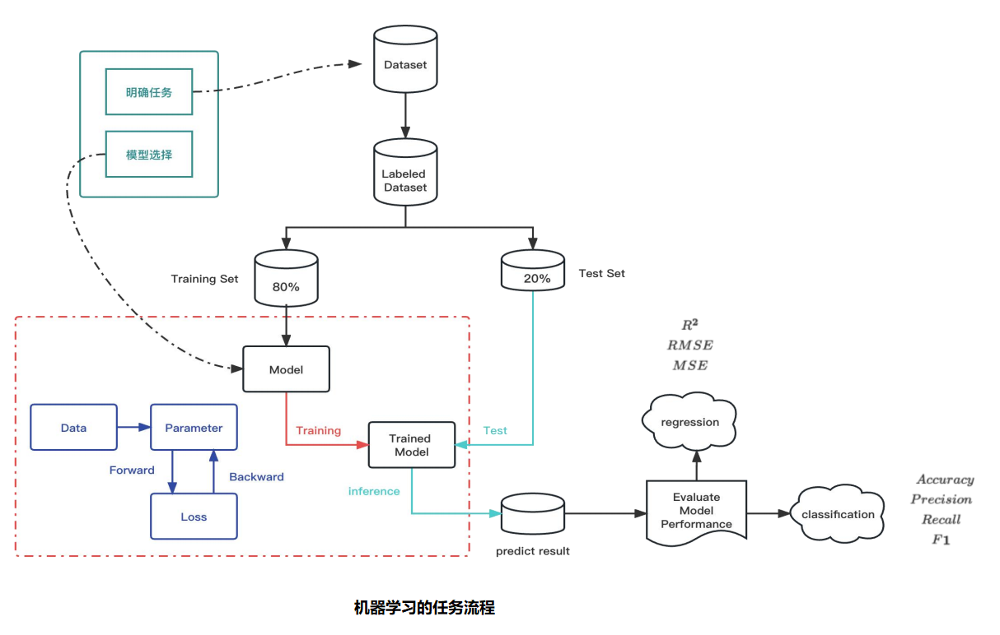

一、明确任务 —— 确认任务与模型选择

1. 先分析任务，比如有一个情况分类的任务，针对用户评论做情感分类；
2. 根据业务类型，选择模型（比如分类，可直接选Google Bert(16年~20年主流）或T5，再早一些可有是LSTM等，现在可选LLM)）

二、准备数据

1. Dataset:  收集数据，上例是从多端收集评论数据 
2. Labeled  Dataset： 数据标注，生成标注好的数据 (有监控学习的流程)  
3. Train Set： 对数据进行划分：80%训练数据，20%测试集 
   1. 训练集、评估集和测试集 （ 评估集也可不分或不单独分）
   2. 80%：如上图; 训练与评估集在80%里，占其中的5%~10% —— 数据集越小评估集的比例越低或者不用评估集
   3. 20%：测试集要对最终训练出来的数据，做最终的性能评估与汇报结果等
   4. 如果数据少的话，测试集可以少一些，以训练为主。

三、模型训练

1. Model ： 模型训练
2. Train Model： 训练后的模型，将20%的测试数据放入，评估性能与结果
3. predict result:  将20%的测试数据放入Train Model，输出预测结果
4. Evaluate Model Performance :  根据不同的任务（regression 回归，或classification 分类），计算准确率。

### 数据标注举例

1. 定义标注规范 , 比如情感分类的标注规范（正向、反向、中性）
2. 内容：这是什么玩意（反向），666（正向），今天吃了一碗面（中性）

## 模型训练的基本流程

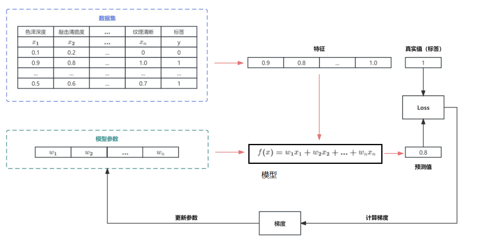

> 所谓模型：是含有大量未知参数的表达式

1. 模型参数：实际训练中，参数的获取方式：会按照正态分布或某一种数学分布得的随机值作为参数预设值或其他模型的训练结果

2. 模型训练：根据预调进行随机初始化...，同时将特征值带入模型 ，可计算出一个预测值（如图所示0.8的预测值）

3. LOSS（损失函数：y=...）： 预测值0.8与真实值(标签)比较，计划误差，上述图中所示为误差0.2 

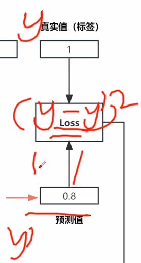

4. 得到新的参数模型：计算梯度 -> 梯度 -> 更新参数 
5. 再进行模型训练：新的参数模型 + 特征值，再得到预测值...如此反复

### LOSS - 损失函数

用于衡量预测值与真实值之间误差量或损失量的一个函数，是模型训练的核心。

> 模型训练的过程是通过不断的优化模型参数，让LOSS的值在相同的输入情况下其值不断降值以达到目标预测
>
> 对一个任务说，损失函数是不变的。但对于不同的任务，损失函数是不同的。

##  模型训练的详细流程

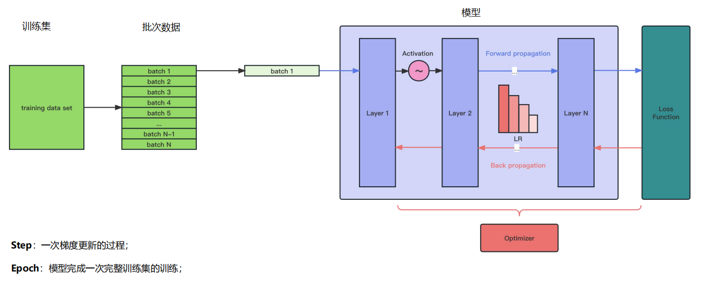

一、train data set

二、batch1（1...N-1,N)

		batch size: 一次输入模型中样本条数，（8，16，32等8的倍）
	
		一次batch size越高，一次输入模型中样本条数越多，对显存的占用越多。

三、layer 1, 2,...N（模型）

	深度学习或LLM模型，会将内部分层（大模型可以将以前的6层或12层的模型变成100或200+层）
	
	每一层的结构都相同；层数越多，可训练的参数就越多；理论上训练层数越多，挖掘的细节越多，结果越逼近真实

### Activation- 激活函数

层与层之间会有一个激活函数，通过激活函数，再进入下一层。

进模型某层 --》激活 --》再入下一层...以此类推

### Forward Propagation — 前向传播

进模型某层 --》激活 --》再入下一层...层层类推，这样的一个过程 称之为 前向传播

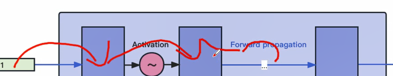

### Back propagation — 反向传播

正向传播后，会进入损失(loss)函数 ，计算预测值与真实值之间的损失，再进行反向传播（对每一层计算梯度，逐层更新参数），通过更新参数，让模型在相同输入的情况下，损失函数的值变的越来越小。

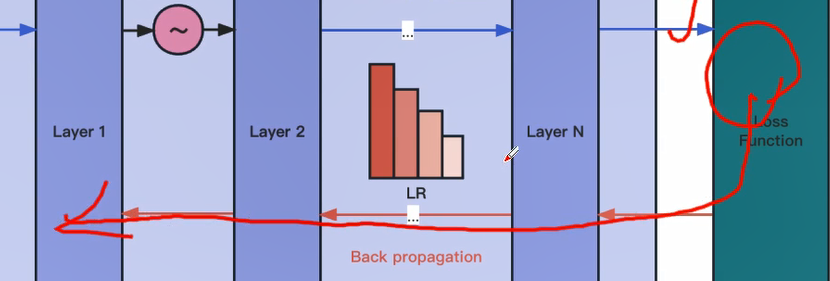

### Step & Epoch

**Step**：一次梯度更新的过程；

**Epoch**：模型完成一次完整训练集的训练；

>  Step: 含前向传播与反向传播
>
>  Epoch: 数据存在多次训练的情况，对于大模型来说：一般会有1次Epoch，也有2次或 3 次Epoch。
>
>  Epoch: 多次Epoch时，还是会使用相同的数据，只不过每次使用会重新打乱数据顺序。

### 模型参数

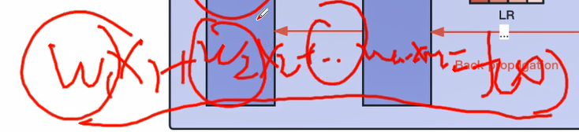

w1..n：参数（权重）

## 正向传播与反向传播

### 正向传播 

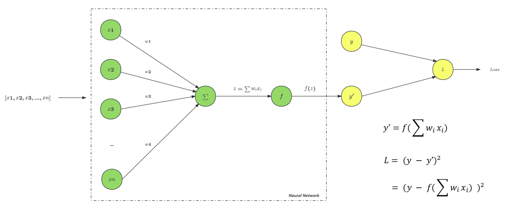

>  x1...xn：为不同的特征
>
>  ∑:  累加函数：∑(w(i)x(i))
>
>  f:  f(z) y' = f(z) = f(∑x..y..) ..
>
>  ---
>
>  假设： Loss: L = (y - y') 的平方 
>
>  那么:    L = (y - y')的平台 =  (y - f(∑x..y..) ) 的平方
>
>  ---
>
>  损失函数也是由模型参数构成 
>
>  模型训练的目标：降低模型的误差

### 梯度

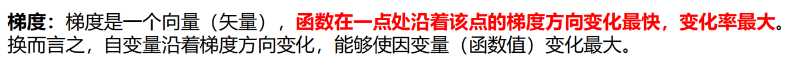

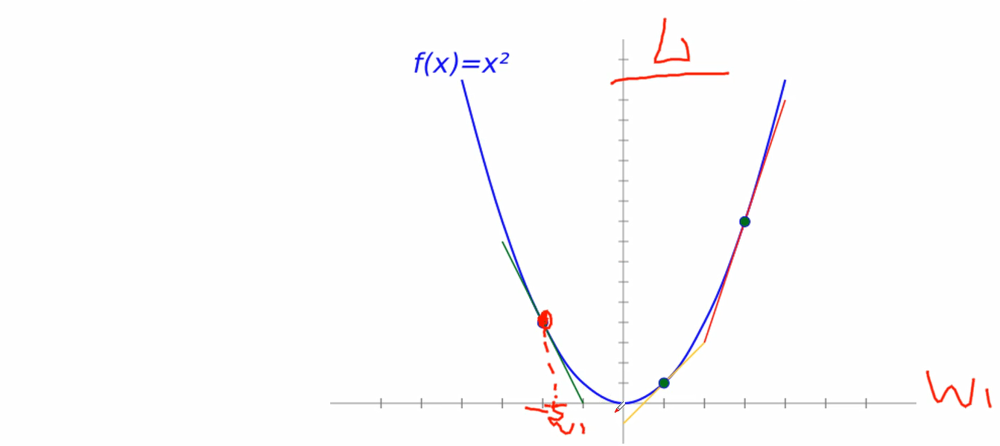

> 凸函数：
>
> 曲线：f(x）= x平方 - 
>
> 纵轴：L损失函数
>
> 横轴： 参数（w1,w2...wn)
>
> 
>
> 偏导数，斜率???
>
> ----
>
> 损失函数：针对某一个W1，沿曲线向下...（着负梯度方向）...其损失率下降越快
>
> ...每个参数的 偏导数，斜率 - 就是这一轮要更新的方向???

### 反向传播

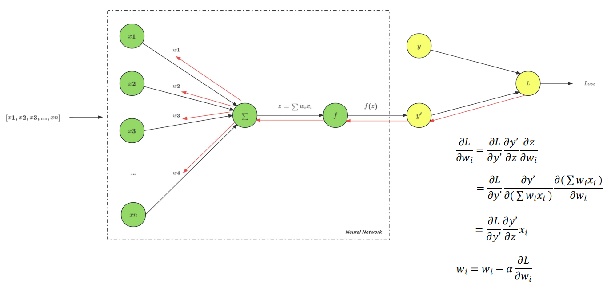

> **链式法则** - 逐层求导
>
> ---
>
> 反向传播过程中Loss对于 а 的偏导取值： а 为学习率，越小对梯度变化虎
>
> 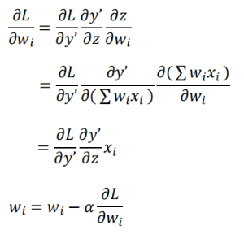

# 附录

## Transformer: Encoder-Decoder与Attention

大模型的发展正在逐渐从单一模态数据输入向多模态数据输入演进，文本、语音、图像、视频等多模态的联合训练学习，不同模态之间形成有效互补，这将有助于提升模型的效果和泛化能力，为迈向通用人工智能奠定更加坚实的一步。而提到多模态的算法模型，就不得不提到大名鼎鼎的 Transformer。

2017年, **Google研究团队**发表了论文 **《Attention Is All You Need》**，Transformer横空出世，并很快成为**自然语言处理(NLP)**领域的标杆模型，如机器翻译及后续的BERT、GPT系列等NLP大模型。Transformer也被应用到**计算机视觉(CV)**领域，用于图像分类、物体检测、图像生成和视频处理等任务，代表性如DERT、ViT等。此外，Transforme也被应用到了**语音领域(ASR)**，用于语音识别、语音合成、语音增强和音乐生成等任务。此外，NLP、视觉和语音构成的**多模态**场景，也是近年来Transformer应用的热点方向，例如视觉问答、视觉常识推理、语音到文本翻译和文本到图像生成等。

> 针对基于CNN和RNN的Seq2Seq模型存在的不足，《Attention is all you need》这篇论文提出了一种完全基于Attention Mechanism（Self Attention）的`Transformer`架构：抛弃CNN和RNN，基于Attention来构造Encoder和Decoder，搭建`完全基于Attention`的`Seq2Seq模型`。论文的详细阅读笔记：[Transformer 模型详解](https://blog.csdn.net/Wisimer/article/details/104415321)。

Encoder-Decoder, Attention, Transformer 三者的关系：

| 概念            | 说明                                     |
| --------------- | ---------------------------------------- |
| Encoder-Decoder | 解决序列-序列问题的框架                  |
| Attention       | 改善Encoder-Decoder输出结果的机制        |
| Transformer     | 使用了Encoder-Decoder框架和Attention机制 |

> Attention 机制的提出就是为了解决`「序列过长，信息丢失」`的问题。原理详见[Attention机制详解](https://blog.csdn.net/Wisimer/article/details/104462274)。

https://zhuanlan.zhihu.com/p/609271490

https://code84.com/71951.html

> encoder: Google Bert
>
> decoder: openAI（双向注意力机制）

## 谷歌曾经的最强NLP模型BERT

http://lihuaxi.xjx100.cn/news/286261.html?action=onClick

## 数学基础

###  导数、偏导、方向导数、梯度、梯度下降

> 导数：函数（因变量对应实数值）
>
> 偏导数：函数（因变量对应实数值）
>
> 梯度：向量（向量的每一维对应偏导数）
>
> 方向导数：函数（因变量对应实数值）
>
> 梯度下降：一种优化方法
>
> 二阶导数：函数（因变量对应实数值）
>
> 二阶方向导数：函数（因变量对应实数值）

https://blog.csdn.net/weixin_45252110/article/details/98489269

https://www.jianshu.com/p/55399b7d19a9

### 二阶导数、二阶方向导数

https://blog.csdn.net/qq_32103261/article/details/122347105

### 矩阵

https://blog.csdn.net/m0_47397401/article/details/106240271

### 机器学习所需的数学知识

https://zhuanlan.zhihu.com/p/392672549

## 机器人

- 智能机器人 —— 聚深智能

## 周边知识

- 熟悉：python & pytorch 

- **重点学习**：深度学习 & NLP

- 基础：数学：导数、偏导、...

  

