# 模型训练的基本概念

## Learning Rate - 学习率

>  可调的参数之一

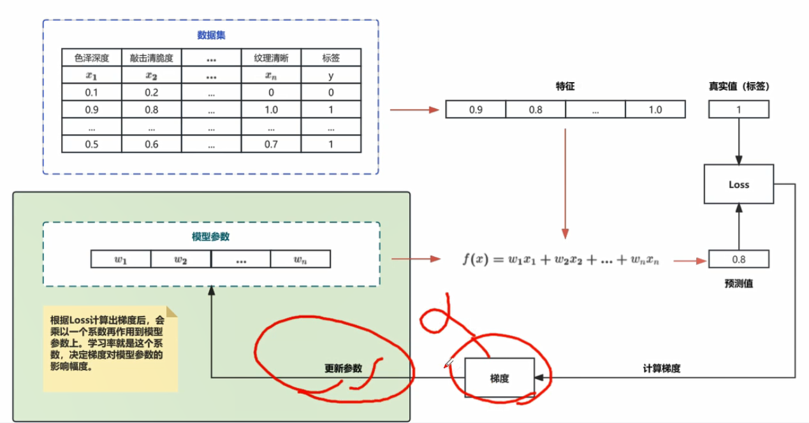

> 在梯度计算过程中，会*α参数。

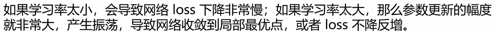

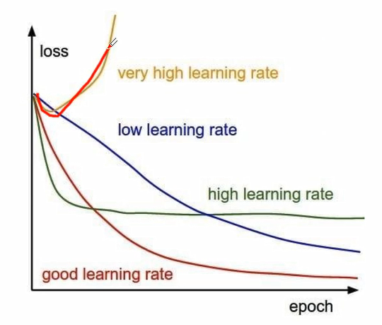

gpt4：

openAI：实同了使用小1万倍的模型来预估GPT4的效果。

## Batch Size

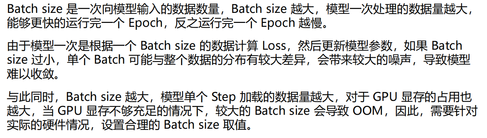

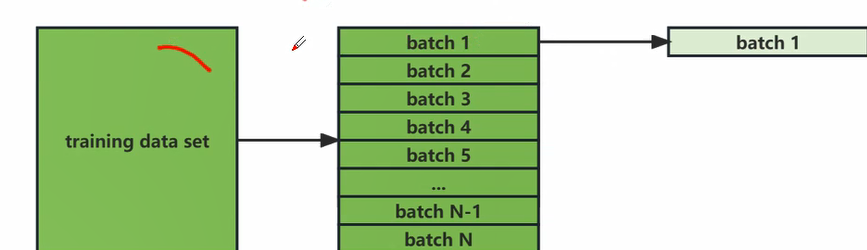

> Batch Size: 
>
> 在传统领域里，取个适当的值，比较好。
>
> 在LLM数：
>
> 数据量足够大的情况下，Batch Size越大越好，显存够用为前题。 
>
> 数据量不大的情况下：Batch Size:太大，迭代次数太少，模型被更新的次数太少，模型训练之后的效果不好。
>
> ---
>
> 取值：8-16-32..。128，256， ...以8的倍数计算
>
> 迭代次数：取决于数据总量与Batch Size大小，大概在几千次迭代量(百次太少)
>
> 一次Step：上一层的输出结果，经过激活函数，会是下一次的输入(x)

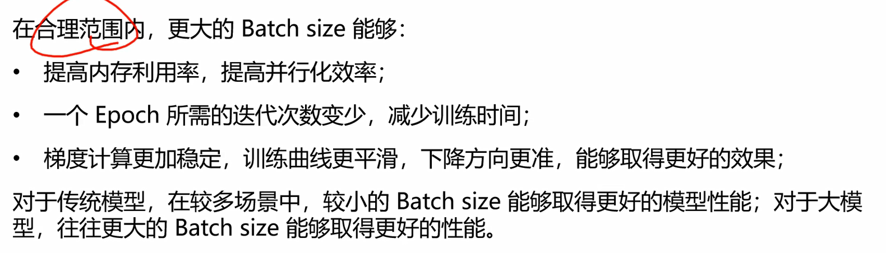

## 激活函数

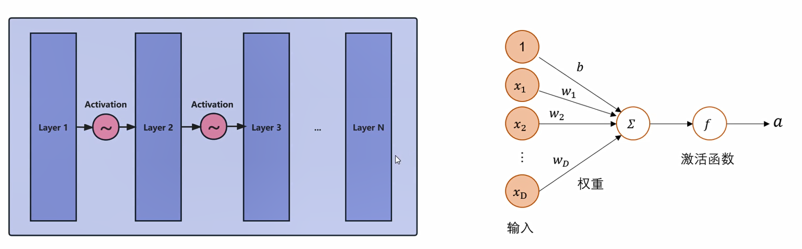

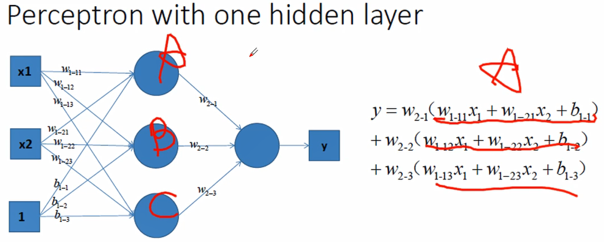

> b1：偏值
>
> 我们的数据绝大部分都是非线性的，而在一般的神经网络中，计算都是线性的。而引入激活函数就是在神经网络中引入非线性，强化网络的学习能力。

上述模型分层计算后变成一个线性函数

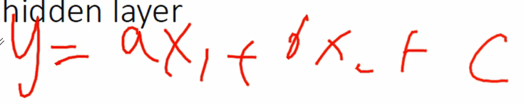

> 上式公式中c为偏值

**而激活函数的存在，保证多层网络不退化成线性函数，让其可以拟合任意复杂的分布**。即，线性模型的表达能力不够，激活函数“**使用得神经网络可以逼近其他的任何非线性函数**”这样可以使用得神经网络应用到更多的非线性模型中。

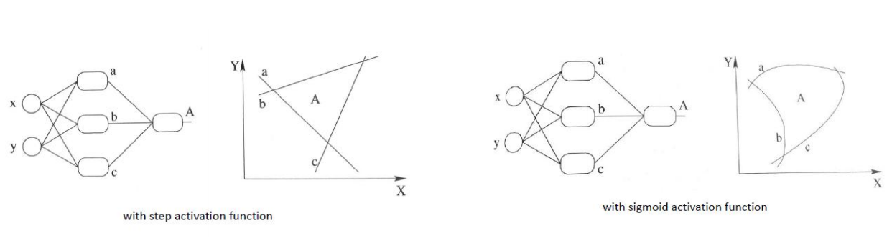

## 常见激活函数

### sigmoid

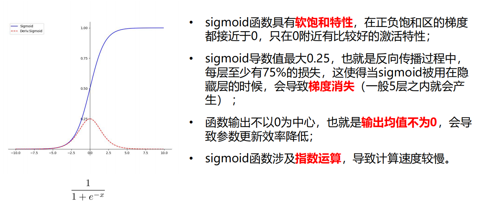

> Y到了100上，基本饱和了。只有在0附近有一个比较好的梯度值。

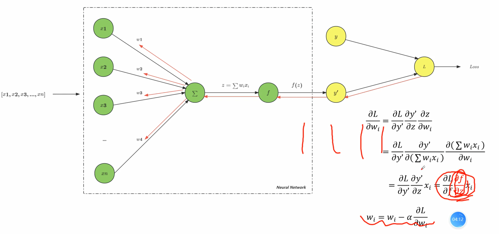

**激活函数 — 为什么希望激活函数输出均值为0？**

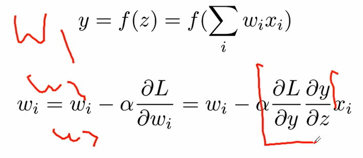

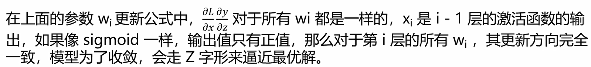

### softmax & tanh

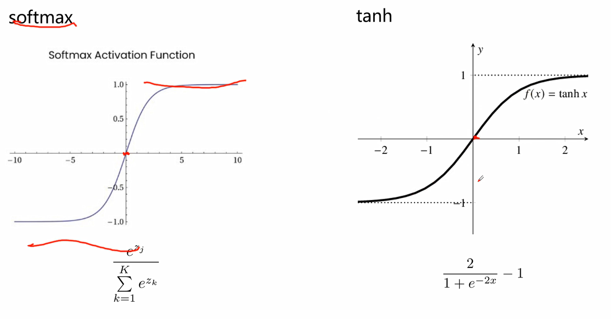

### ReLU

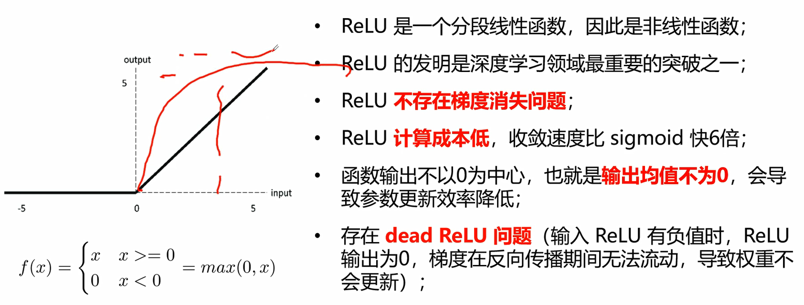

> 不存在0.25衰减的问题，且表达式简单(不存在指数) 
>
> 打破sigmoid长期以来带来的瓶颈，使之模型可以再做的更加有深度

#### Leaky ReLU & ELU  —  解决Dead ReLU 

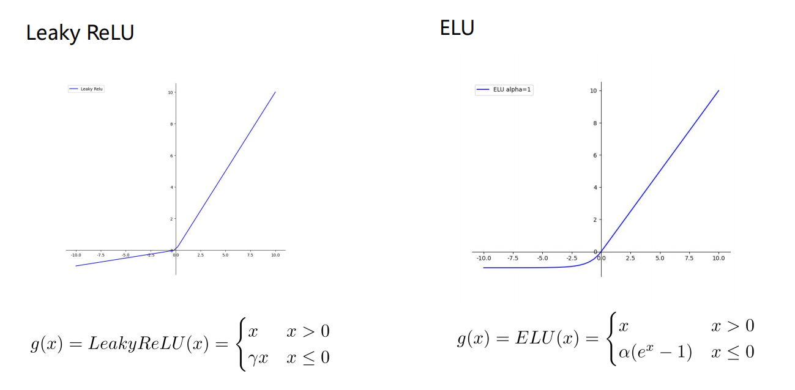

### Swish — 目前大模型在使用 — 目前使用较广

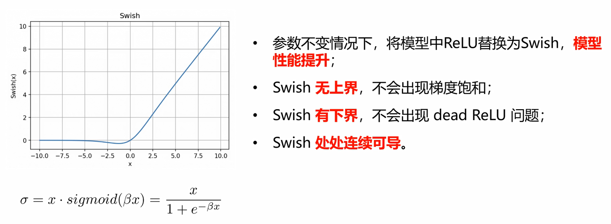

> 大部分的情况下，效果比ReLU好
>
> 目前大模型在用Swish做激活函数

## 损失函数

损失函数（loss function）就是用来**度量模型的预测值f(x)与真实值Y的差异程度**（损失值）的运算函数，它是一个**非负实值函数**。

损失函数仅用于模型训练阶段，得到损失值后，通过反向传播来更新参数，从而降低预测值与真实值之间的损失值，从而提升模型性能。

整个模型训练的过程，就是在**通过不断更新参数，使得损失函数不断逼近全局最优点（全局最小值）**。

不同类型的任务会定义不同的损失函数，例如回归任务重的MAE、MSE，分类任务中的交叉熵损失等

## 损失函数分类

### MSE & MAE

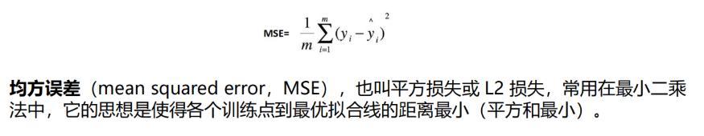

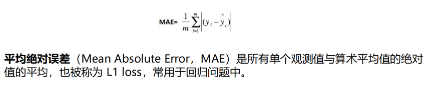

### 交叉熵损失 - 经典且常用

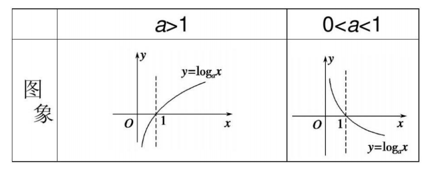

> log函数：
>
> 当底数a>1时，是单调递增 （x<1时，y<0；x>1时，y>0）
>
> 当底数0<a<1时，log函数值是单调下降的。(x<1时，y>0；x>1时，y<0)

log 函数是很多损失函数中的重要组成部分，对于 log 函数，默认的底数 a 是 e，**也就是损失函数中使用的 log 函数默认 a>1**。

#### 二分类

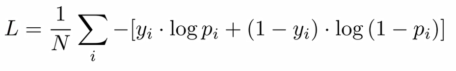

> 其中，yi 为样本 i 的真实标签，正类为 1，负类为 0；pi 表示样本 i 预测为正类的概率。

#### 多分类

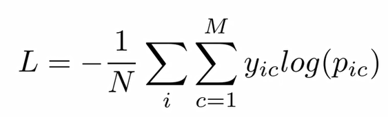

> 其中，M 为类别数量；y(ic) 符号函数，样本 i 真实类别等于 c 则为 1，否则为 0；预测样本 i 属于类别 c 的预测概率。

27:02