> Chapter01_深度学习基础.pdf 第52页
>
> 第二次课：2023.10.5

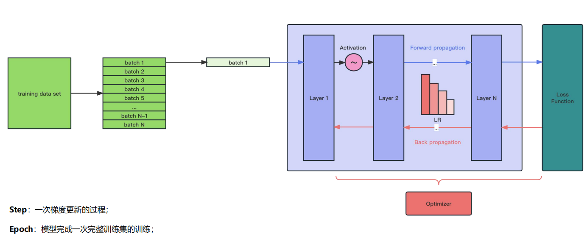

# 优化器

优化器就是在深度学习反向传播过程中，**指引损失函数（目标函数）的各个参数往正确的方向更新合适的大小，使得更新后的各个参数让损失函数（目标函数）值不断逼近全局最小**	。

**优化器不计算梯度，它只是梯度的更新者，他决定了以什么样的形式更新参数**

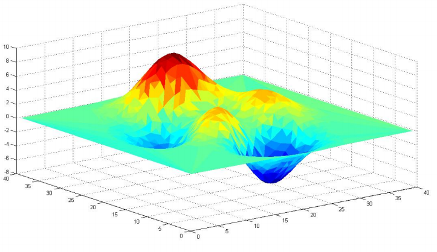

> 深度学习模型通过引入损失函数，用来计算目标预测的错误程度。根据损失函数计算得到的误差结果，需要对模型参数（即权重和偏差）进行很小的更改，以期减少预测错误。但问题是如何知道何时应更改参数，如果要更改参数，应更改多少？这就是引入**优化器**的时候了。简单来说，优化器可以优化损失函数，优化器的工作是以使损失函数最小化的方式更改可训练参数，损失函数指导优化器朝正确的方向移动。  优化器即优化算法是用来求取模型的最优解的，通过比较神经网络自己预测的输出与真实标签的差距，也就是Loss函数。为了找到最小的loss（也就是在神经网络训练的反向传播中，求得局部的最优解），通常采用的是梯度下降(Gradient Descent)的方法，而梯度下降，便是优化算法中的一种。

总的来说可以分为三类，一类是梯度下降法（Gradient Descent），一类是动量优化法（Momentum），另外就是自适应学习率优化算法。

## **梯度**

梯度是一个向量，它的每一个分量都是对一个特定变量的偏导数，**每个元素都指示了函里每个变量的最陡上升方向**，换句话说，**梯度指向函数增长最多的方向**。

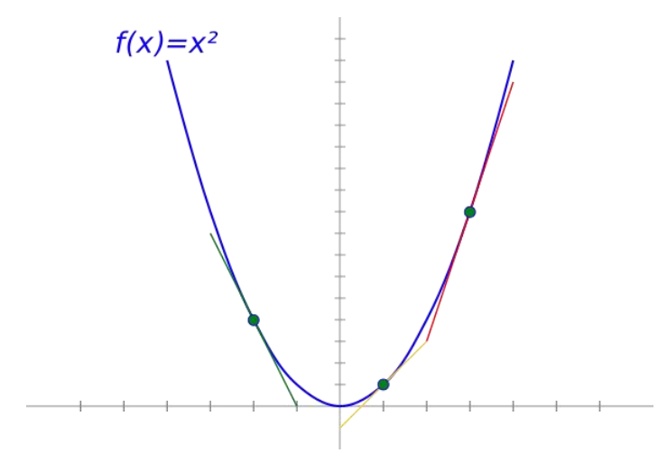

在模型训练过程中, 梯度计算分成两部分：

- Loss 内的Backup方法 - 执行所有参数的梯度计算
- Optimizer -  执行Step 执行实际的参数更新

## 优化器分类

### 梯度下降算法(Gradient Descent )

$$
w_i = w_i - α \frac{αL}{αw_i}
$$

梯度下降法是最基本的优化算法之一。梯度下降法就是沿着梯度下降最快的方向求极小值。

顾名思义，**梯度下降法的计算过程就是沿梯度下降的方向求解极小值，也可以沿梯度上升方向求解最大值**。梯度下降法是最基本的优化算法之一。梯度下降法就是沿着梯度下降最快的方向求极小值。

**标准的梯度下降主要有两个缺点：**

**训练速度慢**：每走一步都要计算调整下一步的方向，下山的速度变慢。在应用于大型数据集中，每输入一个样本都要更新一次参数，且每次迭代都要遍历所有的样本。会使得训练过程及其缓慢，需要花费很长时间才能得到收敛解。

**容易陷入局部最优解**：由于是在有限视距内寻找下山的方向。当陷入平坦的洼地，会误以为到达了山地的最低点，从而不会继续往下走。所谓的局部最优解就是鞍点。落入鞍点，梯度为0，使得模型参数不在继续更新。“鞍部” 如下图所示

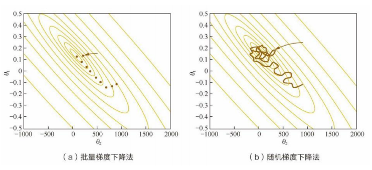

因此，真正在使用时，主要是经过改进的以下三类方法，区别在于**每次参数更新时计算的样本数据量不同**：

| 算法                                                         | 优缺点                                                       |
| ------------------------------------------------------------ | ------------------------------------------------------------ |
| **BGD** 批量梯度下降法 (Batch Gradient Descent)  在全部训练集上计算精确的梯度。 (batchSize = 整个数据集的大小) | **优点**： 由于**每一步迭代使用了全部样本**，每次下降的方向为总体的平均梯度，因此损失函数收敛过程会比较稳定。对于凸函数可以收敛到全局最小值，对于非凸函数可以收敛到局部最小值。 **缺点**:  为了获取准确的梯度，批量梯度下降法的**每一步都把整个训练集载入进来进行计算**，时间花费和内存开销都非常大，无法应用于大数据集、大模型的场景。 |
| **SGD** 随机梯度下降（Stochastic Gradient Descent,SGD ) 采样单个样本来估计的当前梯度。 (batchSize = 1) | **优点**： 随机梯度下降法则放弃了对梯度准确性的追求，每步仅仅**随机采样一个样本**来估计当前梯度，计算速度快，内存开销小。 **缺点**：但由于每步接受的信息量有限，随机梯度下降法对梯度的估计常常出现偏差，造成目标函数曲线收敛得很不稳定，伴有剧烈波动，有时甚至出现不收敛的情况。 |
| **mini-batch GD** 小批量梯度下降法（Mini-batch Gradient Descent) 使用batch的一个子集来计算梯度。 （batchSize = 8bit 、16bit、32bit等以8为倍数的样本数来估计当前梯度。） | 经实践证明，该方法一方面可以降低参数更新时的方差，收敛更稳定，另一方面可以充分地利用深度学习库中高度优化的矩阵操作来进行更有效的梯度计算。 |

鉴于 BGD 和 SGD 各自的局限性，目前的训练采用 Mini-Batch GD，每次对batch_size的数据进行梯度计算，更新参数。

### 动量优化器(Momentum)

$$
v_t = γv_{t-1} + ηg_t
$$

$$
θ_{t+1} = θ_t - v_t
$$

> 动量优化法引入了物理之中的概念。动量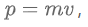当一个小球从山顶滚下，速度越来越快，动量越来越大，开始加速梯度下降，当跨越了山谷，滚到对面的坡上时，速度减小，动量减小。带动量的小球不仅可以加速梯度；还可以借着积累的动量，冲过小的山坡，以避免落入局部最优点。

Momentum 引入**惯性保持**（**动量**）**思想**，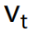由两部分组成：一是学习速率 η 乘以当前估计的梯度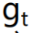；二是带衰减的前一次步伐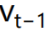。 直接依赖于  和， 而不仅仅是。另外，衰减系数 γ 扮演了阻力的作用。

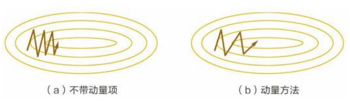

> 动量主要解决SGD的两个问题
>
> 1. 随机梯度的方法（引入的噪声）
>
> 2. Hessian矩阵病态问题（可以理解为SGD在收敛过程中和正确梯度相比来回摆动比较大的问题）

优点：前后梯度一致的时候能够加速学习；前后梯度不一致的时候能够抑制震荡，越过局部极小值（加速收敛，减小震荡）

缺点：增加了一个超参数

### 自适应学习率优化算法

传统的优化算法要么将学习率设置为常数要么根据训练次数调节学习率。往往忽视了学习率其他变化的可能性。然而，学习率对模型的性能有着显著的影响，因此需要采取一些策略来想办法更新学习率，从而提高训练速度

自适应学习率算法主要有：AdaGrad算法，RMSProp算法，Adam算法以及AdaDelta算法等

#### AdaGrad 

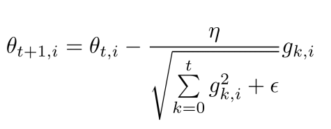
$$
θ_{t+1,i}新权重，θ_{t,i}新权重，分母 历史梯度的平方平
$$

AdaGrad引入**自适应思想**，训练过程中，学习速率逐渐衰减，经常更新的参数其学习速率衰减更快。

> Adagrad自适应思路其实是对学习率进行了一个约束：
>
> 1. 对于**经常更新**的参数，我们已经积累了大量关于它的知识，不希望被单个样本影响太大，希望学习**速率小**一些；
> 2. 对于**偶尔更新**的参数，我们了解的信息太少，希望能从每个偶然出现的样本（稀疏特征的样本）身上多学一些，即**学习速率大一些**。
>
> 而该方法中开始使用二阶动量，才意味着“自适应学习率”优化算法时代的到来。

优点：自适应的学习率，无需人工调节

缺点：AdaGrad方法采用所有**历史梯度平方和的平方根**做分母，分母随时间单调递增，**产生的自适应学习速率随时间衰减的速度过于激进**。

> 分母平方和方式，会存在参数还没更新几次，梯度累积就已经较大，导致梯度几率不更新，因此该算法并没有被广泛使用

#### RMSprop

RMSprop 是 Hinton 在课程中提到的一种方法，是对 Adagrad 算法的改进，主要是**解决学习速率过快衰减的问题**。

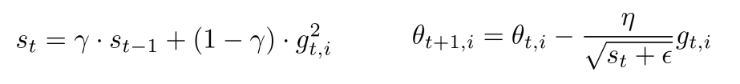

采用**梯度平方的指数加权移动平均值**，其中一般取值0.9，有助于避免学习速率很快下降的问题，学习率建议取值为0.001。

优点：RMSprop算是Adagrad的一种发展，是另外一种自适应学习率(Adadelta)算法的变体，效果趋于二者之间。合处理非平稳目标(包括季节性和周期性)——对于RNN效果很好。

缺点：其实RMSprop依然依赖于全局学习率 

#### Adam - 目前被广泛应用于机器学习、深度学习与大模型中

Adam方法将**惯性保持**（动量）和**自适应**这两个优点集于一身。

> Adam 结合了前面方法的一阶动量和二阶动量，相当于 Ada + Momentum，SGD-M和NAG在SGD基础上增加了一阶动量，AdaGrad和AdaDelta在SGD基础上增加了二阶动量。

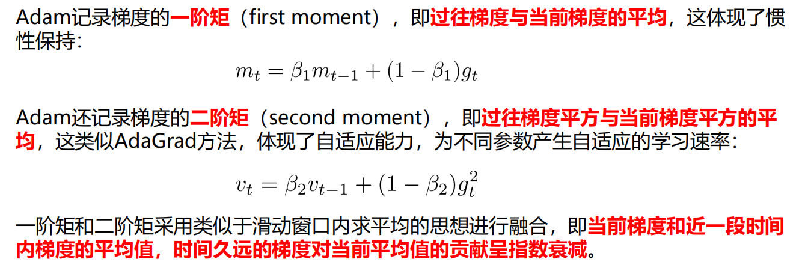

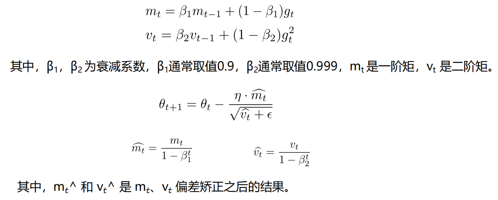

优点：

- Adam梯度经过偏置校正后，每一次迭代学习率都有一个固定范围，使得参数比较平稳。

- 结合了Adagrad善于处理稀疏梯度和RMSprop善于处理非平稳目标的优点

- 为不同的参数计算不同的自适应学习率

- 也适用于大多非凸优化问题——适用于大数据集和高维空间。

缺点： Adam 使用动量的滑动平均，可能会随着训练数据变化而抖动比较剧烈，在online场景可能波动较大，在广告场景往往效果不如 AdaGrad

> Adam目前被广泛应用于机器学习、深度学习与大模型中，现在有很多Adam变体，比如AdamW等

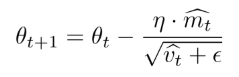

> 该公式是动量优化式的公式与AdaGrad相结合

参考

1. [An overview of gradient descent optimization algorithms](https://link.zhihu.com/?target=https%3A//arxiv.org/pdf/1609.04747.pdf)
2. [机器学习：各种优化器Optimizer的总结与比较](https://www.xjx100.cn/news/432037.html?action=onClick)
3. [最全机器学习优化器Optimizer汇总](https://zhuanlan.zhihu.com/p/578934326?utm_id=0)

