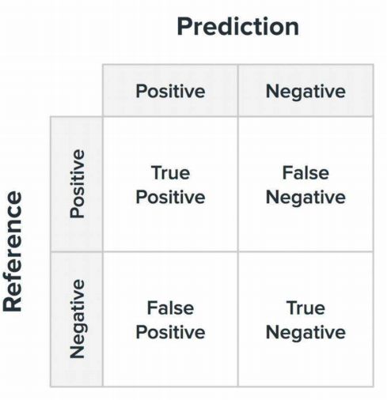
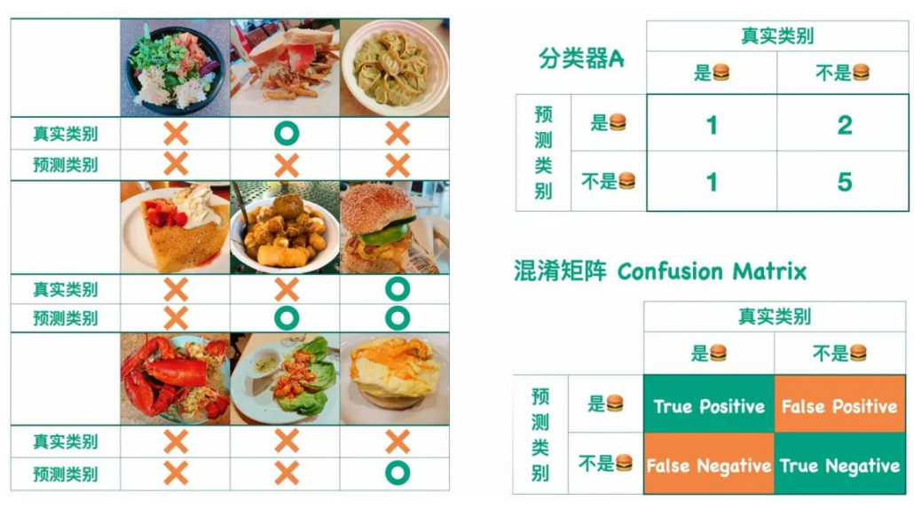
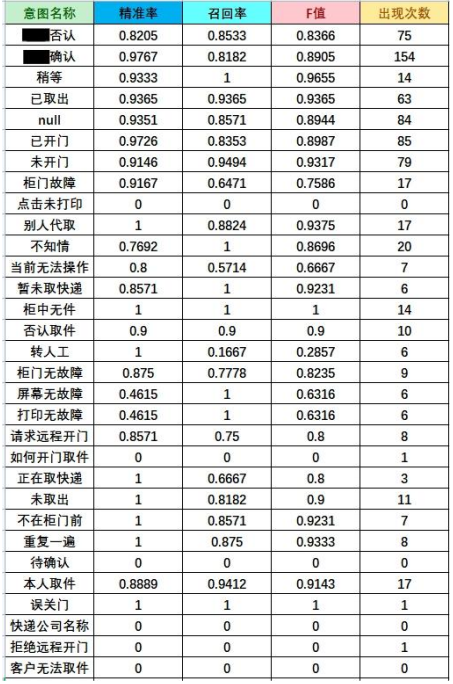
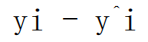
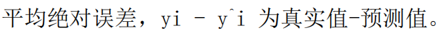

# 梯度评估指标

## 分类模型

### Accuracy - 准确率

$$
Accuracy = \frac{n_{correct}}{n_{total}}
$$

$$
其中 n_{correct} 为被正确分类的样本个数，n_{total} 为总体样本个数。
$$

准确率是分类问题中最简单也是最直观的评价指标，但存在明显的缺陷。比如，当负样本占99%时，分类器把所有样本都预测为负样本也可以获得99%的准确 率。所以，**当不同类别的样本比例非常不均衡时，占比大的类别往往成为影响准确率的最主要因素**。

> 做模型或做评估任务时，刚刚开始我们还是会简单的用Accuracy来做评估 —— 因为样本不均衡的情况会比较少；后期用PRF(F1) 来评估。

### 混淆矩阵 - 目前机器学习与大模型正在使用的评估指标

> 目前机器学习与大模型正在使用的评估指标

混淆矩阵	结果的情形分析表**，以**矩阵形式**将数据集中的记录按照真实的类别与分类模型预测的类别判断两个标准进行汇总。

|                                                              |                                                              |
| ------------------------------------------------------------ | ------------------------------------------------------------ |
| True Positive（TP）：真正类。正类被预测为正类。 False Negative（FN）：假负类。正类被预测为负类。 False Positive（FP）：假正类。负类被预测为正类。 True Negative（TN）：真负类。负类被预测为负类。  |  |

> 术语：
>
> ---
>
> Reference: 真实值
>
> Prediction: 预测值
>
> ---
>
> T: True
>
> P: Positive
>
> F: False
>
> N: Negative

举例

### Precision - 精准率

$$
Precision = \frac{TP}{TP+FP}
$$

精准率，表示预测结果中，**预测为正样本的样本中**，正确预测的概率。

> T、P、F、N 见混淆矩阵
>
> 预测为正样本里，有多少判断对的了

### **Recall** - 召回率

$$
Recall = \frac{TP}{TP+FN}
$$

召回率，表示**在原始样本的正样本**中，被正确预测为正样本的概率。

> 原始数据的正样本中，有多少被判断对的了

**Precision值和Recall值是既矛盾又统一的两个指标**，为了提高Precision值，分类器需要尽量在“更有把握”时才把样本预测为正样本，但此时往往会因为过于保守而漏掉很多“没有把握”的正样本，导致Recall值降低。

> 早期通过追求高Precision，比如100%，来证明模型的准确度，是有实际应用价值。被认可后，后期再通过增加数据标注，逐渐的通过不断的优化数据集再把召回率提高上来。

### F1 - PRF

$$
F1 = \frac{f * Precision * Recall}{Precision * Recall}
$$

F1-score是Precision和Recall两者的综合，是一个综合性的评估指标。

**Micro-F1**：不区分类别，直接使用总体样本的准召计算f1 score。

**Macro-F1**：先计算出每一个类别的准召及其f1 score，然后通过求均值得到在整个样本上的f1 score。

数据均衡，两者均可；**样本不均衡，相差很大，使用Macro-F1**；**样本均衡，相差不大，优先选择Micro-F1**。

> 开始时F1 -> 70%模型被认可，但交付时要求F1 到 90%。

举例

> 在做分类任务时，一般都要阶段性的输出评估指标。
>
> 上图是某企业按期向""业务部门”输出的各个指标的列举。
>
> 开始时F1 -> 70%模型被认可，但交付时要求F1 到 90%。

## 回归模型

### MSE

$$
MSE = \frac{1}{m}\sum_{i=1}^m(y_i - \hat{y_i})^2
$$

### RMSE

$$
RMSE = \sqrt[2]{\frac{1}{m}\sum_{i=1}^m(y_i - \hat{y_i})^2}
$$

均方根误差，为真实值-预测值。解决量纲不一致的问题。

### MAE

$$
MAE = \frac{1}{m}\sum_{i=1}^m|(y_i - \hat{y_i})|
$$

RMSE 与 MAE 的量纲相同，但求出结果后我们会发现RMSE比MAE的要大一些。

这是因为RMSE是先对误差进行平方的累加后再开方，它其实是放大了较大误差之间的差距。

而**MAE反应的是真实误差**。因此在衡量中使RMSE的值越小其意义越大，因为它的值能反映其最大误差也是比较小的。

### R平方

$$
R^2 = 1-\frac{\sum_{i=1}(\hat{y_i}- {y_i})^2}{\sum_{i=1}(\overline{y_i} - y_i)^2}
$$

决定系数，分子部分表示真实值与预测值的平方差之和，类似于均方差 MSE；分母部分表示真实值与均值的平方差之和，类似于方差 Var。

根据 R2 的取值，来判断模型的好坏，其取值范围为[0,1]：
$$
R^2越大，表示模型拟合效果越好。R^2反映的是大概的准确性，因为随着样本量的增加R^2必然增加，无法真正定量说明准确程度，只能大概定量。
$$

### GSB

通常用于两个模型之间的对比, 而非单个模型的评测：
$$
GSB = \frac{good - bad}{good + same + bad}
$$
可以用GSB指标评估两个模型在某类数据中的性能差异。

