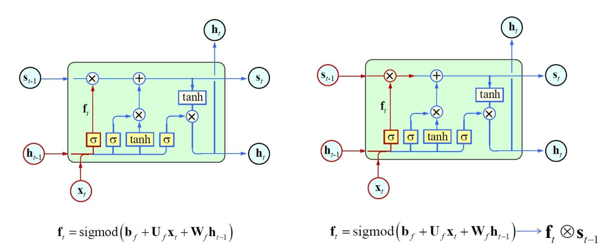
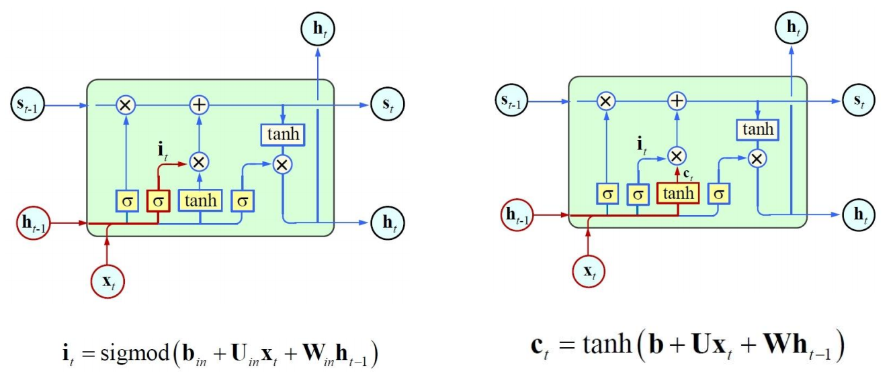
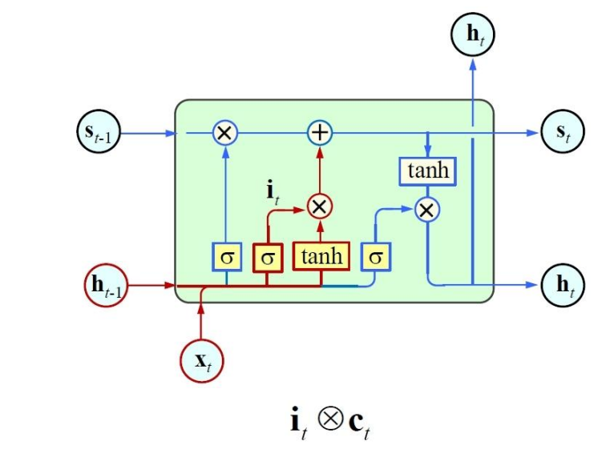
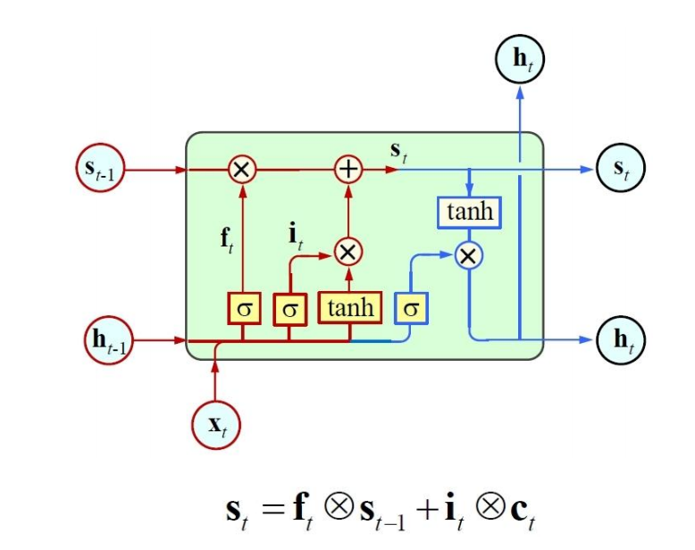
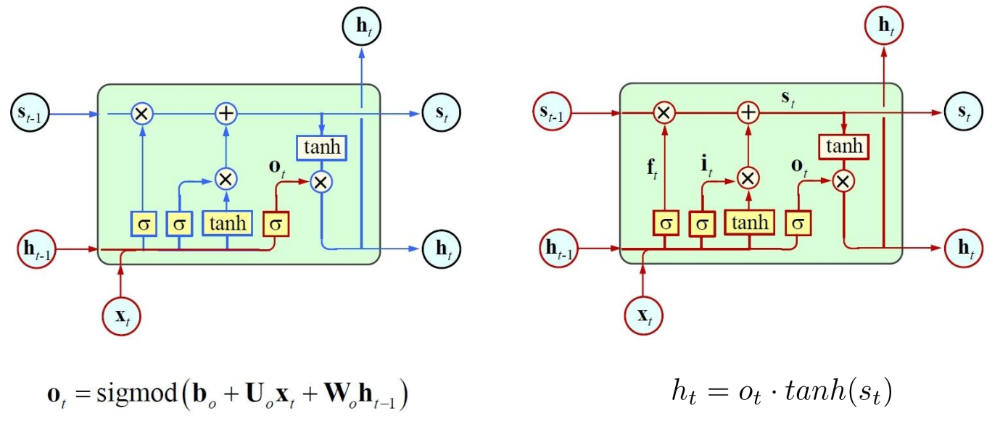
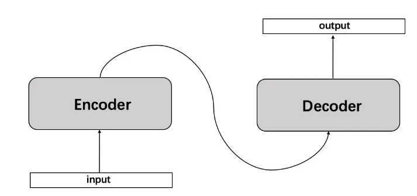
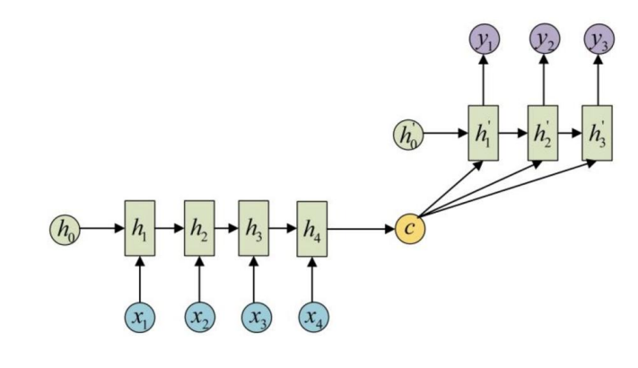
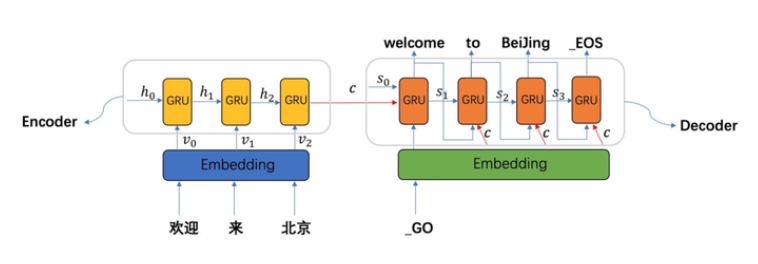
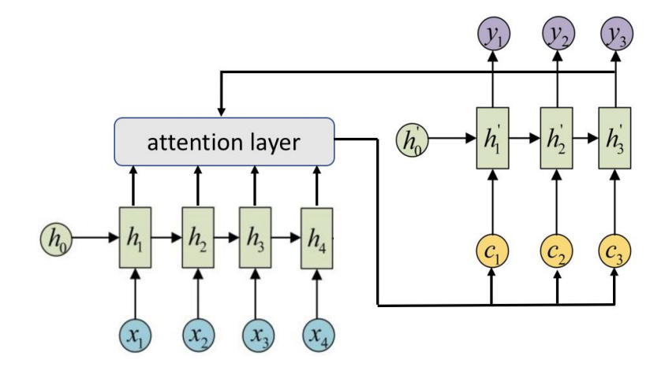
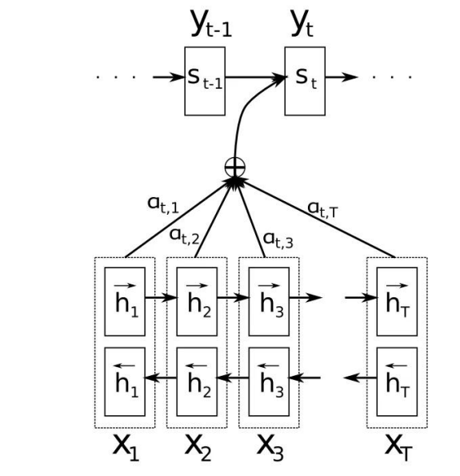

# Deep Learning Classic Model

## RNN - Recurrent Neural Network

>  中文名：循环神经网络 
>
> PPT - page 78

## 什么是RNN

循环神经网络（Recurrent Neural Network, RNN）是一类以序列（sequence）数据为输入，在序列的演进方向进行递归（recursion）且所有节点（循环单元）按链式连接的递归神经网络（recursive neural network）。

RNN是一种特殊的神经网络结构, 它是根据`人的认知是基于过往的经验和记忆`这一观点提出的. 它与DNN,CNN不同的是: 它不仅考虑前一时刻的输入,而且赋予了网络对前面的内容的一种`记忆`功能.

RNN之所以称为循环神经网路，即一个序列当前的输出与前面的输出也有关。具体的表现形式为网络会对前面的信息进行记忆并应用于当前输出的计算中，即隐藏层之间的节点不再无连接而是有连接的，并且隐藏层的输入不仅包括输入层的输出还包括上一时刻隐藏层的输出。

RNN时间线展开图：

$$
t+1或t-1代表的就是时间步，中间（圆园）层信息S？， x_{t-1},x_t,t_{t+1}为输入层，O_{t-1},x_t,t_{t+1}为输出层。
$$

> 时序模型：参考人类思考的方式，按时序步（时间序）将文本（一个字或词）输入至模型里处理，比如”我想吃汉堡“
>
> 前一时间输入的中间层信息，会传递给下一时刻，参与下一时间输出的计算。公式如下

$$
O_t = g(V*S_t)
$$

$$
S_t = f(U * V_t + W * S_{t-1})
$$

具象化的中间信息层的传递图示：

## RNN应用领域

RNN的应用领域有很多, 可以说只要考虑时间先后顺序的问题都可以使用RNN来解决.这里主要说一下几个常见的应用领域：

- 自然语言处理(NLP): 主要有视频处理, 文本生成, 语言模型, 图像处理
- 机器翻译, 机器写小说 
- 语音识别
-  图像描述生成 
- 文本相似度计算 
- 推荐（音乐推荐、网易考拉商品推荐、Youtube视频推荐等新的应用领域）.

## RUN发展

代表性RNN及变体

- 基本RNN：循环网络的基本构成
- LSTM：突破性进展的长短期记忆网络
- GRU：新式的Cell模块单元
- NTM：更大记忆体模型的探索

##  RNN存在的问题

RNN 跟传统神经网络最大的区别在于**每次都会将前一次的输出结果，带到下一次的隐藏层中，一起训练**。也就是说，RNN 前面所有的输入都会对未来的输出产生影响。如下图所示，RNN 中短期的记忆影响较大（如橙色区域），但是长期的记忆影响就很小（如黑色和绿色区域），这就是 RNN 存在的**短期记忆问题**。

> 当处理长文本时，RNN无法处理。

RNN**无法并行训练**，导致训练成本较高。

> RNN变体：将之前所有信息的整合在一块，再做融合和处理，用于解决RNN **短期记忆问题** 问题，来解决RNN的“长文本”问题。

## LSTM - Long Short-Term Memory - 接替RNN

> 长短期记忆网络    
>
> 在Bert出来之前，LP领域的任务都 不管是文本分类或NER(实体提取) 等都是用LSTM来完成。

### 什么是LSTM

由于RNN也有梯度消失的问题，因此很难处理长序列的数据。LSTM是对RNN的改进的特例（Long Short-Term Memory），它可以避免常规RNN的梯度消失，因此在工业界得到了广泛的应用。

Long Short Term Memory networks（以下简称LSTMs），一种特殊的RNN网络，该网络设计出来是为了解决长依赖问题。该网络由 Hochreiter & Schmidhuber (1997)引入，并有许多人对其进行了改进和普及。他们的工作被用来解决了各种各样的问题，直到目前还被广泛应用。

整体表征图（结构图） 

>上图：左侧为t-1的时间步，中间为t时刻的时间步，中侧为t+1时刻的时间步。
>
>α (sigmoid）x不论取何况，所有的值都会被压缩0~1之间，当x1取值越大，α越接近于1，反之接近于0。
>
>一般会把α做成一个门控机制 (见LSTM核心思想) 

所有循环神经网络都具有神经网络的重复模块链的形式。在标准的RNN中，该重复模块将具有非常简单的结构，例如单个tanh层。LSTMs也具有这种链式结构，但它的重复单元不同于标准RNN网络里的单元只有一个网络层，它的内部有四个网络层。

### LSTM核心思路

#### 单元状态

LSTMs的核心是单元状态（Cell State），用贯穿单元的水平线表示。

单元状态有点像**传送带**。它沿着整个链一直走，只有一些微小的线性相互作用。信息很容易在不改变的情况下流动。单元状态如下图所示。

LSTM确实有能力将信息移除或添加到单元状态，并由称为gates的结构小心地进行调节。

> LSTM能处理长文本，是因为始终有一个"s"在不同的时间步上传输

#### 门控机制

门是一种选择性地让信息通过的方式。它们由一个Sigmod网络层和一个点乘运算组成。

因为sigmoid层的输出是0-1的值，这代表有多少信息能够流过sigmoid层。0表示都不能通过，1表示都能通过。

>  一个LSTM里面包含**三个门**来控制单元状态。

三个α (sigmoid），从左到右分别是： 遗忘门，输入门，输出门

> tanh：是对输同值的激活

三个门的表达式：

> 

##### 遗忘门 

遗忘门 是上一个隐层信息 h(t-1) 和 当前输入的信息x(i)息整合(组合成一个非线性的函数)后输入到α里。

> 如果 遗忘门 认为该数据需要丢弃，那么α数值贴近于0，相关于衰减。 越接近于1，数据保留更多，衰减更少。

##### 输入门

输入门依然是上一时刻的信息h(t-1)与当前输入的信息x(i) 组合后，输入到α里。

###### 输入门整合后的图示

> h(t-1)：短期数据
>
> s(t-1)：长期数据
>
> tanh：是指输入信息x(i)与h(t-1)整合后，经过tanh(激活函数）。

###### 输入门与遗忘门的组合

##### 	

## Seq2Seq

### 什么是Seq2Seq

seq2seq是是一种循环神经网络RNN的变种，包含编码器（Encoder）和解码器（Decoder）两个部门，也称为 Encoder-Decoder 模型。

​	

seq2seq是”Sequence to Sequence”的简写，seq2seq模型的核心就是编码器（Encoder）和解码器（Decoder）组成的。

> 1. 输入值： x1,x2,x3,x4 
> 2. （左下角）经过encoder 得到 h1~h4，，每一个h前会有一个α
> 3. （右上角）进入解码阶段：h1~h3是一组模型 - decoder
>
> 4. 自己的初始隐藏层状态  h'0，不再把上下文向量c当成 RNN的初始隐藏层，而是当成每一个神经元的输入（每个神经都拥有一个输入）

### Seq2Seq的数据流程

在Encoder中，“欢迎/来/北京”这些词转换成词向量，也就是Embedding，我们用 `$v_i$`来表示，与上一时刻的隐状态 `$h_{t-1}$`按照时间顺序进行输入，每一个时刻输出一个隐状态`$h_{t}$` ，我们可以用函数`$f$` 表达RNN隐藏层的变换：`$h_t=f(v_i,h_{t-1})$` 。假设有t个词，最终通过Encoder自定义函数`$q$` 将各时刻的隐状态变换为向量 `$c=q(h_0,h_1,...,h_{t})$`，这个 `$c$`就相当于从“欢迎/来/北京”这几个单词中提炼出来的大概意思一样，包含了这句话的含义。

Decoder的每一时刻的输入为Eecoder输出的`$c$` 和Decoder前一时刻解码的输出`$s_{t-1}$` ，还有前一时刻预测的词的向量`$E_{t-1}$` （如果是预测第一个词的话，此时输入的词向量为“_GO”的词向量，标志着解码的开始），我们可以用函数g 表达解码器隐藏层变换： `$s_i=g(c,s_{t-1},E_{t-1})$`。直到解码解出“_EOS”，标志着解码的结束。

### Seq2Seq Attention模型

> 在 Seq2Seq 模型，Encoder 总是将源句子的所有信息编码到一个固定长度的上下文向量 **c**中，然后在 Decoder 解码的过程中向量 **c** 都是不变的。这存在着不少缺陷：
>
> 1. 对于比较长的句子，很难用一个定长的向量 **c** 完全表示其意义。
>
> 2. RNN 存在长序列梯度消失的问题，只使用最后一个神经元得到的向量 **c** 效果不理想。
>
> 3. 与人类的注意力方式不同，即人类在阅读文章的时候，会把注意力放在当前的句子上。

Attention 即**注意力机制**，是一种将模型的注意力放在当前翻译单词上的一种机制。使用了 Attention 后，Decoder 的输入就不是固定的上下文向量 **c**了，而是会根据当前翻译的信息，计算当前的 **c**。

Seq2Seq 是自然语言处理中的一种重要模型，通过在seq2seq结构中加入Attention机制，使seq2seq的性能大大提升，**现在seq2seq被广泛地用于机器翻译、对话生成、文本摘人、人体姿态序列生成等各种任务上**，并取得了非常好的效果。

RNN的attention都是基于decoder中的目标词和encoder的序列中的每一个词计算点积（或者其他的计算方式，如MLP，conv等都可以），然后softmax得到一个概率分布，也就是attention的权值。然后对encoder的序列中的每个词对应的向量做加权和得到最终的attention的结果。具体的如下图：

对于 Decoder 的每一步解码 i ，都有一个输入$Ci$，对输入序列所有隐层信息 h1 ,h2 ,...,hTx进行加权求和。

相当于在预测下一个词时，会把输入序列的隐层信息都看一遍，决定预测预测当前词语输入序列的哪些词最相关。
$$
Ci = \sum_{j=1}^{T_x}a_ijh_j
$$

$$
S_t = f(S_{t-1},y_{t-1},c_t)
$$

【参考】

[Seq2Seq模型介绍](https://zhuanlan.zhihu.com/p/194308943)

[一文看尽RNN（循环神经网络)](https://link.juejin.cn/?target=https%3A%2F%2Fmp.weixin.qq.com%2Fs%3F__biz%3DMzUyODk0Njc1NQ%3D%3D%26mid%3D2247483922%26idx%3D1%26sn%3D9bb257979e579b533db1dffb2c7b5651%26chksm%3Dfa69c13ecd1e482855c3d6b65205354d1d11578f5bb24bbae69b2c5325de455e4711c2c3f3bb%26scene%3D27)

# 附录

##  神经网络中常见的符号含义

- 黄色的盒子是神经网络层 (Neural Network Layer)
- 粉红色的圆圈表示点操作 (Pointwise Operation)，如向量加法乘法，
- 单箭头表示数据流向 (Vector Transfer)
- 箭头合并表示向量的合并（concatenate）操作
- 箭头分叉表示向量的拷贝(Copy) 操作

### BP算法,CNN

BP算法,CNN(卷积神经网络)， 我们会发现, 他们的输出都是只考虑前一个输入的影响而不考虑其它时刻输入的影响, 比如简单的猫,狗,手写数字等单个物体的识别具有较好的效果. 但是, 对于一些与时间先后有关的, 比如视频的下一时刻的预测,文档前后文内容的预测等, 这些算法的表现就不尽如人意了.因此, RNN就应运而生了。

## NER

实体数据的提取

## AI中使用最多的开发语言

python

> C++ 用的不多

**[参考]**

[LSTM（长短期记忆网络](https://mp.weixin.qq.com/s?__biz=MzUyODk0Njc1NQ==&mid=2247483926&idx=1&sn=8cb4861ad6f4a56f8f233c322ebcc5b3&chksm=fa69c13acd1e482ca143d21d476c4f7242a1e438c3a9103fe0931ee18b528176e5c765fa8678&scene=27)

