**Paper:** Attending Is All you Need

#  Transformer - 模型架构

| ---                                                          | ---                                                          |
| ------------------------------------------------------------ | ------------------------------------------------------------ |
|  |  |

# Transformer - 基本流程

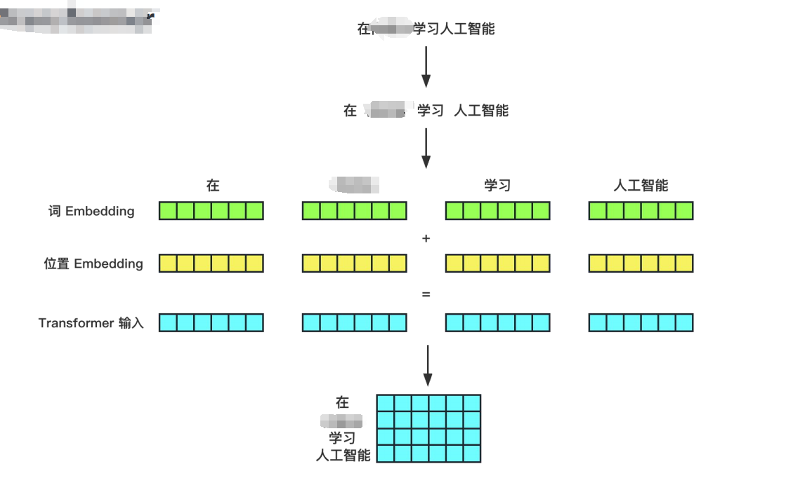

# Transformer - 输入处理

## **Transformer — Position Embedding**

文本是**时序型数据**，词与词之间的顺序关系往往影响整个句子的含义。

**【绝对位置编码】**

给每个位置的位置信息建模。

最简单的实现方式：使用每个词汇的次序 1，2，...，T 作为位置编码信息。

例如，BERT使用的是Learned Positional Embedding，先初始化位置编码，再放到预训练过程中，训练出每个位置的位置向量。

绝对位置编码存在一个严重的问题，假如模型最大序列长度为 512，那么预测阶段输入超过 512 的序列就无法进行处理。

**【相对位置编码】**

相对位置并没有完整建模每个输入的位置信息，而是在**计算Attention的时候考虑当前位置与被Attention的位置的相对距离**。

由于自然语言一般更依赖于相对位置，所以相对位置编码通常也有着优秀的表现。

在Transformer中使用的就是相对位置编码的方式。

**【更好的编码方式】**

目前，已经出现了更优秀的位置编码方式，例如旋转位置编码，它兼顾了绝对位置信息与相对位置信息，我们将在LLaMA系列模型原理一节中详细讲解旋转位置编码。

**【为什么Transformer需要位置编码信息？】**

没有 Position embedding 的 Transformer 模型并不能捕捉序列的顺序，交换单词位置后 attention map 的对应位置数值也会进行交换，并不会产生数值变化，即没有词序信息。所以这时候想要将词序信息加入到模型中。

最简单的思路，就是进行绝对位置编码，给每个词汇按照顺序作为位置编码：
$$
pos = 1，2，3，...，T-1
$$
但是当文本较长时，位置序列没有上界，T位置的编码比0位置的编码大很多，这会导致与 token embedding 合并后出现特征在数值的倾斜和干扰。

如果对上面的位置序列进行归一化呢？
$$
pos = pos / (1 + T)
$$
还是有问题，不同长度的位置编码的步长是不同的，在较短的文本中相邻的两个字的位置编码的差异与长文本中的相邻两个字的位置编码存在数量级上的差异，这会导致**长文本的相对位置关系被稀释**。

*1. 念熹编程培训（T=5）*

*pos(念) = 1 / 5 = 0.2*

*pos(熹）= 2 / 5 = 0.4*

*2. 念熹编程是一家优秀的培训机构，秉承... （T=500）*

*pos(念) = 1 / 500 = 0.002*

*pos(熹） = 2 / 500 = 0.004*

根据上面的讨论，我们希望位置编码满足以下的需求：

1. 能够体现词汇在不同位置的区别（特别是同一词汇在不同位置的区别）。

2. 能够体现词汇的先后次序，并且编码值不依赖于文本的长度。

3. 有值域范围限制。

因此，Transformer 引入了相对位置的概念，使用 sin/cos 函数（有界周期函数）来表示相对位置， sin/cos 函数周期变化规律稳定，使得编码具有一定的不变性。

先看一个简单的例子：
$$
PE(pos) = sin(\frac{pos}{α})
$$
在上式中，通过α来调节函数周期，α越大，1/α 越小，sin图像在纵轴方向被“压扁”，周期变长，相邻位置（横坐标）的位置编码差值变小（相邻横坐标对应y值差异减小）。

在 sin/cos 函数 [-1, 1] 的值域范围内，如果 α 比较大，相邻字符之间的位置差异体现得不明显；如果 α 比较小，在长文本中还是可能会有一些不同位置的字符的编码一样。

因此，Transformer在不同维度上使用不同的函数来生成位置编码，也就是给位置编码的每一维赋予不同的α，同时区分奇偶维度的函数形式。

$$
PE(pos,2i) = sin(pos/10000^{2i/d_model})
$$

$$
PE(pos,2i+1) = cos(pos/10000^{2i/d_model})
$$

在上式中，不同的维度会有不同的α值，周期从2π到10000*2π，并且区分了奇偶维度的函数形式，这使得每一维度上都包含了一定的位置信息，而各个位置字符的编码值又各不相同。

# Transformer  - Encoder

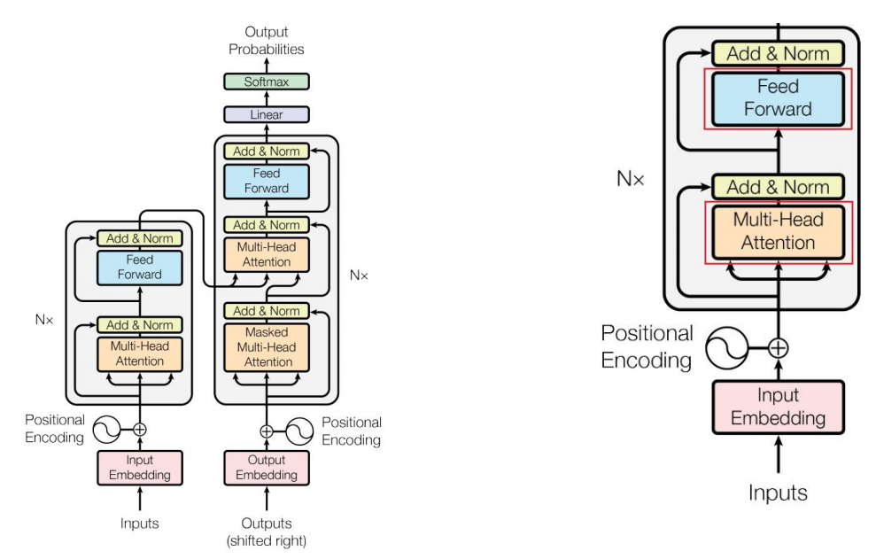

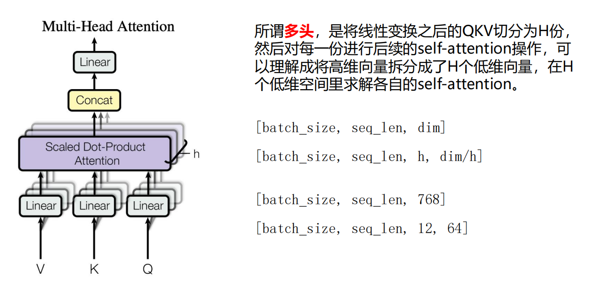

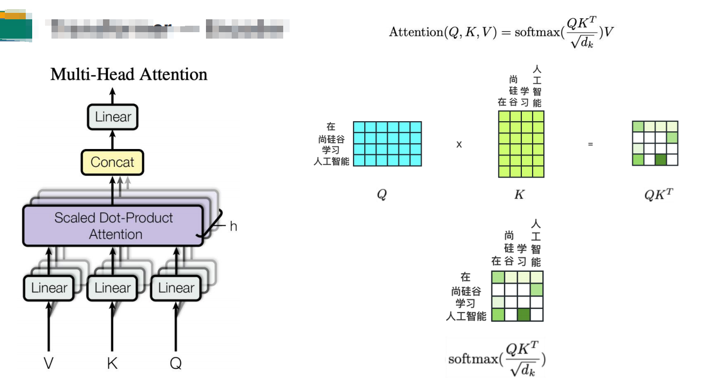

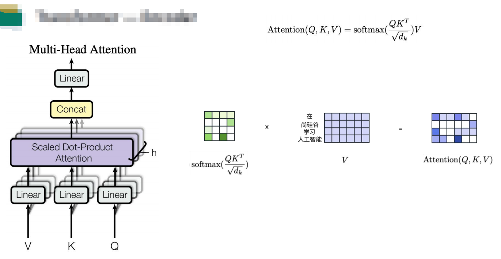

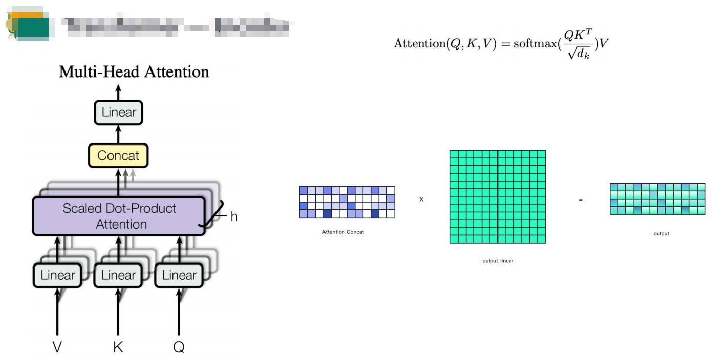

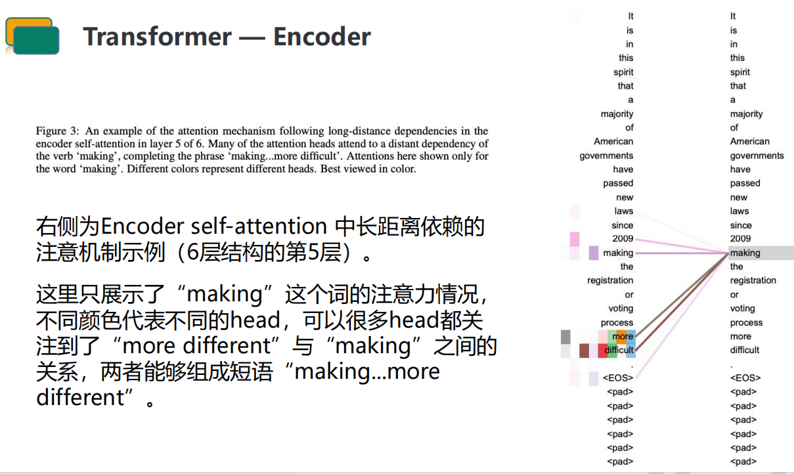

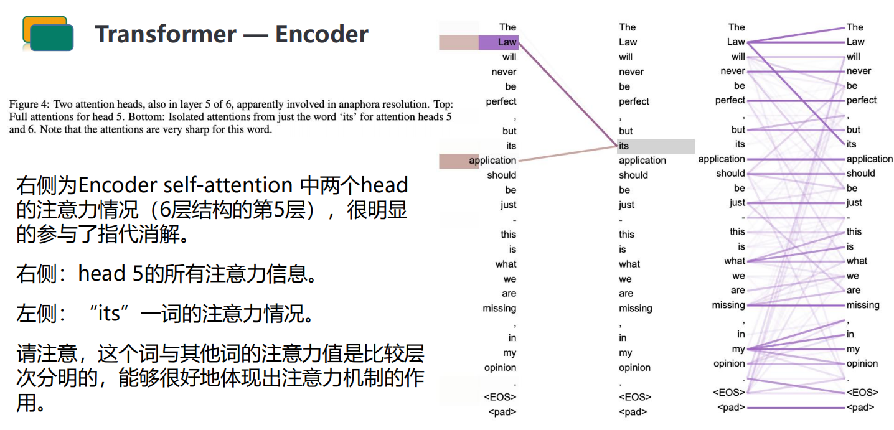

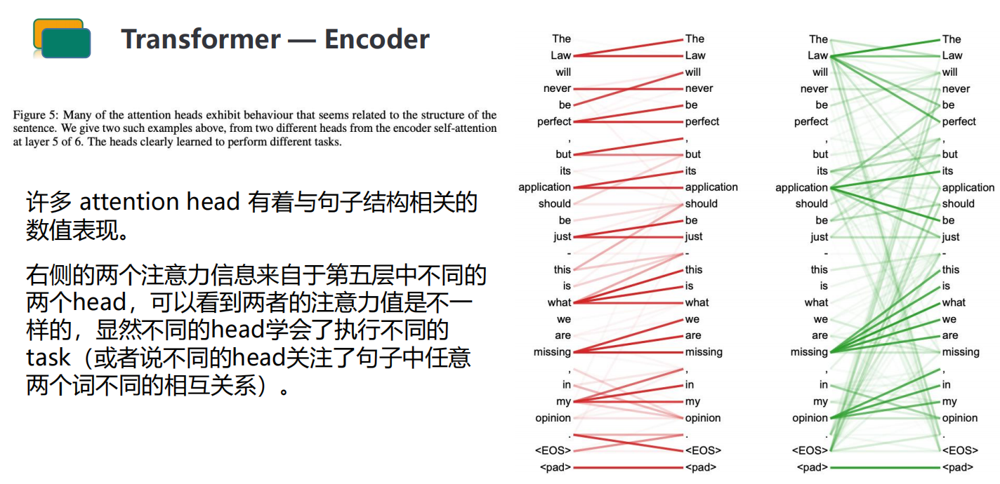

## **Transformer — Add & Norm**

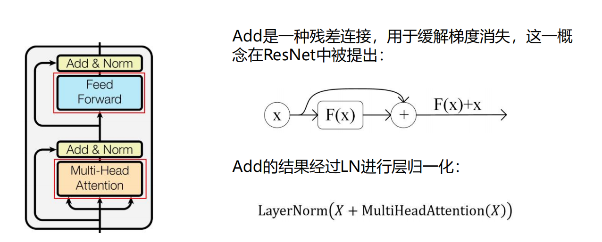

## **Transformer — Feed Forword**

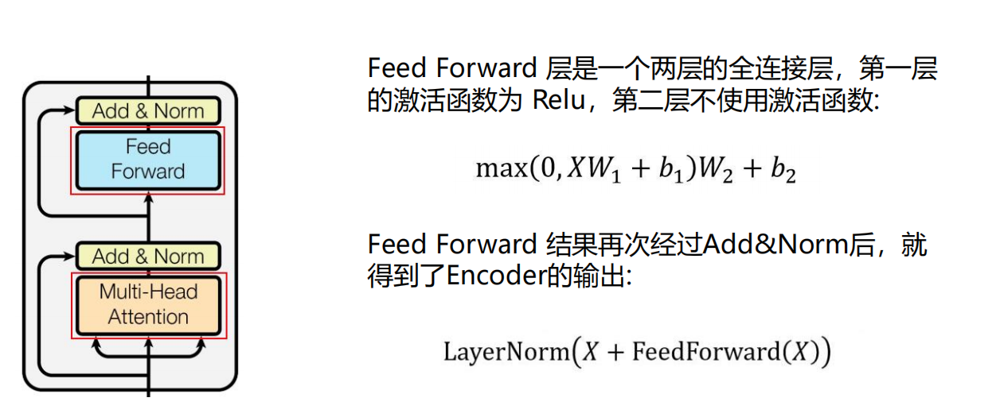

# Transformer  - Decoder

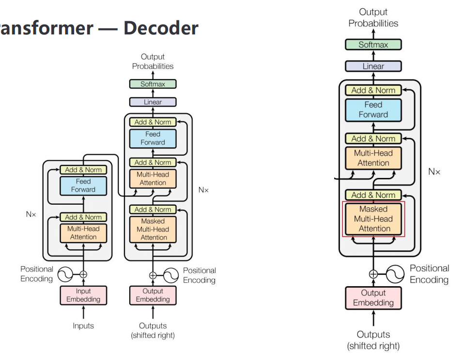

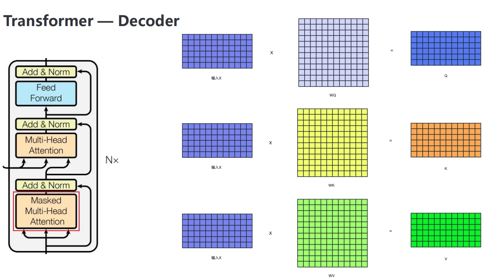

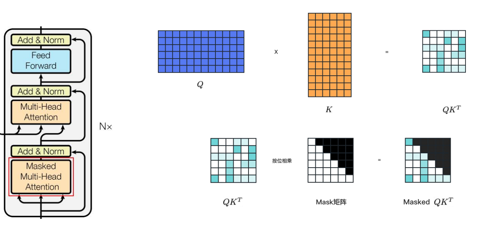

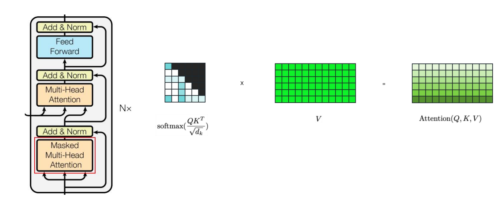

## **Transformer — Output**

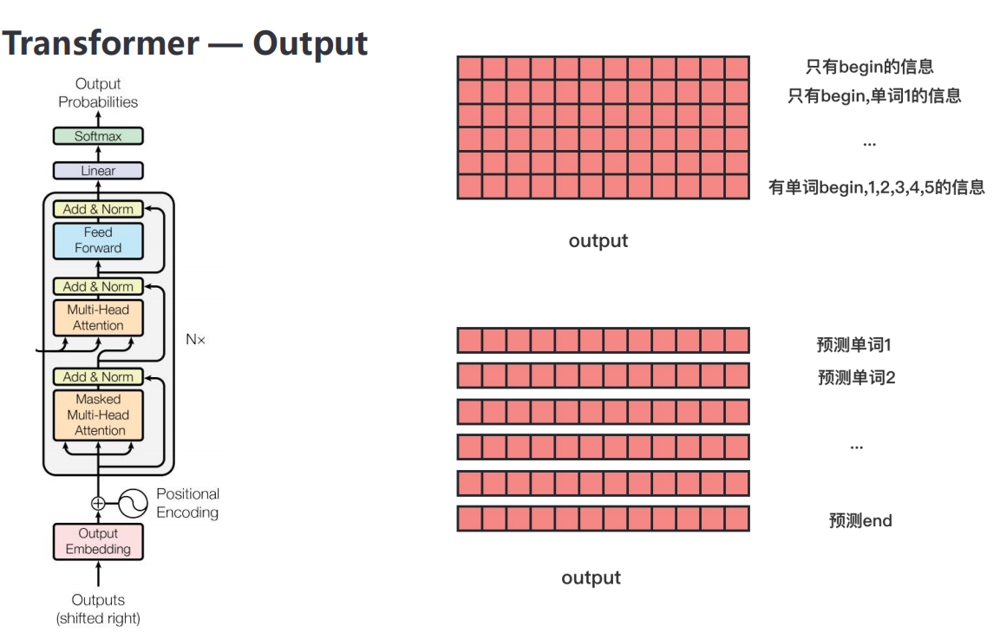

# 

# 附录

## *Attention Is All You Need*论文精读

*Attention Is All You Need* (Transformer) 是当今深度学习初学者必读的一篇论文。

[Attention Is All You Need (Transformer) 论文精读 文字版](https://zhuanlan.zhihu.com/p/569527564) 

