 【Transformer系列（1）】encoder（编码器）和decoder（解码器）

 【Transformer系列（2）】注意力机制、自注意力机制、多头注意力机制、通道注意力机制、空间注意力机制超详细讲解

 【Transformer系列（3）】 《Attention Is All You Need》论文超详细解读（翻译＋精读）

 【Transformer系列（4）】Transformer模型结构超详细解读


# Transformer 概述

Transformer模型是由谷歌公司提出的一种基于自注意力机制的神经网络模型，用于处理序列数据。相比于传统的循环神经网络模型，Transformer模型具有更好的并行性能和更短的训练时间，因此在自然语言处理领域中得到了广泛应用。

> Transformer的论文《Attention is All You Need》，现在是谷歌云TPU推荐的参考模型。哈佛的NLP团队也实现了一个基于PyTorch的版本，并注释该论文。Attention is All You Need：[Attention Is All You Need(https://link.zhihu.com/?target=https%3A//arxiv.org/abs/1706.03762)
>
> Transformer 已发展成 Transformer - Family - 出现了许多分支 


在自然语言处理中，序列数据的输入包括一系列文本、语音信号、图像或视频等。传统的循环神经网络（RNN）模型已经在这些任务中取得了很好的效果，但是该模型存在着两个主要问题：一是难以并行计算，二是难以捕捉长距离依赖关系。为了解决这些问题，Transformer模型应运而生。

作为一种基于自注意力机制的神经网络模型，Transformer模型能够对序列中的每个元素进行全局建模，并在各个元素之间建立联系。与循环神经网络模型相比，Transformer模型具有更好的并行性能和更短的训练时间。


**Transformer模型中包含了多层encoder和decoder**，每一层都由多个注意力机制模块和前馈神经网络模块组成。encoder用于将输入序列编码成一个高维特征向量表示，decoder则用于将该向量表示解码成目标序列。在Transformer模型中，还使用了残差连接和层归一化等技术来加速模型收敛和提高模型性能。


**Transformer模型的核心是自注意力机制（Self-Attention Mechanism）**，其作用是为每个输入序列中的每个位置分配一个权重，然后将这些加权的位置向量作为输出。**自注意力机制的计算过程包括三个步骤：**

1. 计算注意力权重：计算每个位置与其他位置之间的注意力权重，即每个位置对其他位置的重要性。
2. 计算加权和：将每个位置向量与注意力权重相乘，然后将它们相加，得到加权和向量。
3. 线性变换：对加权和向量进行线性变换，得到最终的输出向量。

通过不断堆叠多个自注意力层和前馈神经网络层，可以构建出Transformer模型。


对于Transformer模型的训练，通常采用无监督的方式进行预训练，然后再进行有监督的微调。在预训练过程中，通常采用自编码器或者掩码语言模型等方式进行训练，目标是学习输入序列的表示。在微调过程中，通常采用有监督的方式进行训练，例如在机器翻译任务中，使用平行语料进行训练，目标是学习将输入序列映射到目标序列的映射关系。


#  Transformer-模型架构

| 原文                                                         | 架构图                                                       |
| ------------------------------------------------------------ | ------------------------------------------------------------ |
| 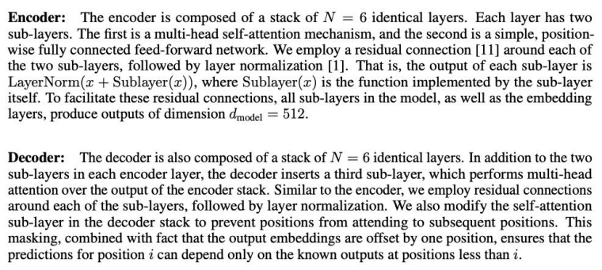 | 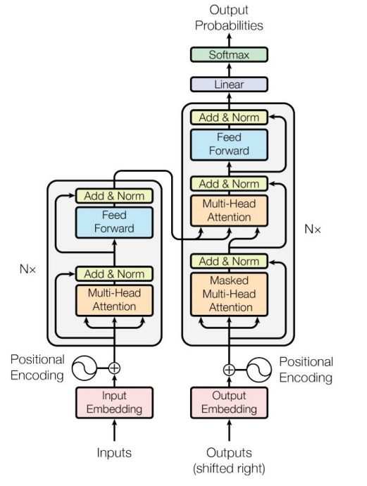 |


简单理解为它是一个黑盒子:

```flow
st=>operation: 机器学习
op=>operation: Transformer(Encoder -》 Decoder)
e=>operation: machine learning

st(right)->op(right)->e
```

上图： 左侧为输入，中间部分就是Transformer模型(分为Encoder与Decoder两大部分）， 右侧为输出


比如：当我们在做文本翻译任务是，我输入进去一个中文，经过这个黑盒子之后，输出来翻译过后的

```flow
st=>operation: 我爱你
op=>operation: Transformer(Encoder -> Decoder)
e=>operation: I love you

st(right)->op(right)->e
```


每个**Encoder** 和 **Decoder** 都包含 6 个 block。这6个block结构相同，但参数各自随机初始化。

> Encoder和Decoder不一定是6层，几层都可以，原论文里采用的是6层

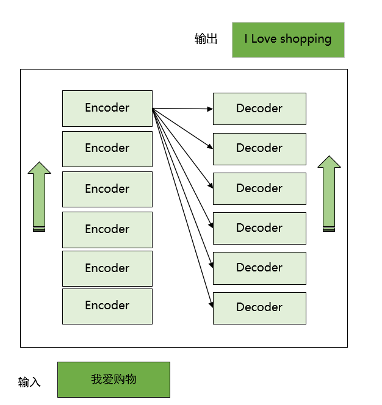


Encoder与Decocer都由N 6个相同层组成。每层有两个子层。

- 第一层是多头自注意机制
- 第二层是一个简单的、位置方向的全连接前馈(神经)网络 
- 残差连接层: LN(Layer normalization)和BN(Batch Normalization)
  每个编码器的每个子层（Self-Attention 层和 FFN 层）都有一个残差连接，再执行一个层标准化操作。我们在两个子层的每一个子层周围使用残差连接: 


Transformer的词向量维度： 512维

> BERT是768维


**与Seq2Seq的区别**

Transformer的架构和Seq2Seq模型（如下图）都采用的是decode-encoder算法，Transformer较之主要改进点是将LSTM 换成了 多头注意力 ；这样改变了Transformer数据处理主试：即一次性输入数据，但在多层注意力层，将数据拆分成多头处理，再汇总归一输出。

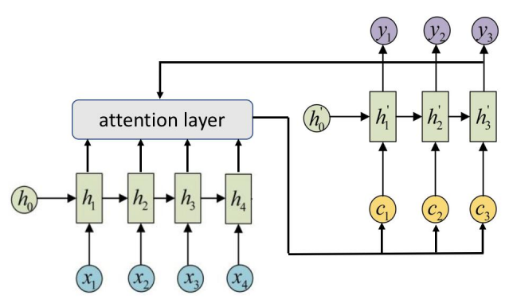


# Transformer 基本流程


从Transformer的总体结构上，可以看出 Transformer 由 Encoder 和 Decoder 两个部分组成，Encoder 和 Decoder 都包含 6 个 block。

Transformer 的工作流程大体如下：

**第一步：**获取输入句子的每一个单词的表示向量 **X**，**X**由单词的 Embedding（Embedding就是从原始数据提取出来的Feature） 和单词位置的 Embedding 相加得到。

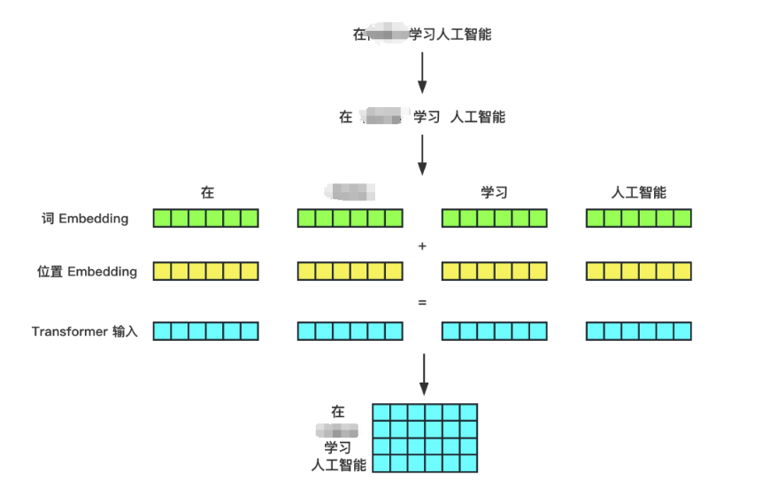


假设有一个1000千万的数据（词）按词切分( 早期按字去切分)，再根据词表大小建立了一个数据矩阵，或lookup的一张表：

- 矩阵的行数，有多少词就有多少行
- 矩阵的列数：取决于模型的维度(训练维度)
  - 可以是 768维，512维等，具体要根据模型的维度和输入数据要求的维度（维护是固定的）

- index：每个词都有一个唯一的index，每一个index对应到矩阵中的一行（0开始计），按词的列表做一个倒排，哪一个词出现的更多，就更靠前。
- 用index去矩阵中去(lookup)查，可以查到唯一的记录，当查询返回第index行的向量，拿到该向量作为词的表征

**Embedding**：把字或词转为向量的过程，称之为Embedding的过程

- 词Embedding：将字或词转为index之后，查表转化为向量，经过模型的迭代之后，矩阵会越来越准确，生成的Embedding的结果就会越来越发。
- 位置Embedding：告诉模型正确的语序  （transformer不是时序模型，是并行输入的，需要专门的位置Embedding才能知道句子顺序)。

**切词工具**： BPE

>  早期是用结巴/Word2vec等，需要自己保存二维数据等。


**第二步：**将得到的单词表示向量矩阵 (如上图所示，每一行是一个单词的表示 **x**) 传入 Encoder 中，经过 6 个 Encoder block 后可以得到句子所有单词的编码信息矩阵 **C**，如下图。单词向量矩阵用$X_{n*d}$ 表示， n 是句子中单词个数，d 是表示向量的维度 (论文中 d=512)。每一个 Encoder block 输出的矩阵维度与输入完全一致。


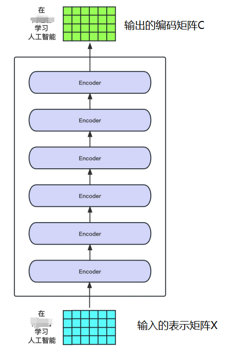

> Transformer的Encoder一共有6层，每一层的结构相同，经过6层的结构处理，每一层的输出是下一层的输出。经过6层输出，到decoder端。


**第三步**：将 Encoder 输出的编码信息矩阵 **C**传递到 Decoder 中，Decoder 依次会根据当前翻译过的单词 1~ i 翻译下一个单词 i+1，如下图所示。在使用的过程中，翻译到单词 i+1 的时候需要通过 **Mask (掩盖)** 操作遮盖住 i+1 之后的单词。

> 在Transformer中 Decoder也是6层，在Decoder过程中，每一步都会结合  Encoder 输出的编码信息矩阵 **C** 执行，最后输出预测结果。


下图 Decoder 接收了 Encoder 的编码矩阵 **C**，然后首先输入一个翻译开始符 "<Begin>"，预测第一个单词 "Learning"；然后输入翻译开始符 "<Begin>" 和单词 "Learning"，预测单词 "artificial"，以此类推。这是 Transformer 使用时候的大致流程，接下来是里面各个部分的细节。

| 预测Learning （输入Begin 预测 输出 Learning)                 | 预测（输入Learning，结合之前的Begin）再预测输出 artificial   |
| ------------------------------------------------------------ | ------------------------------------------------------------ |
|  | 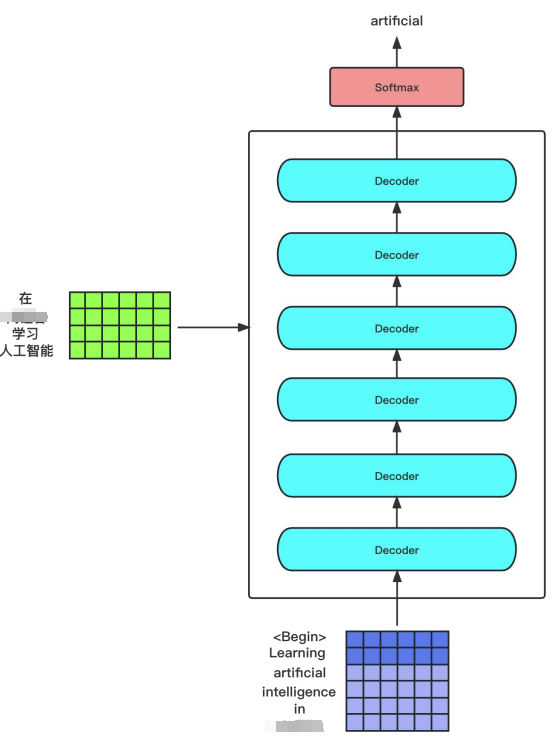 |


# Transformer Inputs

encoder的输入层和decoder的输入层是一样的结构，都是**token embedding（词向量）+ positional embedding（位置向量）**，得到最终的**输入向量**。引入positional embedding主要是解决单单使用token embedding（类似于词袋子），并没有词序的概念的问题，即Transformer 中单词的输入表示 **x**由 **Word Embedding** 和 **Position Embedding**相加得到，如下图：

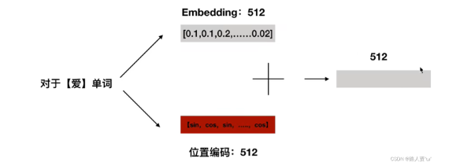


Embedding会提取重要的两个信息： 词的意思 （Input Embedding）、词的位置信息 (Position Embedding)。并将位置信息加入到 Input embedding里面


## word embedding 

**词嵌入层** 负责将自然语言转化为与其对应的独一无二的词向量表达。

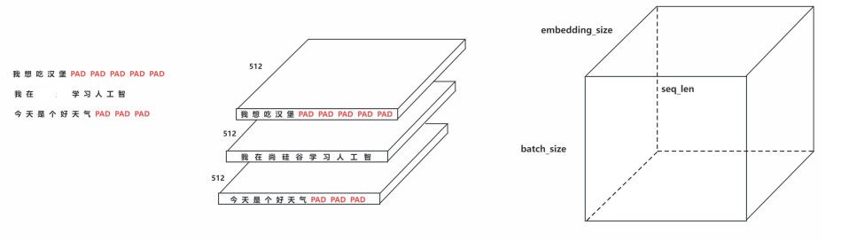

### 处理流程

首先将每个词的信息放入到模型中，得到的数据维度将为： (batch_size, seq_length, bemedding_size(d_model))  

> 维度相关信息: batch_size * embedding_size
>
> batch_size是批次大小, seq_len是序列长度，一批次中一个序列最长的字数  比如：上图中 seq_length为10 （有不足10字的填充，超出的截断）
>
> embedding_size（d_model)：维度，transfomer为512维，BERT是768维
>
> 在Transfomer中： 1个字：1 * 512维；10个字：10  *  512 

#### 文本的<font color=red>PAD</font>与<font color=red>截断</font>

当往encoding输入数据时，如果长度小于规定的长度，会补充特殊字段；如果长度超出规定的长度，会进截断处理。

> 如上图：<font color="red">PAD</font>为填充的特殊文本，截断的信息会造成信息丢失


#### 构建Index

确定处理方式：按字或按词处理。

确定维度：512维 ( 该维度由所选模型而定，Transformer的整个向量传输都是512维 BERT则是768维）

> 比如我想吃汉堡，把 “我”映射成一个 Index，其他字词也如此...这样会构成一张Index表或Lookup表。

该词表结构分析：

1. 行数：行Id为Index，通过Lookup或查询可以查到唯一的一个字/词。 

2. 上图处二张图，**纵深**代表一个字的维护（512维）；那 么seq_length为10个字，则一行字一共有 10*512维。如上中间那幅图的最高一层平板面

3. BatchSize：transformer是按Batchsize处理文字/词的，当所有的文本都转换完成之后，会形成一个高为Batchsize的矩阵，每一切片代表输入的一行文本即一个序列， 如上图最右则矩阵；每一切片都维度计算： ```seq_len * embedding_size``` 。

   >  seq_len为一个序列长度，embedding_size=维度(512)，batch_size：该批次数据（8，16或32...）

4. 最后会以右侧矩阵的方式输入到模型里（每一行的结构都是 ```seq_len * embedding_size``` 的结构，如上一点所述）。

总结：经过Embedding后，文本中的每一个字就被转变为一个向量 ，能够在计算机中表示。《Attention is all you need》这一论文中，作者采用的是 512维词向量表示，也就是说，每一个字被一串长度为512的字向量表示。


### 特征向量工具

**将词汇表示成特征向量的**方法有多种

对于要处理的一串文本，我们要让其能够被计算机处理，需要将其转变为词向量，方法有最简单的one-hot或者有名的Word2Vec等，甚至可以随机初始化词向量。本文只介绍One-hot和数字表示。

#### One-hot编码

One-hot编码使用一种常用的离散化特征表示方法，在用于词汇向量表示时，向量的列数为所有单词的数量，只有对应的词汇索引为1，其余都为0。

举个栗子，“我爱我的祖国”这句话，总长为6，但只有5个不重复字符，用One-hot表示后为6*5的矩阵，如图所示：

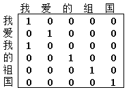

> 但是这种数据类型十分稀疏，即便使用很高的学习率，依然不能得到良好的学习效果。


#### 数字表示

数字表示是指用整个文本库中出现的词汇构建词典，以词汇在词典中的索引来表示词汇。所以与其叫做“数字表示”，还不如叫“索引表示”。

举个栗子，还是“我爱我的祖国”这句话，就是我们整个语料库，那么整个语料库有5个字符，假设我们构建词典{'我':0, '爱':1, '的':2, '祖':3, '':4}，“我爱我的祖国”这句话可以转化为向量：[0, 1, 0, 2, 3, 4]。如图所示。这种方式存在的问题就是词汇只是用一个单纯且独立的数字表示，难以表达出词汇丰富的语义。

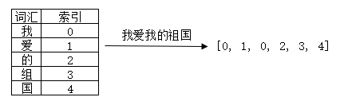


### 主流文本处理工具

现在主流的工具是：BPE ( 在早期用 结巴/Word2vec等需要自己手工切词，自己建词表 )。

> 现阶段中文词表：
>
> - 大模型不需要大动词量，特别是百川2等模型出来之后，完全不需要修改中文词表（基本包含全网数据，垂直领域的词也不需要）
> - （BERT时期需要训练时追修改词表）。
> - llama2直接训练，可能需要修改词表。如果需要添加，只需追加


## Position Embedding

Transformer 中除了Word Embedding，还需要使用Position Embedding 表示单词出现在句子中的位置。**因为 Transformer 不采用 RNN 的结构，而是使用全局信息，因此是无法捕捉到序列顺序信息的**，例如将K、V按行进行打乱，那么Attention之后的结果是一样的。但是序列信息非常重要，代表着全局的结构，因此必须将序列的分词相对或者绝对position信息利用起来。

> 文本是**<font color=red>时序型数据</font>**，词与词之间的顺序关系往往影响整个句子的含义。


### 绝对位置编码

给每个位置的位置信息建模，最简单的实现方式：使用每个词汇的次序 1，2，...，T 作为位置编码信息。

**例如**，BERT使用的是Learned Positional Embedding（可学习的位置嵌入)，先初始化位置编码，再放到预训练过程中，训练出每个位置的位置向量。

>  **绝对位置编码存在一个严重的问题**，假如模型最大序列长度为 512，那么预测阶段输入超过 512 的序列就无法进行处理。


**绝对位置编码的缺陷**

最简单的思路，就是进行绝对位置编码，给每个词汇按照顺序作为位置编码：

```pos = 1，2，3，...，T-1
pos = 1，2，3，...，T-1
```

**缺点：**但是当文本较长时，位置序列没有上界，T位置的编码比0位置的编码大很多，这会导致与 token embedding 合并后出现特征在数值的倾斜和干扰。


如果对上面的位置序列进行归一化呢？

```
pos = pos / (1 + T)
```


**缺点：**还是有问题，不同长度的位置编码的步长是不同的，在较短的文本中相邻的两个字的位置编码的差异与长文本中的相邻两个字的位置编码存在数量级上的差异，这会导致**长文本的相对位置关系被稀释**。

```
1. 念熹编程培训（T=5）
pos(念) = 1 / 5 = 0.2
pos(熹）= 2 / 5 = 0.4

2. 念熹编程是一家优秀的培训机构，秉承... （T=500）
pos(念) = 1 / 500 = 0.002
pos(熹） = 2 / 500 = 0.004
```


### 相对位置编码 - 使用 sin/cos 函数

相对位置并没有完整建模每个输入的位置信息，而是在<font color=red>**计算Attention的时候考虑当前位置与被Attention的位置的相对距离**</font>。

由于自然语言一般更依赖于相对位置，所以相对位置编码通常也有着优秀的表现。

在Transformer中使用的就是相对位置编码的方式。


**因此Transformer 引入了相对位置的概念 - 使用 sin/cos 函数**，根据上面的讨论，我们希望位置编码满足以下的需求：

1. 能够体现词汇在不同位置的区别（特别是同一词汇在不同位置的区别）。

2. 能够体现词汇的先后次序，并且编码值不依赖于文本的长度。

3. 有值域范围限制。

   

使用 sin/cos 函数（有界周期函数）来表示相对位置， sin/cos 函数周期变化规律稳定，使得编码具有一定的不变性 。因此，Transformer在不同维度上使用不同的函数来生成位置编码，也就是给位置编码的每一维赋予不同的α，同时区分奇偶维度的函数形式 。


Position Embedding 用 **PE**表示，**PE** 的维度与Word Embedding 是一样的。PE 可以通过训练得到，也可以使用某种公式计算得到。在 Transformer 中采用了后者，《Attention is all you need》论文中给出的计算公式：
$$
PE_(pos,2i) = sin(\frac{pos}{ 10000^{2i/d_{model}} })
$$

$$
PE_(pos,2i+1) = cos(\frac{pos}{ 10000^{2i/d_{model}} })
$$


其中  pos表示字词的位置，2i表示在512维词向量中的偶数位置，2i+1表示在512维词向量中的奇数位置 d<sub>model</sub> 表示词向量的维度（例如为512）；公式表达的含义是在偶数的位置使用sin函数计算，在奇数的位置使用cos函数计算。为了表示方式， 用 α 表示分母： 10000<sup>2i/d<sub>model</sub></sup>


通过α来调节函数周期，α越大，1/α 越小，sin图像在纵轴方向被“压扁”，周期变长，相邻位置（横坐标）的位置编码差值变小（相邻横坐标对应y值差异减小）。在 sin/cos 函数 [-1, 1] 的值域范围内，如果 α 比较大，相邻字符之间的位置差异体现得不明显；如果 α 比较小，在长文本中还是可能会有一些不同位置的字符的编码一样。


在上式中，不同的维度会有不同的α值，周期从2π到10000*2π，并且区分了奇偶维度的函数形式，这使得每一维度上都包含了一定的位置信息，而各个位置字符的编码值又各不相同。

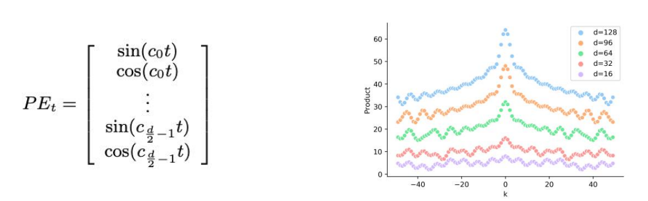

> 从BERT之后，就没有再用sin与cos的方式，是直接变成可训练的形式。该算法了解下即可。
>
> 目前目流的位置编码也是由 RePE或AliBi来实现。


### 更好的编码方式

目前，已经出现了更优秀的位置编码方式，例如旋转位置编码(RoPE)，它兼顾了绝对位置信息与相对位置信息。

> 两个主流的位置编码：RoPE（旋转位置编码）， ALiBi
>
> LLaMA中使用了解旋转位置编码。


# Multi-Head Attention


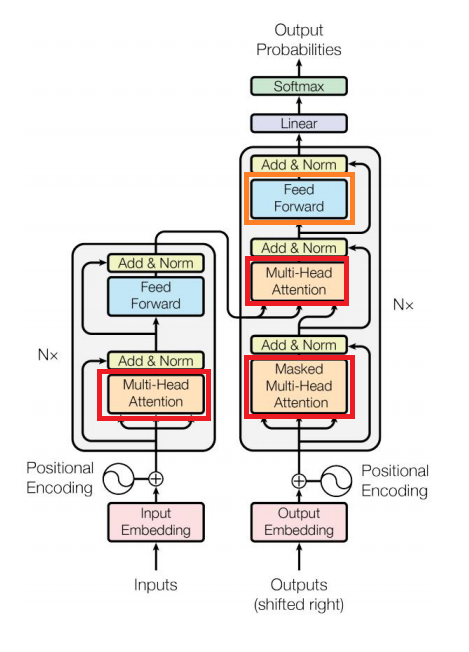

上图中，Encoder与Decoder中红色圈中的部分为 **Multi-Head Attention**，是由多个 **Self-Attention**组成的。

> Multi-Head Attention： 
>
> - Encoder block 包含一个 Multi-Head Attention
> - 而 Decoder block 包含两个 Multi-Head Attention (其中有一个用到 Masked)  
>
> Add & Norm 层  (数据入encoder这后 1/4入Add & Norm 层，3/4入Multi-Head Attention)
>
> - Add 表示残差连接 (Residual Connection) 用于防止网络退化
> - Norm 表示 Layer Normalization，用于对每一层的激活值进行归一化。


这里主讲 **Multi-Head Attention**及**Self-Attention**


## **多头注意力定义**

|                                                              |                                                              |
| ------------------------------------------------------------ | ------------------------------------------------------------ |
| 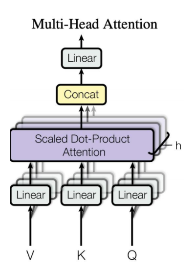 | 所谓<font color="red">**多头**</font>，是将线性的变换之后的Q K V切分为H份，然后对每一份进行后续的self-attention操作，<br>可以理解成将高维向量拆分成了H个低级向量，在H个低维空间里求解各自的**self-attention**。 <br> 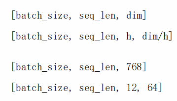 |

>  从上左图是多头注意力结构，中间的Scaled Dot-Product Attention为自注意力部分(Self-Attention 层)。
>
>  从上图可以看到 Multi-Head Attention 包含多个 Self-Attention 层，
>
>  1. 首先将输入**X**分别传递到 h 个不同的 Self-Attention 中，计算得到 h 个输出矩阵**Z**，如上右图的第一行``` [batch_size, seq_len, dim]```
>  2. 再将其拆分，[batch_size, seq_len, h, dim/h]   比如拆成8份 (h-8)  —— 会从512的维度拆成8份
>
>  Batchsize = 1024,  h=8，dim=512，seq_len =5 （BERT's h=12)
>
>  ```
>  [1024,  5,     512  ]
>  [1024,  5,  8, 512/8]
>  
>  [1024,  5,     512  ]
>  [1024,  5,  8,  64  ] 
>  ```


### 多头注意力理解

**多头注意力理解** 

> 为了增加模型的语言表达能力
>
> 1. 代码层面：把原始的维度切成 H份（假如切成8份，h=8，每份是 768/8=96，在每个96维做相关度（即相乘））
> 2. 原理层面：把原来在一个高维空间里衡量一个文本任意两个字之间去衡量相关度，变成了在12维空间里去分别衡量任意两个字的相关度的变化


## 工作原理

1. 如下图：经过position embedding 与 word embedding 计算之后进入Encoder的数据，经过3次线性变化之后，得到 Q K V 。

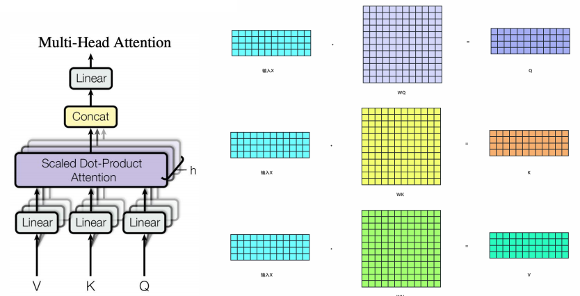


2. 进入Q/K/V的空间：第一张图仍然是一个完整的数据矩阵，经过第一次维度(batch_size）得到下图右侧第1列，然后我们再次矩水平切为每行 (seq_len * 512维的信息)  数据（如下图右侧第二列），再以此按维度再切成H份（如最右侧的第三列）。再然后，计算一个字的维度，即将一个字分成H分，每一份为```512/H```维信息，那么一个完整的字一共有```512/H```维度的信息。

   

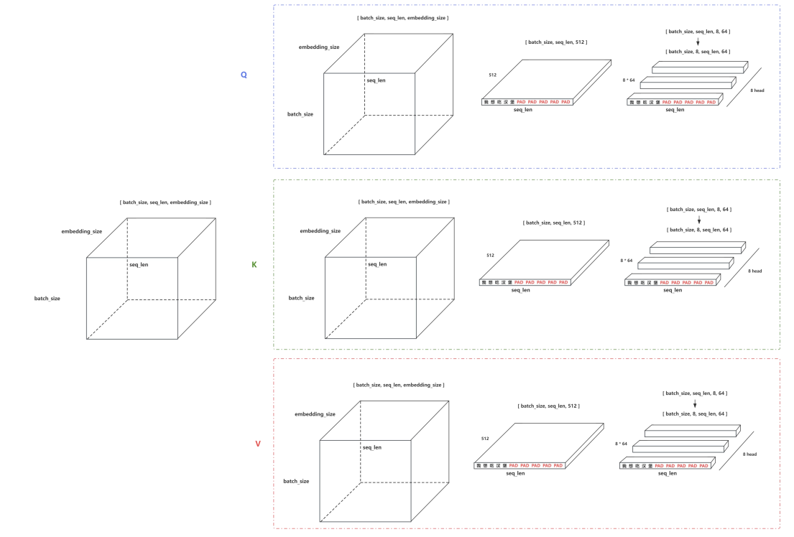


3. 接上图，比如 "我“ 字，按h=8拆分，得64 (512/8) 维的信息。接下来再把我字的第一个64维度的信息分别和其他字的第一个64维的信息进行向量相乘。如果相乘的结果越大代表两个向量相似度接高，越小两个向量的相似度越低。如下图，右侧说明一个序列的第1个字的64维分别与其他字的第一个64维的向量相乘（对于我要吃汉堡，一共是5个字，对应右侧的5个图，从左到向，从上一下：我  想  吃  汉 堡）。

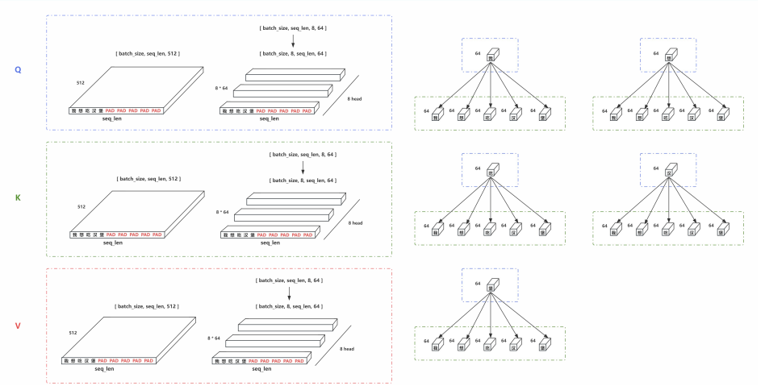


经过上图的拆分，由原来在512的大的维度空间里计算相似度，变成了在H个不同的(```512/H```) 维的子空间里分别去计算任意两个字的相似（关）度。 

> 比如：原来  512 * 512  ==》  变成 8次  64 * 64 这样的向量相乘，即把原来的高维空间映射成了8个不同的64维的子空间，在每次64维的子空间时在，分别去衡量这一序列字词之任意两个字之间的相似度。进而提升模型的表达能力。

下图是一行文字，拆分成多个维度的的具象模型。 


4. 当拆分计算完成，相乘之后，行成如下右图所示的矩阵. 下图右则第一个格子的相似关是： Q* K<sup>t</sup>  ，其他格子也是..最后再聚合起来（线性变化）成为一个512维的矩阵。

   > h=8，相当于从8个角度去衡量了我和我，我和想，我和吃，我和汉，我和保 等相关度的关联关系.。

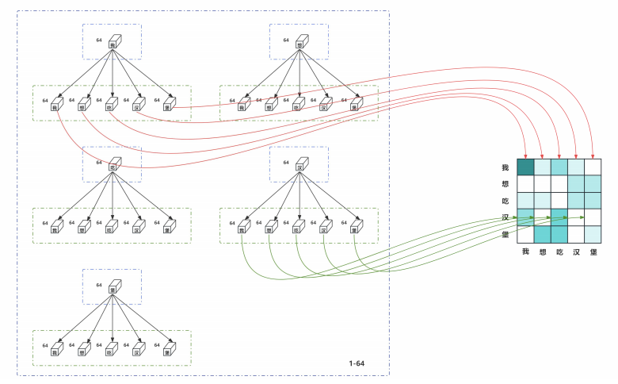

6. 以上就是多头注意力的原理。


## 自注意力-Self-Attention


### Self-Attention结构

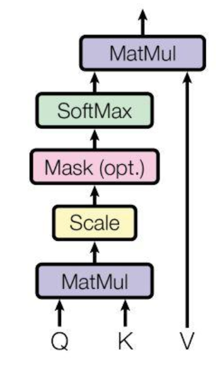

上图是 Self-Attention 的结构，在计算的时候需要用到矩阵**Q(查询),K(键值),V(值)**。在实际中，Self-Attention 接收的是输入(单词的表示向量x组成的矩阵X) 或者上一个 Encoder block 的输出。而**Q,K,V**正是通过 Self-Attention 的输入进行线性变换得到的。

> 自注意力机制将一个单词与句子中的所有单词联系起来，从而提取每个词的更多信息。


Q与K[^T]经过MatMul，生成相似度矩阵。对相似度矩阵每个元素除以  **根号 d<sub>k</sub>**  ，其中d<sub>k</sub>为K的维度大小。这个除法被称为Scale。 当 d<sub>k</sub>很大时，Q*K[^T]的乘法结果方法变大， 进行Scale可使方差变小，训练时梯度更新更稳定。


Mask是机器翻译等自然语言处理任务中经常使用的环节。在机器翻译等NLP场景中，每个样本句子的长短不同，对于句子结束之后的位置，无需参与相似度的计算，否则影响Softmax的计算结果。


> 引用国外博主Transformer详解博文[^2]： 


### Q, K, V 计算

Self-Attention 的输入用矩阵X进行表示，则可以使用线性变量矩阵**WQ, WK ,WV**计算得到**Q,K,V**。计算如下图所示，**注意 X, Q, K, V 的每一行都表示一个单词。**

> 在实际中，Self-Attention 接收的是输入(单词的表示向量x组成的矩阵X) 或者上一个 Encoder block 的输出。而**Q,K,V**正是通过 Self-Attention 的输入进行线性变换得到的。

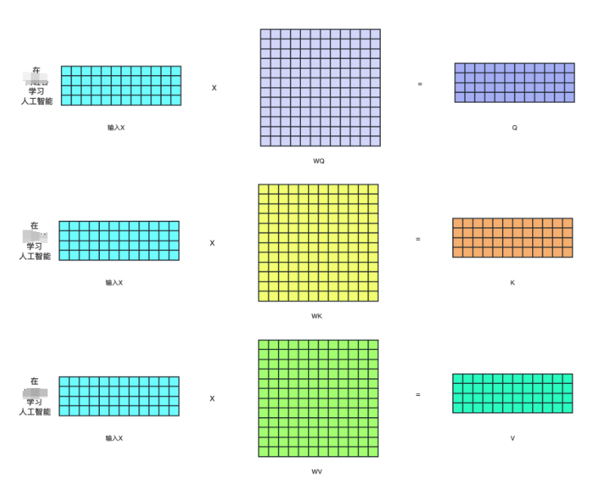


### Self-Attention公式

$$
Attention(Q,K,V) = softmax(\frac{QK^T}{\sqrt{d_k}})*V \\d_k是Q,K矩阵的列数，即向量维度
$$


用图示与解释如下：

|                                                              |                                                              |
| ------------------------------------------------------------ | ------------------------------------------------------------ |
| 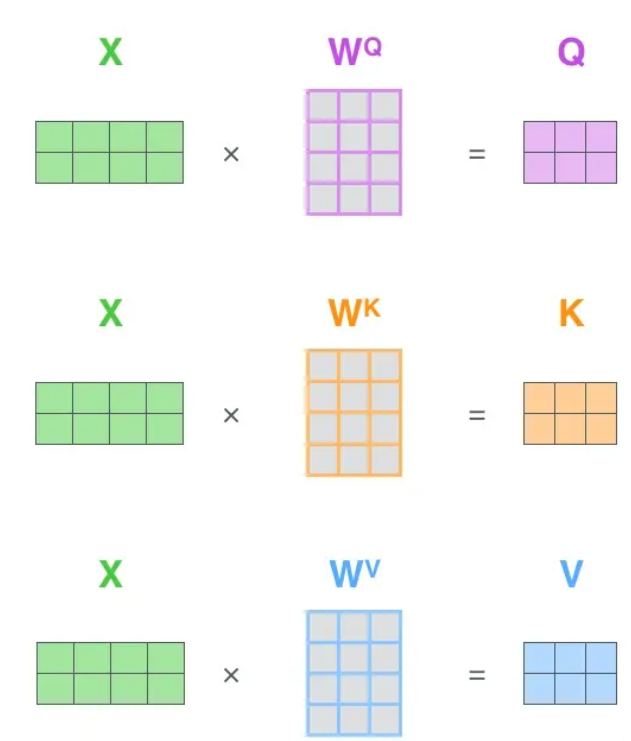 | 其中W[^Q],W[^K]和W[^V]是三个可训练的参数矩阵，输入矩阵X分别与W[^Q],W[^K]和W[^V]相乘，生成Q, K和V， 相当于经历了一次线性变换。Attention不直接使用X，而是使用经过矩阵乘法生成的三个矩阵，因为使用了一次性变换，Attention不直接使用X，而是使用经过矩阵乘法生成的这三个矩阵，因为使用了三个可训练的参数矩阵，可增强模型的拟合能力。 |


【分析】

Transformer[^1]论文中将这个Attention公式描述为：Scaled Dot-Product Attention。其中，Q为Query、K为Key、V为Value。Q、K、V是从哪儿来的呢？Q、K、V其实都是从同样的输入矩阵X线性变换而来的。我们可以简单理解成：
$$
Q = XW^Q \\
K = XW^K \\
V = XW^V
$$


1. 先计算softwax，**当输入为词向量矩阵X（每个词为矩阵中的一行），经过与三个系数 W[^Q],W[^K]和W[^V] 进行矩阵乘法，首先生成Q、K和V。**如下图：

   > 论文中提到的，与其他模型不同的注意力机制不同的点。

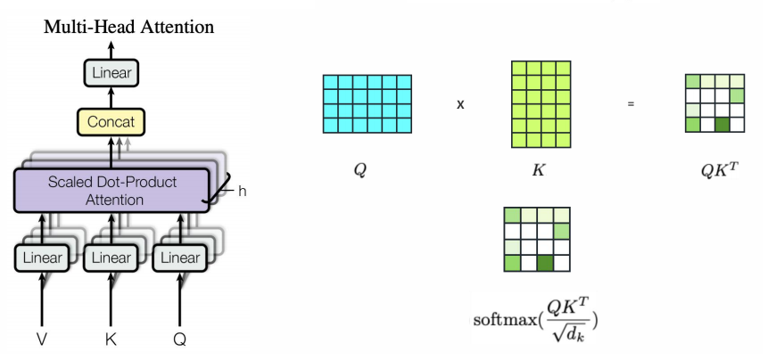


2. 得到${QK^T} 之后，使用Softmax 计算每一个单词对于其他单词的 attention 系数，公式中的 Softmax 是对矩阵的每一行进行 Softmax。 

3. 得到 Softmax 矩阵之后可以和**V**相乘，得到最终的输出**Attention(Q,K,V) **。如下图：


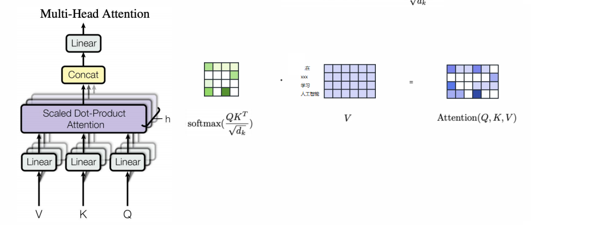

[**举例**]

我们拆分一个单词来看，假设Z表示一个单词的注意力值**Attention(Q,K,V)**， 上图中 Softmax 矩阵的第 1 行表示单词 1 与其他所有单词的 attention 系数，最终单词 1 的输出$Z_1$ 等于所有单词 i 的值$V_i$ 根据 attention 系数的比例加在一起得到，如下图所示：

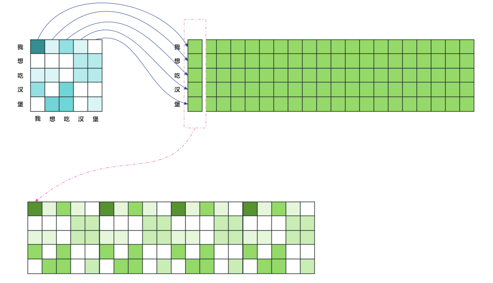


4. 最后再经过一个Conca（聚合）再经过Linear(线性变换)  ，得到最后的整个多头注意力机制的输出。如下图与公式再展示。

   

   
   $$
   Attention(Q,K,V) = softmax(\frac{QK^T}{\sqrt{d_k}})*V
   $$
   

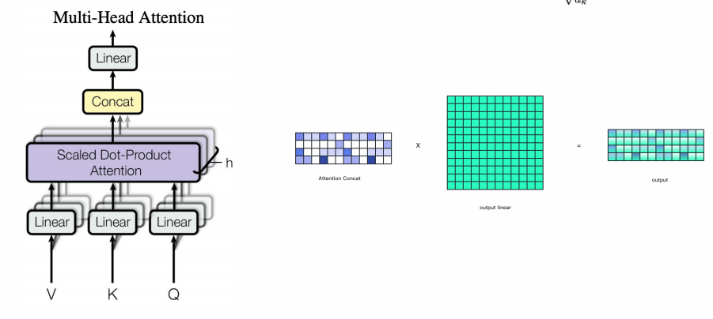


## **为什么要做拆分**


<Table>
    <tr><td>Figure 3: An example of the atention mechanism following long-distance dependencies in theencoder self-attention in layer 5 of 6. Many of the attention heads attend to a distant dependency ofthe verb 'making', completing the phrase 'making...more difficult’ Attentions here shown only forthe word 'making. Different colors represent different heads, Best viewed in color.<br><br>More Actions右侧为Encoder self-attention 中长距离依赖的注意机制示例 (6层结构的第5层)<br/>这里只展示了“making”这个词的注意力情况不同颜色代表不同的head，可以很多head都关注到了“more different”与“making”之间的关系，两者能够组成短语"making...moredifferent。</td>
<td width="30%">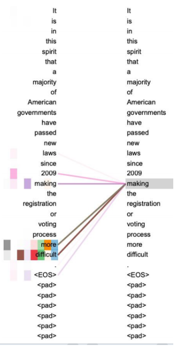 </td></tr></Table>


.

<Table>
    <tr><td>Figure 4: Two attention heads, also in layer 5 of 6, apparently involved in anaphora resolution. Top"ull attentions for head 5. Bottom: Isolated attentions from iust the word its' for attention heads 5and 6. Note that the attentions are very sharp for this word.<br><br>右侧为Encoder self-attention 中两个head的注意力情况 (6层结构的第5层) ，很明显的参与了指代消解
右侧: head 5的所有注意力信息
左侧:“its”一词的注意力情况
请注意，这个词与其他词的注意力值是比较层次分明的，能够很好地体现出注意力机制的作用。</td>
<td width="35%">
    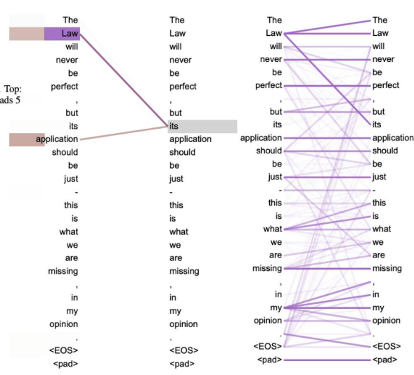 </td></tr></Table>


..

<Table>
    <tr><td>Figure 5: Many of the attention heads exhibit behaviour that seems related to the structure of thesentence. We give two such examples above, from two different heads from the encoder self-attentionat layer 5 of 6. The heads clearly learned to perform different tasks.<br><br>许多 attention head 有着与句子结构相关的数值表现。
右侧的两个注意力信息来自于第五层中不同的两个head，可以看到两者的注意力值是不一样的，显然不同的head学会了执行不同的task (或者说不同的head关注了句子中任意两个词不同的相互关系)。</td>
<td width="35%">
     </td></tr></Table>


【数据维度计算 - 重理解 】

在多头注意力机制中， Embedding vector被分成H头， 所以数据维度为 batch_size * H * seq_len * (d_model / H) 

```shel
[batch_size，seq_len, dim]
[batch_size, seq_len, h, dim/h]
[batch_size, seq_len, 768]
[batch_size, seq_len, 12, 64]
---
[0，1024, 768]
[0，1024, 12，64]
```

> 1. seq_len： 输入的序列长度，比如我爱中国，这就是4 （但如查一个batch_size中有比4更高的，seq按最长的序列计算？？？）
>
> 2. batch_size：一轮处理多少个样本
>
> 3. dim:每一个单词的维度 transformer有512，768等维护
>
> 4. h按分析维度切分，每列1个1H，几列就有几个H？？ 在Transformer中，如果将原始数据维度768，切成12份（H头就分成H分）, 则切后的一份的维度为768/12 = 64
>
>    假设一个体立体：高为batch，长为seq_len，宽为dim：现行维并大部分 h=8或h=12
>
>     举例：**我在上网课 的向量如何切分**
>
>    seq_len * dim 
>
>    假设 seq_len = 1024
>
>     [1024 * 768]  =>  [1024 *  (768/12)] 
>
>    总维度 768，维度分为12分，每维64
>
>     [1024 * 768 *  (768/12)] 


# Transformer Encoder

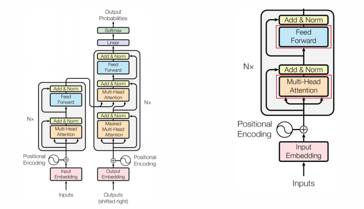


**Encoder: 主要包含前馈神经一网络、Input和多头注意力**

Input Embedding(Token Embedding) 与Position Encoding: 都通过维度转为一个 ```512 * batch_size``` 的向量，再让他们按位相加。完成信息输入之后，会进入encode，如下方流程：

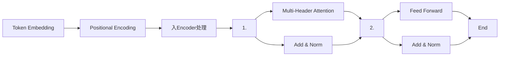
```mermaid
graph LR
A[Token Embedding] --> B[Positional Encoding] -->  C[入Encoder处理]

C -->  

1. --> D[Multi-Header Attention] 
1. --> E[Add & Norm]

2. --> F[Feed Forward]
2. --> G[Add & Norm]

D --> 2.
E --> 2.

F --> End[End]
G --> End[End]

```

> 1. Token Embedding： 文本 -> 先转Index  转  1* 512 维度的向量( Batch-size = 1) 
>
> 2. Position Encoding： 同样把位置信息转为一个 1* 512维度的向量( Batch-size = 1)
>
> ​      再把上述两项按位相加 （会被分为四个分支，进入Encoder中，其中三个分支进入多注意力机制，一个分动词原封不动的输入到 Add & Norm中）
>
> 3. 进入Encoder包含以下几部分内容
>    1. 多投注意力机制
>    2. 残差链接- Add & Norm
>    3. Feed Forward


## Add & Norm

Transformer中的Add&Norm层是一种常用的层，用于在多头自注意力机制和前馈神经网络之间添加残差连接和归一化操作。这个层的作用是将前一层的输出与前一层的输入相加，并进行归一化，以便更好地传递信息和控制梯度。

具体来说，Add&Norm层的操作可以分为以下几个步骤：

1. 残差连接：将前一层的输出与前一层的输入相加，得到一个残差向量。

2. 归一化：对残差向量进行归一化，以便更好地传递信息和控制梯度。归一化可以采用不同的方法，如Layer Normalization或Batch Normalization。

3. 线性变换：对归一化后的向量进行线性变换，以便更好地适应下一层的输入。

**Add&Norm层的作用是在保持信息流畅性的同时，避免梯度消失或爆炸的问题，从而提高模型的训练效率和性能**。


### Add

#### **什么是残差连接**

什么是残差连接呢？残差连接就是把网络的输入和输出相加，即网络的输出为F(x)+x，在网络结构比较深的时候，网络梯度反向传播更新参数时，容易造成梯度消失的问题，但是如果每层的输出都加上一个x的时候，就变成了F(x)+x，对x求导结果为1，所以就相当于每一层求导时都加上了一个常数项‘1’，有效解决了梯度消失问题。

> 残差连接的思想最经典的代表就是2015年被提出的[ResNet](https://link.zhihu.com/?target=https%3A//arxiv.org/pdf/1512.03385.pdf)，这个用于解决深层网络训练问题的模型最早被用于图像任务处理上，现在已经成为一种普适性的深度学习方法。


#### Transformer中的残差连接

在Transformer中，数据过Attention层和FFN层后，都会经过一个**Add & Norm**处理。其中，Add为**residule block（残差模块）**，数据在这里进行**residule connection（残差连接）**。

|                                                              |                                                              |                                                              |
| ------------------------------------------------------------ | ------------------------------------------------------------ | ------------------------------------------------------------ |
| 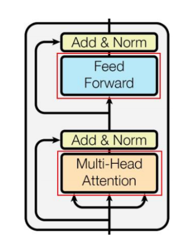 | 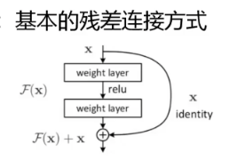 | Add是一种残差连接，用于缓解梯度消失，这一概念在ResNet中被提出: <br>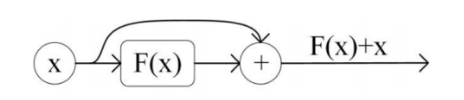 |

> Add: 让反向传播过程中，有一路的梯度不会经过梯度F(x) 计算（如上右图公式中的第一个F(x)），直接经过后续的处理（传播），能够保存更多的梯度信息。有了Add(残差连接)我们可以将网络做的更深。


### Norm

#### 什么是Normalization

Norm即为Normalization（标准化）模块，就是把输入数据X，在输送给神经元之前先对其进行平移和伸缩变换，将X的分布规范化成在固定区间范围的标准分布，简单的说就是 将数据统一到固定区间内。变化框架
$$
h=f(g * \frac{x-μ}{α} + b) \\\\
μ：平移参数 ，δ：缩放参数 ，b ：再平移参数， g 再缩放参数，得到的数据符合均值为 b 、方差为g^2 的分布。
$$


#### **Transformer中Norm**

Normalization 的作用很明显，把数据拉回标准正态分布，因为神经网络的Block大部分都是矩阵运算，一个向量经过矩阵运算后值会越来越大，为了网络的稳定性，我们需要及时把值拉回正态分布。

| 架构                                                         |                                                              |                                                              |
| ------------------------------------------------------------ | ------------------------------------------------------------ | ------------------------------------------------------------ |
|  | 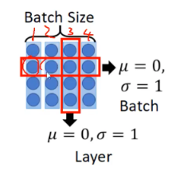 | Add的结果经过LN进行层归一化:<br/><br/>&nbsp;&nbsp;&nbsp;&nbsp;&nbsp;&nbsp;&nbsp;&nbsp;&nbsp;&nbsp;&nbsp;&nbsp;&nbsp;&nbsp;&nbsp;&nbsp;**&nbsp;&nbsp;LayerNorm(X +MultiHeadAttention(X))** |


#### Normalization分类

Normalization 的作用很明显，把数据拉回标准正态分布，因为神经网络的Block大部分都是矩阵运算，一个向量经过矩阵运算后值会越来越大，为了网络的稳定性，我们需要及时把值拉回正态分布。


Normalization根据标准化操作的维度不同可以分为batch Normalization和Layer Normalization，不管在哪个维度上做noramlization，本质都是为了让数据在这个维度上归一化，因为在训练过程中，上一层传递下去的值千奇百怪，什么样子的分布都有。BatchNorm就是通过对batch size这个维度归一化来让分布稳定下来。LayerNorm则是通过对Hidden size这个维度归一化来让某层的分布稳定。 

> **Transformer中采用的是Layer Normalization（层标准化）方式**。**BN是对一个batch-size样本内的每个特征做归一化，LN是对每个样本的所有特征做归一化**。.


**Batch Normalization和Layer Normalization的区别** 

layer normalization和batch normalization类似，缓解Internal Covariate Shift问题，可以**将数据分布拉到激活函数的非饱和区，具有权重/数据伸缩不变性的特点。起到缓解梯度消失/爆炸、加速训练、正则化的效果。**

|                        | 权重矩阵Re-Scaling 不变性 | 权重向量Re-Scaling不变性 | 数据Re-Scaling不变性 |
| ---------------------- | ------------------------- | ------------------------ | -------------------- |
| Batch Normalization    | 不变                      | 不变                     | 不变                 |
| Layer Normalization    | 不变                      | 变化                     | 不变                 |
| Instance Normalization | 不变                      | 不变                     | 不变                 |
| Group Normalization    | 不变                      | 变化                     | 不变                 |

> 类似的normalization方法还有weight / Instance  / group normalization， 比较时一起列出。


**二者原理上有些不同**

batch normalization对一个神经元的batch所有样本进行标准化，layer normalization对一个样本同一层所有神经元进行标准化，前者纵向 normalization，后者横向 normalization。

| Batch Normalization                                          | Layer Normalization                                          |
| ------------------------------------------------------------ | ------------------------------------------------------------ |
| 纵向规范化<br><br> | 横向规范化<br><br>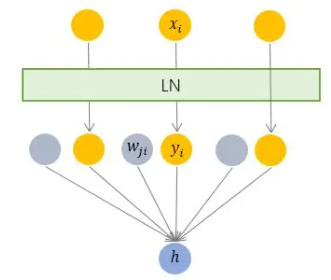 |
| 计算方式<br/>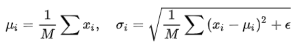<br/><br/>针对单个神经元进行，利用网络训练时一个 mini-batch 的数据来计算该神经元xi的均值和方差,因而称为 Batch Normalization。 | 计算方式<br/>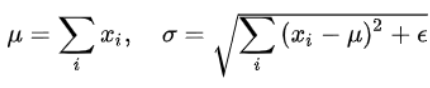<br><br/>综合考虑一层所有维度的输入，计算该层的平均输入值和输入方差，然后用同一个规范化操作来转换各个维度的输入 |

> **Transformer中采用的是Layer Normalization（层标准化）方式**。
>
> - **BN是对一个batch-size样本内的每个特征做归一化，LN是对每个样本的所有特征做归一化**。
> - BN抹杀了不同特征之间的大小关系，但是保留了不同样本间的大小关系；LN抹杀了不同样本间的大小关系，但是保留了一个样本内不同特征之间的大小关系。


**场景上的异同**

- 在BN和LN都能使用的场景中，BN的效果一般优于LN，原因是基于不同数据，同一特征得到的归一化特征更不容易损失信息。
- 但是有些场景是不能使用BN的，例如batch size较小或者序列问题中可以使用LN。这也就解答了**RNN 或Transformer为什么用Layer Normalization？**


**训练和预测的异同**

- LN针对的是单独一个样本，在训练和预测阶段的使用并无差别；

- BN是针对一个batch进行计算的，训练时自然可以根据batch计算，但是预测时有时要预测的是单个样本，此时要么认为batch size就是1，不进行标准化处理，要么是在训练时记录标准化操作的均值和方差直接应用到预测数据，这两种解决方案都不是很完美，都会存在偏差。


## Feed Forword - 前馈神经网络

### 什么是前馈神经网络

#### 人工神经元

人工神经元（Artificial Neuron），简称神经元，是构成神经网络的基本单元。典型的神经元结构如下：

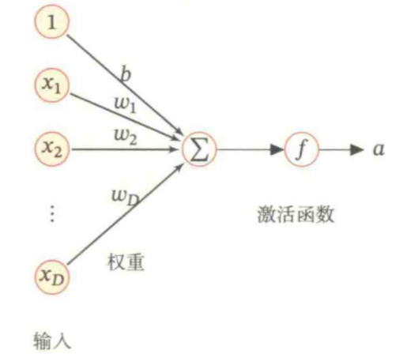


其中，**激活函数**在神经元中是非常重要的。为了增强网络的表示能力和学习能力，激活函数需要具备以下几点性质：

（1）连续并可导（允许少数点上不可导）的非线性函数。

（2）激活函数及其导函数要尽可能简单。

（3）激活函数的导函数的值域要在一个合适的区间内，不能太大也不能太小，否则会影响训练的效率和稳定性。

>  常用的激活函数见以前章节。


#### 网络结构

想要模拟人脑的能力，单一的神经元是远远不够的，需要通过很多神经元一起写作来完成复杂的功能。这样通过一定的连接方式或信息传递方式进行协作的神经元可以看作一个网络，就是神经网络。

到目前为止，常用的神经网络结构有以下三种

**（1）前馈网络**

前馈网络中各个神经元按接收信息的先后分为不同的组。每一组看作一个神基层。每一层中的神经元接收前一层神经元的输出，并输出到下一层神经元。整个网络中的信息是朝一个方向传播，没有反向的信息传播。前馈网络可以看作一个函数，通过简单的非线性函数的多次复合，实现输入空间到输出空间的复杂映射。

> 前馈网络包括**全连接前馈网络**和**卷积神经网络**。

**（2）记忆网络**

记忆网络也称为反馈网络，网络中的神经元不但可以接收其他神经元的信息，也可以接收自己的历史信息。记忆网络可以看作一个程序，具有更强的计算和记忆能力。

> 记忆网络包括**循环神经网络、Hopfield网络、玻尔兹曼机、受限玻尔兹曼机**等。


**（3）图网络**

前馈网络和记忆网络的输入都可以表示为向量或向量序列，但他们都很难处理图结构的数据。在实际应用中，很多数据都是图结构的数据，比如知识图谱、社交网络、分子网络等。

图网络是定义在图结构数据上的神经网络。图中的每个结点都由一个或一组神经元构成。节点之间可以是有向的，也可以是无向的。每个节点可以收到来自相邻节点或自身的信息。


**三种网络结构图**

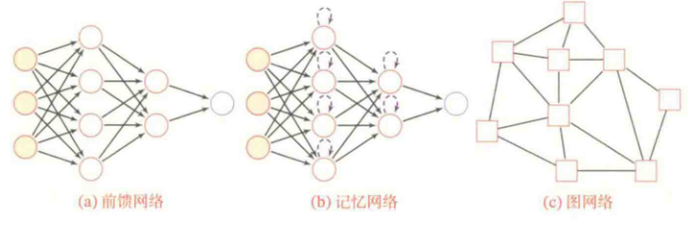

> 上图展示的三种网络结构，圆形节点表示一个神经元，方形结点表示一组神经元。


#### 前馈神经网络


**前馈神经网络定义**

**前馈神经网络(Feedforward Neural Network, FNN)** 是最早发明的简单人工神经网络。在前馈神经网络中，各神经元分别属于不同的层，每一层的神经元可以接收前一层神经元的信号，并产生信号输出到下一层。第0层称为**输入层**，最后一层称为**输出层**，其他中间层称为**隐藏层**。整个网络中无反馈，信号从输入层向输出层单向传播，可用一个有向无环图表示。

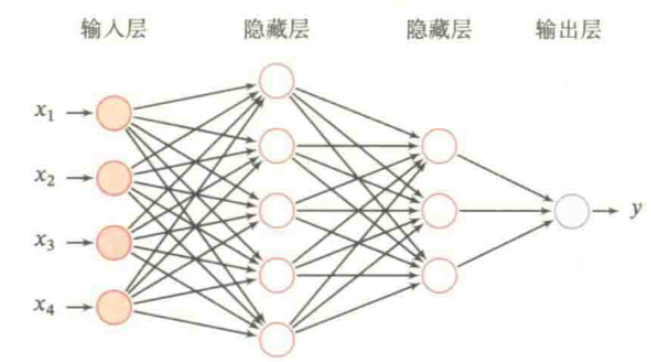


**前缀神经网络使用总结**

1. 神经网络是一种典型的分布式并行处理模型，通过大量神经元之间的交互来处理信息。

2. 神经网络中的激活函数一般为连续可导函数，在神经网络中选择合适的激活函数十分重要。

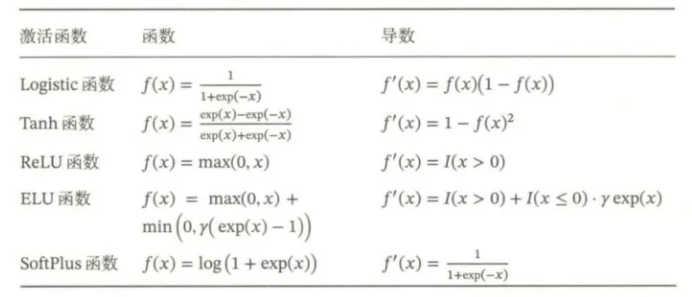

3. 前馈神经网络相邻两层的神经元之间为全连接关系，也成为全连接神经网络

4. 前馈神经网络是一种很强的非线性模型，其能力可以由通用近似定理来保证。


### Transformer中的前馈神经网络

|                                                              |                                                              |
| ------------------------------------------------------------ | ------------------------------------------------------------ |
|  | Feed Forward 层是一个两层的全连接层，第一层的激活函数为 Relu，第二层不使用激活函数: <br>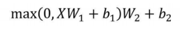<br><br><br/>Feed Forward 结果再次经过Add&Norm后，就得到了Encoder的输出::<br><br>&nbsp;&nbsp;&nbsp;&nbsp;&nbsp;&nbsp;&nbsp;&nbsp;&nbsp;&nbsp;&nbsp;&nbsp;&nbsp;&nbsp;&nbsp;&nbsp;&nbsp;&nbsp;&nbsp;&nbsp;&nbsp;&nbsp;&nbsp;&nbsp;&nbsp;&nbsp;&nbsp;&nbsp;&nbsp;&nbsp;LayerNorm(X + FeedForward(X)) |


# Transformer  - Decoder

## Encoder架构


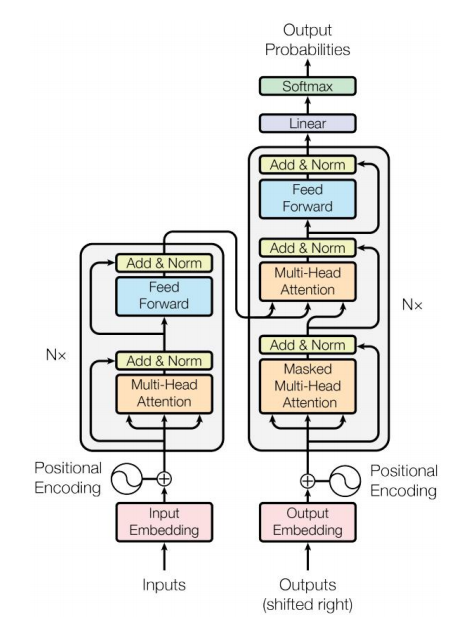

**上图左侧是encoder部份**：输入一个句子，通过multi-head attention，然后经过残差链接（resdituial connection），然后通过一个全连接的神经网络。

> feedForward是对输入的每个multi-head attention的输出做独立处理，且对每个上一层的输出，做相同的矩阵变换。


**上图右侧decoder部份**：Decoder比Encoder多了一个Multi-Head Attention，第一个Multi-Head Attention采用Masked操作，第二个 Multi-Head Attention 层的**K, V**矩阵使用 Encoder 的**编码信息矩阵C**进行计算，而**Q**使用上一个 Decoder block 的输出计算。如下图：


Transformer的Decoder的从输入至输出的整个过程可以用流程图表示

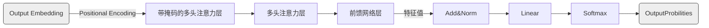
```mermaid
graph LR
A(Output Embedding) --Positional Encoding--> B[带掩码的多头注意力层] --> C[多头注意力层] --> D[前馈网络层] --特征值--> D1[Add&Norm] --> E[Linear] --> F[Softmax] --> G(OutputProbilities)

style A fill:#eee,stroke:#333,stroke-width:1px;
style G fill:#eee,stroke:#333,stroke-width:1px;

```

步1，我们将解码器的输入转换为嵌入矩阵，然后将位置编码加入其中，并将其作为输入送入底层的解码器

步2，解码器收到输入，并将其发送给带掩码的多头注意力层，生成注意力矩阵M

步3：然后将注意力矩阵M和编码器输出的特征值R作为多头注意力层的输入，并再次输出新的注意力矩阵

步4：把从多头注意力层得到的注意力矩阵作为输入，送入前馈网络层，前馈网络层将注意力矩阵作为输入，并将解码后的特征作为输出

步5：步4的输出经过Add&Norm后，做linear及Softmax回归，并输出目标句子的特征 


## Masked Multi-Head Attention

>1. 加入类对焦矩阵，实现并行解码，加速整个训练过程
>2. 引入masked，让生成attention时，保存信息不泄露（没有生成不该生成的数据）

在Seq2Seq时，采用逐步Decoder：在Encoder时一次性输入全部数据，生成第一个字时，会先结合 <起始符> ，再生成；然后用生成第二个字符是 由第一个字符再结合起始符达成，以此类推，**整个过程是串行化的过程**。在大规模的模型训练过程中，解决效率的的关键就是**把串行计算改为计算（并行解码）**，即一次性输入，一次性解码。当一次性将信息全部输入，模型一次计算时会所有数据以至于影响效果？，为避免这种问题的产生，加入了Masked避免信息泄露。输入时还是一次性输入全部数据，在Attention时追加一个Masked保证一个字符只能看到前一个字或起始符，如下图：

|                                                              |                                                              |
| ------------------------------------------------------------ | ------------------------------------------------------------ |
| 第一层: Masked Multi-Head Attention <br><br/>当生成**I**时不能看到Like、eat、hambugers更不能生成他们之间的相关度信息，解码时只能看到自己或<起始符>，后面的信息都隐掉，即masked | 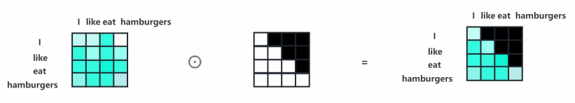 |
| 第二层<br/>Multi-Head Attention<br><br/>把Encoder信息与Decoder信息进行整合 | 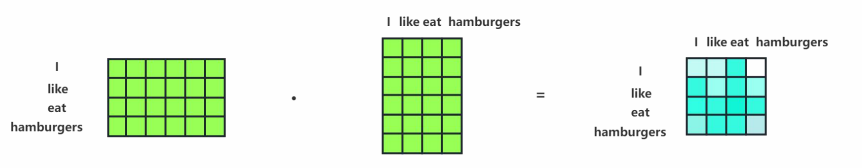 |

> Masked 是Decoder的核心重点，否则数据只有串行化计算。上图中”黑色“代表被隐去的内容，只看到该看一的。


**以翻译为例**，讨论Decoder的操作，即输入（”我爱购物“）  如何输出（“ I love shopping"）的过程：

- 输入：我爱购物
- 输出： I love shopping

---

解码时同时输入”我爱购物“ ，同时解码，计算结果时 <起始符>[+**已输出全部字符**]  来预测或生成后一个字符，即同时解码，具体步骤如下：

**Time Step 1**

- 初始输入： 起始符</s> + Positional Encoding（位置编码）
- 中间输入：（我爱购物）Encoder Embedding
- 最终输出：产生预测“I”

**Time Step 2**

- 初始输入：起始符</s> + “I”+ Positonal Encoding
- 中间输入：（我爱购物）Encoder Embedding
- 最终输出：产生预测“love”

**Time Step 3**

- 初始输入：起始符</s> + “I”+ “love"+ Positonal Encoding
- 中间输入：（我爱购物）Encoder Embedding
- 最终输出：产生预测“shopping”

> Encoder与Decoder并行的任务，可用于翻译。


**从公式导面推导**


1. 输入数据：I love shopping，进行三次线性变化，得到Q，K，V。


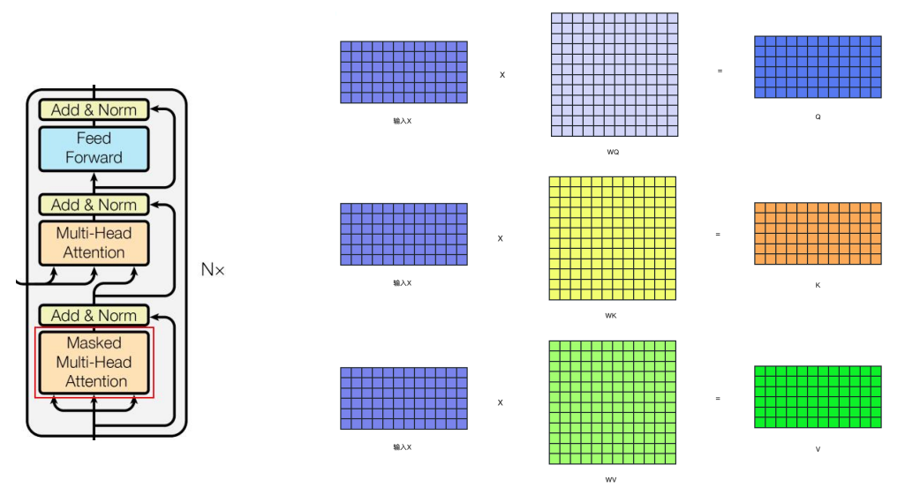

2. 当 Q*K = QK<sup>T</sup> 得到相当度信息后，再和Masked矩阵做按位相乘得到masked  QK<sup>T</sup> 。Masked保存此次解码只看到该看到的，隐去看不到的或不应该看到的。


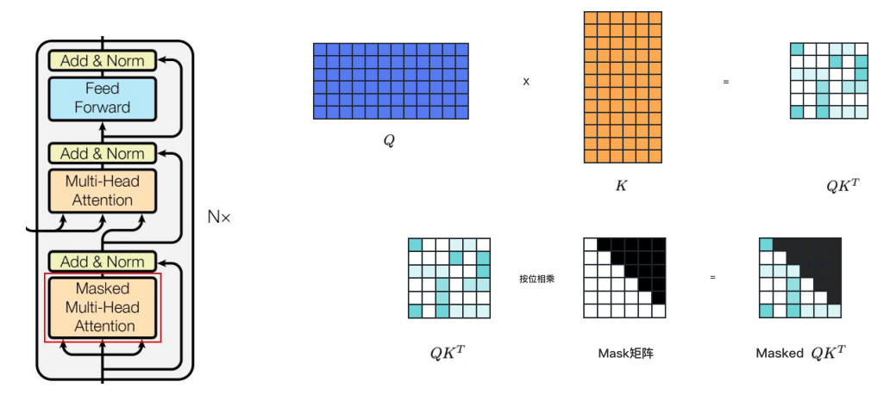


3. 拿到 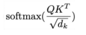 结果 后再和V(value) 进行一个Attention计算得到Attention(Q,K,V)

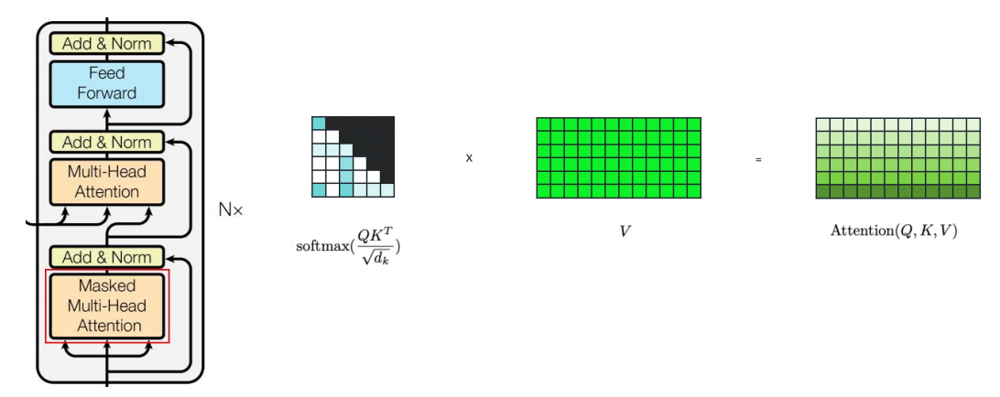


以下是剖析图：主要强调带Masked的得到权重信息(Sequence * Sequence ) 再乘以V(value) 的过程，信息不会泄露。

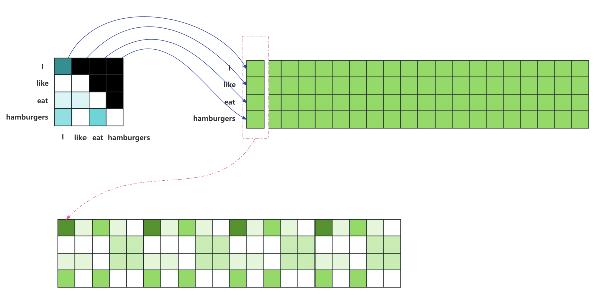


## Multi-Head Attention 

> 也称 Cross Multi-Head Attention ： 即是结合Encoder与Encoder而得到的信息。

把Encoder信息与Decoder信息，进行整合的Attention。Q，K，V 

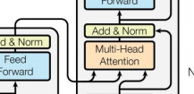

1. K、V： 由Encoder端输出，经过两次线性变化的得到K和V；

2. Q：由Decoder端的masked Multi-head Attention 经过Add & Norm之后得到信息作为Q；

3. 将所有的Q (Decoder端所有的 token）去和encoder的输出去衡量他们之间的相关度，结合Value生成Attention。


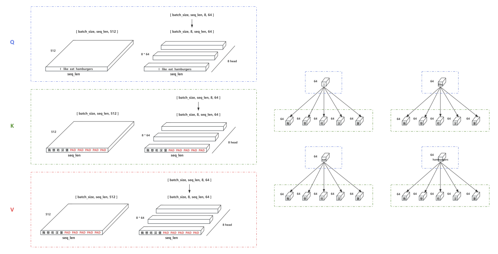

>  所以Cross： 即是结合Encoder与Encoder而得到的信息。


## Output embedding

初始输入：前一时刻Decoder输入+前一时刻Decoder的预测结果 + Positional Encoding

中间输入：Encoder Embedding

Shifted Right：在输出前添加起始符，方便预测第一个Token


论文在Decoder的输入上，对Outputs有Shifted Right操作。Shifted Right 实质上是给输出添加**起始符**/**结束符**，方便预测第一个Token/结束预测过程。

正常的输出序列位置关系如下：

```
0："I"
1："Love"
2："China"
```

但在执行的过程中，我们在初始输出中添加了起始符</s>，相当于将输出整体右移一位（Shifted Right），所以输出序列变成如下情况：

```
0： </s>【起始符】
1： “I”
2： “Love”
3： “China”
```

这样我们就可以通过起始符</s>预测“I”，也就是通过起始符预测实际的第一个输出。


## Output Probabilities

transformer的输出为**output probabilities**，即输出的token是各个词的概率分别是多少。

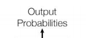


数据经过(cross) multi-head Attention及线性变化之后，输出softmax，最后输出数据。如下图：


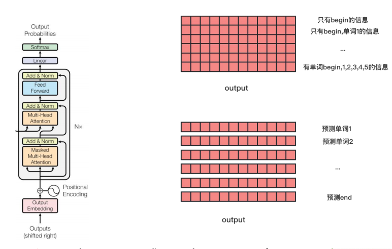


Ttransformer输出是以概率分布的形式输出的。

Transformer模型的**输入是经过词嵌入（word embedding）处理后的词向量序列**，**而输出则是每个位置上单词的概率分布**。在训练过程中，我们希望模型能够根据输入序列预测出正确的输出序列，因此在输出端需要将每个位置上的词汇表中的所有单词都考虑到，并计算出对应的概率分布。在训练过程中，我们会根据预测输出与真实输出之间的差异来更新模型参数，以便模型能够更好地预测正确的输出序列。在推理阶段，我们则可以根据模型输出的概率分布来选择最有可能的单词作为模型的预测输出。


## 总结

### Masked Multi-Headed Attention：

**输入**: Training： 训练数据标签（Y)  2.Position Embedding： 位置编码 + Shifted Right:右移一位

**预测步骤（并行）**：

（以 I love shopping为例）

Decoder输入 Encoder Embedding + </s>（起始符） -->   Decoder：产生预测: **l** 

Decoder输入 Encoder Embedding + </s>（起始符）+ I  -->   Decoder：产生预测: **Love** 

...

### Multi-Head Attention

输入数据获取方式：

Q: Decoder的masked Multi-head Attention输出，再经过 Add&Norm后得到的数所

K\V: 是Encoder输出经过两次线性变化而得。

> 所以被称为cross multi-head attention

### Output Probalities 

- Linear:将输出扩展至Vocabulary Size

- Softmax: 概率化选取概率最高的作为预测结构

- 输入是经过词嵌入（word embedding）处理后的词向量序列，而输出则是每个位置上单词的概率分布


# Transformer模型的优缺点

## Transformer模型的优点

- 更好的并行性能：Transformer模型能够在所有位置同时计算，从而充分利用GPU并行计算的优势，加速了模型的训练和推理过程。
- 能够处理长序列：传统的循环神经网络模型在处理长序列时容易出现梯度消失和梯度爆炸的问题，而Transformer模型使用了自注意力机制，能够同时考虑所有位置的信息，从而更好地处理长序列。
- 更好的性能表现：Transformer模型在自然语言处理领域中已经取得了很多重要的研究成果，比如在机器翻译、文本生成、语言模型等任务中都取得了很好的效果。


## Transformer模型的缺点

- 对于小数据集，Transformer模型的表现可能会不如传统的循环神经网络模型，因为它需要更大的数据集来训练。
- Transformer模型的计算复杂度较高，需要更多的计算资源，比如GPU等。
- Transformer模型的可解释性不如传统的循环神经网络模型，因为它使用了自注意力机制，难以解释每个位置的重要性。


# Transformer模型应用领域

Transformer模型是一种基于注意力机制的神经网络架构，最初被提出用于自然语言处理任务中的序列到序列学习。随着时间的推移，Transformer模型被应用于各种不同的领域，如下所示：

##  自然语言处理

自然语言处理是指将人类语言转换为计算机可以理解的形式，以便计算机能够处理和理解语言。Transformer模型在自然语言处理领域有许多应用案例。以下是一些例子：

1. 文本分类：Transformer模型可以对文本进行分类，例如将电子邮件分类为垃圾邮件或非垃圾邮件。在这种情况下，Transformer模型可以将文本作为输入，然后输出类别标签。
2. 机器翻译：Transformer模型可以将一种语言的文本翻译成另一种语言的文本。在这种情况下，Transformer模型可以将源语言的文本作为输入，然后输出目标语言的文本。
3. 命名实体识别：Transformer模型可以识别文本中的命名实体，例如人名、地名、组织名称等。在这种情况下，Transformer模型可以将文本作为输入，然后输出命名实体的类型和位置。
4. 情感分析：Transformer模型可以对文本进行情感分析，例如判断一篇文章是积极的还是消极的。在这种情况下，Transformer模型可以将文本作为输入，然后输出情感极性。

## 语音识别

语音识别是指将人类语音转换为计算机可以理解的形式，以便计算机能够处理和理解语音。一些最新的研究表明，基于Transformer的语音识别系统已经取得了与传统的循环神经网络（RNN）和卷积神经网络（CNN）相媲美的性能。下面是一些Transformer模型在语音识别领域的应用案例：

1. 语音识别：Transformer模型可以对语音信号进行识别，例如将语音转换为文本。在这种情况下，Transformer模型可以将语音信号作为输入，然后输出文本结果。
2. 语音合成：Transformer模型可以将文本转换为语音信号。在这种情况下，Transformer模型可以将文本作为输入，然后输出语音信号。
3. 说话人识别：Transformer模型可以识别不同说话者的语音信号。在这种情况下，Transformer模型可以将语音信号作为输入，然后输出说话者的身份。
4. 声纹识别：Transformer模型可以对声音信号进行识别，例如将声音转换为特征向量。在这种情况下，Transformer模型可以将声音信号作为输入，然后输出特征向量。

这些应用案例只是Transformer模型在语音识别领域中的一部分应用。由于Transformer模型具有处理变长序列数据的能力和更好的性能，因此在语音识别领域中得到了广泛的应用。

##  计算机视觉

计算机视觉是指让计算机理解和分析图像和视频。Transformer模型在计算机视觉领域也有广泛应用。以下是一些例子：

1. 图像分类：Transformer模型可以对图像进行分类，例如将图像分类为不同的物体或场景。在这种情况下，Transformer模型可以将图像作为输入，然后输出类别标签。
2. 目标检测：Transformer模型可以检测图像中的物体，并将它们分割出来。在这种情况下，Transformer模型可以将图像作为输入，然后输出物体的位置和大小。
3. 图像生成：Transformer模型可以生成新的图像，例如生成一张艺术作品或者修改一张图像。在这种情况下，Transformer模型可以将图像作为输入，然后输出新的图像。

这些应用案例只是Transformer模型在计算机视觉领域中的一部分应用。由于Transformer模型具有处理变长序列数据的能力和更好的性能，因此在计算机视觉领域中得到了广泛的应用。


## 强化学习

Transformer模型在强化学习领域的应用主要是应用于策略学习和值函数近似。强化学习是指让机器在与环境互动的过程中，通过试错来学习最优的行为策略。在强化学习中，模型需要通过学习状态转移概率，来预测下一个状态和奖励，从而实现增强学习。

1. Transformer模型可以通过多头注意力机制来处理多个输入序列，并将它们融合成一个输出序列。在强化学习中，Transformer模型可以将当前状态作为输入，然后输出一个行动策略。具体而言，Transformer模型可以学习到状态转移概率函数，使得在当前状态下，选择行动后可以获得最大的奖励。

2. Transformer模型还可以用于值函数近似。值函数是指在给定状态下，执行一个特定行动所能获得的期望奖励。在强化学习中，值函数通常是通过蒙特卡罗方法来估计的。而Transformer模型可以通过学习值函数来近似这些值，从而提高强化学习的效率和精度。

3. Transformer模型已经被广泛应用于自然语言处理、语音识别、计算机视觉和强化学习等领域，并且在这些领域中都取得了显著的成果。它的广泛应用前景表明，Transformer模型在未来的人工智能领域中将扮演着越来越重要的角色。


总体来说，Transformer模型是一种高效、灵活、易于实现的神经网络模型，其在自然语言处理领域中发挥着越来越重要的作用。随着深度学习技术的不断发展，Transformer模型必将在未来的自然语言处理领域中发挥越来越重要的作用。


# 附录

## 自注意力机制

[注意力机制](https://so.csdn.net/so/search?q=注意力机制&spm=1001.2101.3001.7020)一直是一个比较热的话题，其实在很早之前就提出了。不过真正火起来是从谷歌发表了《Attention Is All You Need》这篇论文后。这篇论文本来是NLP领域的，不过在CV领域也有越来越多人开始引入注意力机制。


### 注意力的理解

娱乐圈的明星大咖们，他们都拥有许多粉丝，不同的粉丝对其偶像的关注也是不同的。 举几个栗子：

- 明星本人：看人-->看脸
- 明星相关新闻：看文章-->看标题
- 重点新闻事件： 看段落-->看开头


**注意力机制**其实是源自于人对于外部信息的处理能力。由于人每一时刻接受的信息都是无比的庞大且复杂，远远超过人脑的处理能力，因此人在处理信息的时候，会将注意力放在需要关注的信息上，对于其他无关的外部信息进行过滤，这种处理方式被称为注意力机制。


我用通俗的大白话解释一下：注意力呢，对于我们人来说可以理解为“关注度”，对于没有感情的机器来说其实就是赋予多少权重(比如0-1之间的小数)，越重要的地方或者越相关的地方就赋予越高的权重。


### 注意力机制的应用

#### Query & Key & Value

- **Q: 查询（Query）：** 指的是查询的范围，自主提示，即主观意识的特征向量
- **K: 键（Key）：** 指的是被比对的项，非自主提示，即物体的突出特征信息向量
- **V: 值（Value） ：** 则是代表物体本身的特征向量，通常和Key成对出现

注意力机制是通过**Q**与**K**的注意力汇聚（给定一个 **Q**，计算Q与**K**的相关性，然后根据**Q**与**K**的相关性去找到最合适的 **V**）实现对**Value**的注意力权重分配，生成最终的输出结果。

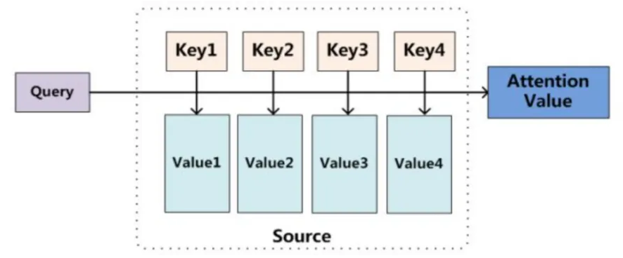

> 举例：
>
> 1. 当你用上淘宝购物时，你会敲入一句关键词（比如：显瘦），这个就是**Query**。
> 2. 搜索系统会根据关键词这个去查找一系列相关的**Key**（商品名称、图片）。
> 3. 最后系统会将相应的 **Value** （具体的衣服）返回给你。


####  注意力机制计算过程

输入Query、Key、Value：

- **阶段一：** 根据Query和Key计算两者之间的相关性或相似性（常见方法点积、余弦相似度，MLP网络），得到注意力得分；

$$
点积：Similarity(Query,Key_i) = Query * Key_i
$$


$$
Consine: Similarity(Query, Key_i) = \frac{Query * Key_i}{||Query||*||Key_i||}
$$

$$
MIL网络：Similarity(Query,Key_i) = MLP(Query, Key_i)
$$


- **阶段二：**对注意力得分进行缩放scale（除以维度的根号），再softmax函数，一方面可以进行归一化，将原始计算分值整理成所有元素权重之和为1的概率分布；另一方面也可以通过softmax的内在机制更加突出重要元素的权重。一般采用如下公式计算：


$$
a_i = Softmax(Sim_i) = \frac{e^{sim_i}}{\Sigma_{j=1}^{L_x}*a_i*Value_i}
$$


- **阶段三：**根据权重系数对Value值进行加权求和，得到Attention Value（此时的V是具有一些注意力信息的，更重要的信息更关注，不重要的信息被忽视了）；

$$
Attention(Query,Source) = \Sigma_{j=1}^{L_x}*a_i*Value_i
$$


- 这三个阶段可以用下图表示：

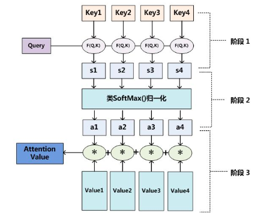


 

### 自注意力机制：Self-Attention

#### 理解自注意力机制

**自注意力机制**实际上是注意力机制中的一种，也是一种网络的构型，它想要解决的问题是<font color='red'>神经网络接收的输入是很多大小不一的向量，并且不同向量向量之间有一定的关系，但是实际训练的时候无法充分发挥这些输入之间的关系而导致模型训练结果效果极差</font>。比如

- 机器翻译(序列到序列的问题，机器自己决定多少个标签)
- 词性标注(Pos tagging一个向量对应一个标签)
- 语义分析(多个向量对应一个标签)等文字处理问题。

针对全连接神经网络对于多个相关的输入无法建立起相关性的这个问题，通过自注意力机制来解决，<font color='red'>自注意力机制实际上是想让机器注意到\**整个输入中不同部分之间的相关性</font>。


自注意力机制是注意力机制的变体，其<font color='red'>减少了对外部信息的依赖，更擅长捕捉数据或特征的内部相关性</font>。自注意力机制的关键点在于，<font color='red'>Q、K、V是同一个东西，或者三者来源于同一个X，三者同源</font>。通过X找到X里面的关键点，从而更关注X的关键信息，忽略X的不重要信息。**不是输入语句和输出语句之间的注意力机制，而是输入语句内部元素之间或者输出语句内部元素之间发生的注意力机制**。


**注意力机制和自注意力机制的区别：**

-  **注意力机制的 Q 和 K 是不同来源的**，例如，在Encoder-Decoder模型中，K是Encoder中的元素，而Q是Decoder中的元素。在中译英模型中，Q是中文单词特征，而K则是英文单词特征。

-  **自注意力机制的 Q 和 K 则都是来自于同一组的元素**，例如，在Encoder-Decoder模型中，Q和K都是Encoder中的元素，即Q和K都是中文特征，相互之间做注意力汇聚。也可以理解为同一句话中的词元或者同一张图像中不同的patch，这都是一组元素内部相互做注意力机制，因此，自注意力机制（self-attention）也被称为内部注意力机制（intra-attention）。


**自注意力机制的问题**

自注意力机制的原理是**筛选重要信息，过滤不重要信息**，这就导致其有效信息的抓取能力会比CNN小一些。这是因为自注意力机制相比CNN，无法利用图像本身具有的尺度，平移不变性，以及图像的特征局部性（图片上相邻的区域有相似的特征，即同一物体的信息往往都集中在局部）这些先验知识，只能通过大量数据进行学习。**这就导致自注意力机制只有在大数据的基础上才能有效地建立准确的全局关系，而在小数据的情况下，其效果不如CNN**。

另外，自注意力机制虽然考虑了所有的输入向量，**但没有考虑到向量的位置信息**。在实际的文字处理问题中，可能在不同位置词语具有不同的性质，比如动词往往较低频率出现在句首。


#### 如何运用自注意力机制

**第一步：得到Q，K，V的值**

输入为词向量矩阵X（每个词为矩阵中的一行），经过与三个系数 W[^Q],W[^K]和W[^V] 进行矩阵乘法，首先生成Q、K和V。

> `q1 = X1 * WQ`，`q1`为`Q`矩阵中的行向量，`k1`等与之类似。


第二步：**Matmul**

进行QK[^t]计算，得到相似度。

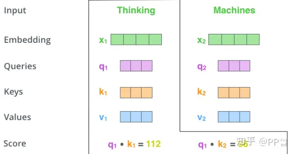


第三步： **Scale+Softmax**

将刚得到的相似度除以 **根号 d<sub>k</sub>** ，再进行Softmax。经过Softmax的归一化后，每个值是一个大于0小于1的权重系数，且总和为0，这个结果可以被理解成一个权重矩阵。

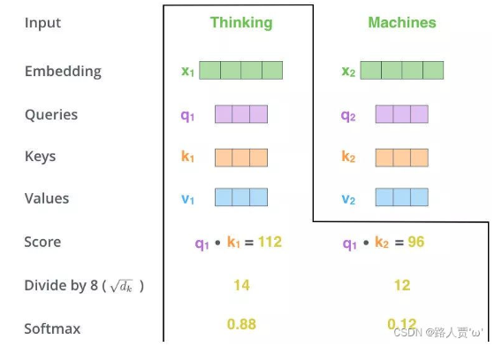


第4步： 使用刚得到的权重矩阵，与V相乘，计算加权求和。

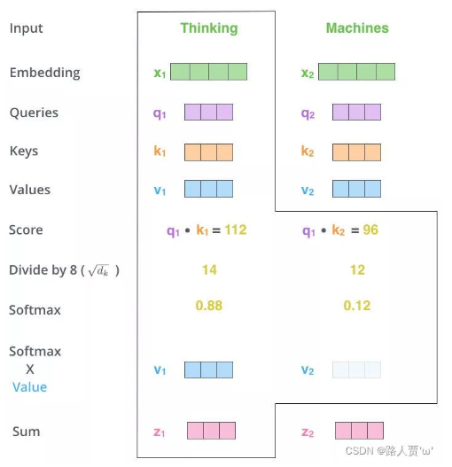


>  对于上图中的第2）步，当前为第一层时，直接对输入词进行编码，生成词向量X；当前为后续层时，直接使用上一层输出。


### 多头注意力机制：Multi-Head Self-Attention

> 自注意力机制的缺陷:  模型在对当前位置的信息进行编码时，会过度的将注意力集中于自身的位置，有效信息抓取能力就差一些。 多头注意力机制来解决这一问题。这个也是实际中用的比较多的。

在实践中，当给定相同的查询、键和值的集合时， 我们希望模型可以基于相同的注意力机制学习到不同的行为， 然后将不同的行为作为知识组合起来， 捕获序列内各种范围的依赖关系 （例如，短距离依赖和长距离依赖关系）。 因此，允许注意力机制组合使用查询、键和值的不同 子空间表示（representation subspaces）可能是有益的。

为此，与其只使用单独一个注意力汇聚， 我们可以用独立学习得到的h组（一般h=8）不同的线性投影（linear projections）来变换查询、键和值。 然后，这h组变换后的查询、键和值将并行地送到注意力汇聚中。 最后，将这h个注意力汇聚的输出拼接在一起， 并且通过另一个可以学习的线性投影进行变换， 以产生最终输出。 这种设计被称为多头注意力（multihead attention）。


### 通道注意力机制

对于输入2维图像的CNN来说，一个维度是图像的尺度空间，即长宽，另一个维度就是**通道**，因此通道注意力机制也是很常用的机制。通道注意力旨在<font color=red>显示的建模出不同通道之间的相关性</font>，通过网络学习的方式来自动获取到每个特征通道的重要程度，最后再为每个通道赋予不同的权重系数，从而来强化重要的特征抑制非重要的特征。

> 使用通道注意力机制的目的：为了让输入的图像更有意义，大概理解就是，通过网络计算出输入图像**各个通道的重要性（权重）**，也就是哪些通道包含关键信息就多加关注，少关注没什么重要信息的通道，从而达到**提高特征表示能力**的目的。


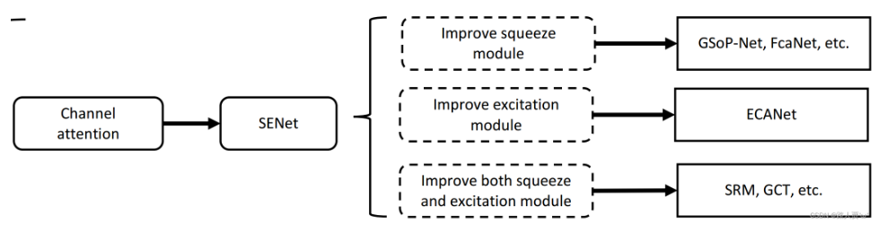


有如下通道注意力机制：

- **SENet**:  SENet注意力机制（Squeeze-and-Excitation Networks）在通道维度增加注意力机制，关键操作是**squeeze**和**excitation**。

- **ECA :**:  ECA 注意力机制，它是一种通道注意力机制；常常被应用与视觉模型中。支持即插即用，即：它能对输入特征图进行通道特征加强，而且最终ECA模块输出，不改变输入特征图的大小。
- **CBAM**： CBAM全称Convolutional Block Attention Module，这是一种用于前馈卷积神经网络的简单而有效的注意模块。是传统的通道注意力机制+空间注意力机制，是 channel(通道) + spatial(空间) 的统一。即对两个Attention进行串联，channel 在前，spatial在后。


### 空间注意力机制：Spatial Attention

<font color=red>空间注意力模型就是寻找网络中最重要的部位进行处理</font>。**空间注意力**旨在<font color=red>提升关键区域的特征表达</font>，本质上是将原始图片中的空间信息通过空间转换模块，变换到另一个空间中并保留关键信息，为每个位置生成权重掩膜（mask）并加权输出，从而增强感兴趣的特定目标区域同时弱化不相关的背景区域。


## *Attention Is All You Need*论文精读

*Attention Is All You Need* (Transformer) 是当今深度学习初学者必读的一篇论文。

[Attention Is All You Need (Transformer) 论文精读 文字版](https://zhuanlan.zhihu.com/p/569527564) 

https://blog.csdn.net/weixin_43334693/article/details/130208816?spm=1001.2014.3001.5502


# 矢量库或向量数据库

生成式AI技术的横空出世，带动了新一波创业浪潮。在这轮生成式AI创业竞争中，拥有优秀大语言模型的公司备受追捧。据统计，自ChatGPT 3.5问世以来，短短四个月内，美国人工智能领域发生了近500笔投资，总金额接近160亿美元，平均每个项目超过3000万美元。对于商人来说，向量数据库显然是一个风口。


随着大型AI语言模型的崛起，向量数据库成为了解决模型“幻觉”问题的关键。


## 向量数据库的原理

向量数据库（Vector Database），也称为向量相似度搜索引擎或近似最近邻（ANN）搜索数据库，是一种专门用来处理向量嵌入的数据库。它通过比较值并找到彼此相似的值来索引向量，以便于搜索和检索。与传统数据库不同，向量数据库可以处理复杂数据，如文档、图像、视频和网页上的纯文本等非结构化数据，为扩展大语言模型（如ChatGPT所使用的GPT-4）提供了重要支持。


向量数据库的工作原理可以通过CPU和GPU的工作原理进行类比。CPU和GPU分别是计算机的运算和图形处理核心，而向量数据库则是大模型的记忆和存储核心。在大模型学习阶段，向量数据库接收多模态数据进行向量化表示，让大模型在训练时能够更高效地调用和处理数据。通过多线程机制和矩阵运算，GPU提供了强大的计算能力，让大模型的训练变得更加快速和高效。


## 向量数据库怎么火起来的


2023年3月21日，黄仁勋在GPU 技术大会宣布今年将要推出RAFT向量数据库，黄他认为：" 对于自研大型语言模型的组织而言，向量数据库至关重要。" 创业者和厂商也将目光投向向量数据库项目的研发。


拥有超大规模数据量的大语言模型和多模态数据的需求推动了向量数据库的崛起。Zilliz成为全球最流行的开源向量数据库，累计融资1.03亿美元，估值6亿美元，并成为NVIDIA官方合作伙伴。


## 向量数据库的重要性


向量数据库是大模型的记忆与灵魂，对于解决大模型的“幻觉”问题至关重要。随着AI技术的不断发展，大模型在各个行业的应用场景不断增加，需要处理的多模态数据也日益复杂。向量数据库作为AI理解世界的通用数据形式，将在多个领域发挥关键作用。


在未来，多模态向量化将成为向量数据库的重要趋势。通过将多模态数据向量化压缩，让大模型在学习和训练时更高效地调用，从而让大模型变得更加智能和懂得回答问题。向量数据库的发展前景广阔，有望成为AI领域的重要基建，推动AI技术的进一步发展。


## 向量数据库公司有哪些


- **Tencent Cloud VectorDB:**  腾讯云发布的量数据库，计划今年8月发布，现在应该已发布了
- **Fabarta ArcNeural**： Fabarta 是一家成立于中国的AI基础设施公司，旗下有包含 ArcNeural在内的多款AI时代的数据产品。
- **<font color=red>Pinecone</font>**： Pinecone是一家成立于美国的向量数据库初创公司，产品名称是Pinecone Alternate，目前非常火的AutoGPT就集成了它的产品。
- **Weaviate**：Weaviate总部位于荷兰阿姆斯特丹，产品是一款名为Weaviate MongoDB的托管/自托管向量数推库，可存储多达数十亿个向量;在今年早些时候，Weaviate推出了ChatGPT的Plug in插件;此公司业务还包括Weaviate云服务--为开发人员提供Weaviate数据库的全部功能，而无需任何操作开销。
- **Chroma**： Chroma是一个基于向量检索库实现的轻量级向量数据库，内置了入门所需的一切，并提供了简的API。。目前只支持CPU计算，但可以利用乘积量化的方法，将一个向量的维度切成多段，每分别进行k-means，从而减少存储空间和提高检索效率，它还可以与LangChain集成，实现基于语言模型的应用。Chroma的优点是易用、轻量、智能，缺点是功能相对简单、不支持GPU加速。
- **Zilliz**：Zilliz专注于研发面向AI应用的向量数据库系统，旗下有开源产品Milvus、商业产品Zilliz Cloud等被广泛应用于计算机视觉、NLP、推荐系统、搜索引擎、自动驾驶和生物制药等领域。Milvus是一款分布式向量云原生数据库，能提供数百亿条向量数据的毫秒级查询。
- **Qdrant**: Faiss由Facebook Al Research团队开发的开源向量搜索库，为稠密向量提供高效相似度搜索和器类，支持十亿级别向量的搜索，是目前最为成熟的近似近邻搜索库，在GitHub上获得了超过1.5万预Star;但需要自己构建和管理索引，支持CPU和GPU计算。
- **<font color='red'>FAISS</font>**: Faiss由Facebook Al Research团队开发的开源向量搜索库，为稠密向量提供高效相似度搜索和器类，支持十亿级别向量的搜索，是目前最为成熟的近似近邻搜索库，在GitHub上获得了超过1.5万预Star;但需要自己构建和管理索引，支持CPU和GPU计算。

> 今天老师专门提了 FAISS https://zhuanlan.zhihu.com/p/646832642


<br><br>


# 【参考】

https://blog.csdn.net/weixin_43334693/article/details/130189238?spm=1001.2014.3001.5502

https://blog.csdn.net/qq_45556665/article/details/127114299

https://aistudio.baidu.com/projectdetail/5734882

https://blog.csdn.net/weixin_43334693/article/details/130189238?spm=1001.2014.3001.5502

李默老师《机器这习》

