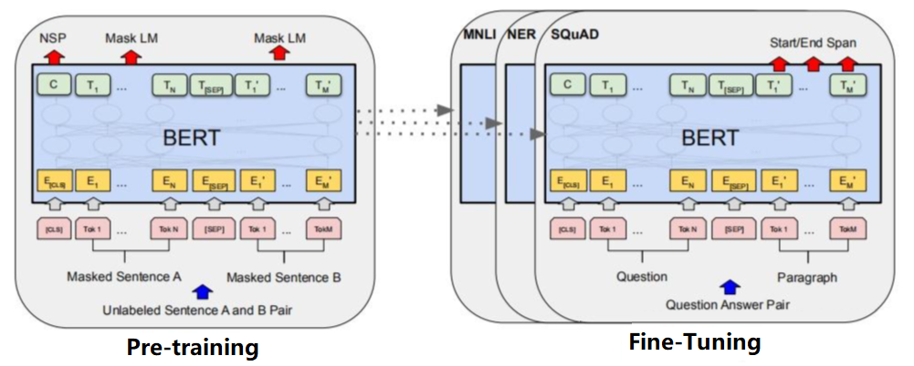
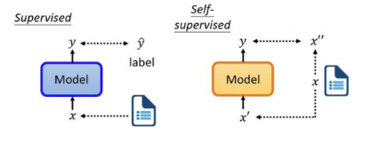
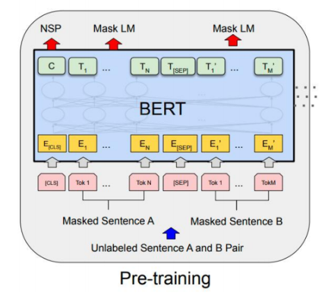
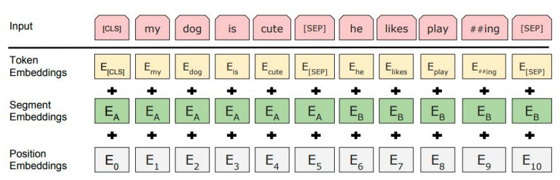
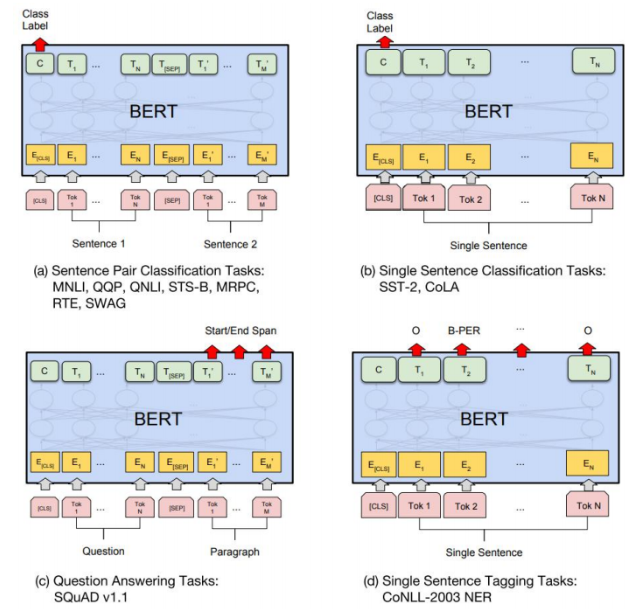

> tensorflow - 已不流行了, 现在主流的都是使用pytorch
>
> bert虽然现在被替代，但是影响力巨大。
>
> 2018年论文出来之后，在T5出来之前，Bert发挥了大作用。
>
> BERT：有110M的参数。


# 总体概述


## 基本信息

**Paper:** <font color=red>Pre-training</font> of  <font color=red> Deep Birdirectional Transformers</font> for <font color=red> Language Understanding</font>

**Full Name:**  Bidirectional Encoder Representation from Transformers


## BERT特点

**Pre-training**：通过大量的数据**预训练**得到的通用模型，后续基于通用模型再进行微调

> BERT的主要创新点都在pre-train方法上，即用了Masked LM和Next Sentence Prediction两种方法分别捕捉词语和句子级别的representation。BERT的本质上是通过在海量的语料的基础上**运行自监督学习方法**为单词学习一个好的特征表示。
>
> 通过前期的Pre-training，让其达到一定的语言表达；后期再通过**少量**的样本，比如文本分类（正向、负向、中性等情感类文本分类）再进行训练，就可以达到很好的效果。
>

**Deep**： BERT-base采用12层Encoder， 层数更深。 

>  使用更强大的机器训练更大规模的数据，使BERT的结果达到了全新的高度，并且Google开源了训练好的多语言BERT 模型代码，用户可以直接使用BERT作为Word2Vec的转换矩阵并高效的将其应用到自己的任务中。

**Bidirectional**： 通过MLM（**masked** language model) 任务实现上下文理解。

> "MLM"实现自监督方式，通过数据集自动构建有监督的数据集

**Transformer**：基于Transformer的Encoder。

> Transformer其最大的特点是抛弃了传统的RNN和CNN，通过Attention机制将任意位置的两个单词的距离转换成1，有效的解决了NLP中棘手的长期依赖问题，能更彻底的捕捉语句中的双向关系。而BERT模型的基本框架就是使用《Attention is all you need》中提出的多层Transformer结构中的 Encoder block (12层Encoder），利用大规模无标注语料训练、获得文本的包含丰富语义信息的Representation，即：文本的语义表示，然后将文本的语义表示在特定NLP任务中作微调，最终应用于该NLP任务。

**Language Understanding**： BERT是一个语言模型，通过深层双向Encoder实现语义理解（场景：文本分类、语义理解，NER等）。

**Self-supervised Learning**: 通过设计合理的训练任务，实现使用大量无监督数据进行训练。

> GPT包括BERT开启了一个时代，进入了Pre-training阶段


## 与Transformer的区别

- 只是使用了transformer的encoder

- 与Transformer本身的Encoder端相比，BERT的Transformer Encoder端输入的向量表示，多了Segment Embeddings。

- 网络层数L, 隐藏层维度H,Attention 多头个数A

  base：L=12, H=768, A=12, 110M,使用GPU内存：7G多
  large:  L=24,H=1024,A=16, 340M,使用GPU内存：32G多
  transformer 是512维，encoder是6个堆叠，8个头，
  bert是12个transformer叠加。每一个transformer由6个 encoder叠加

> 术语： few-shot learning(FSL  少样本学习）, zero-shot learning（零样本学习，ZSL）、Meta learning（学习其它机器学习任务输出的机器学习算法）。 


##  主要贡献

- 引入了Masked LM，使用双向LM做模型预训练。 为预训练引入了新目标NSP，它可以学习句子与句子间的关系。
- 进一步验证了更大的模型效果更好： 12 --> 24 层。
- 为下游任务引入了很通用的求解框架，不再为任务做模型定制。
- 刷新了多项NLP任务的记录，引爆了NLP无监督预训练技术


# 两阶段模型

BERT是一个预训练的语言表征模型，不再像以往的模型采用传统的单向语言模型或者把两个单向语言模型进行浅层拼接的方法进行预训练，而是采用新的**masked language model（MLM）**，以生成**深度的双向**语言表征。


BERT模型是一个两阶段模型，第一阶段 pre-training，第二阶段 fine-tuning—— **预训练和微调**。

**预训练阶段（第一阶段），**模型有两个任务，即Masked Language Model (简称MLM) 和Next Sentence Prediction (简称NSP)。**预训练后（第二阶段）**，只需要添加一个额外的输出层进行fine-tune，就可以在各种各样的下游任务中取得state-of-the-art的表现。在这过程中并不需要对BERT进行任务特定的结构修改：




除了输出层之外：

1. 在预训练和微调中都使用了相同的架构，还使用了相同的预先训练过的模型参数d为不同的下游任务初始化模型。

2. 在微调期间，所有参数都会进行微调。[CLS]是添加在每个输入示例前面的一个特殊符号，而[SEP]是一个特殊的隔板 工具标记（例如，分离问题/答案）。


#  自监督学习

在机器学习中，最常见的是有监督学习，即通过人工对数据进行标注，然后在提供输入 x 和 标签 y^ 的情况下，对模型进行训练，让模型输出 y 尽可能与标签 y^一致。自监督不需要人工标注，通过将数据处理成两部分，一部分作为输入x一部分作为标签X，然后使用这组数据对模型进行训练，让模型输出y 尽可能与标签“一致由于自监督不需要大量的人工标注，因此能够极大的降低模型训练成本，BERT的大规模**预训练**就是基于自监督学习。




左侧为有监督学习：模型、标签

右则为自监督学习：数据本身就有label,  MLM‘s masked通过掩盖（或完形填空）的方式，将Label提取，把数据变为有标签的数据。

以下是自监督实现两个任务：LML和NSP


# Pre-training


## 预训练任务之MLM （ Masked Language Model）

在每一个训练序列中以**15%的概率随机地选中某个token**进行MASK，当一个token被选中后，有以下三种处理方式（my dog is hairy 为例）：

1. 80%的概率被[MASK]。如，my dog is **hairy**  --> my dog is [MASK]   

   >  hairy 是15%的概率随机地选中某个token，选为label，被mask

2. 10%的概率修改为随机的其他token。如，my dog is hairy-->my dog is apple 

   > 10%的数据加噪声，让模型鲁棒性或容错性更强

3. 10%的概率不变。如，my dog is hairy>my dog is hairy

   

然后在对该位置的MASK进行预测

> 对80%被掩码的数据进行预测，预测被掩码的位置上的数据，如果预测错了，计算损失进行反向传播。


数据选择15%的标记，其肿80%被换位为[MASK], 10%,10%随机其他单词的原因，是要解决BERT的两个缺点：

1. 因为Bert用于下游任务微调时， [MASK] 标记不会出现，它只出现在预训练任务中。这就造成了预训练和微调之间的不匹配，微调不出现[MASK]这个标记，模型好像就没有了着力点、不知从哪入手。所以只将80%的替换为[mask]，但这也**只是缓解、不能解决**。

2. 相较于传统语言模型，Bert的每批次训练数据中只有 15% 的标记被预测，这导致模型需要更多的训练步骤来收敛。


以上的MLM任务让BERT针对被MASK的token的上下文信息预测目标token.


## 预测训练任务之NSP（Next Sentence Predict）

除了masked的自监督的构建方式，对于每一个训练样例，又以另外一种方式（NSP）进行预测，主要原理是：

1. 将一句话的前后两句话拿出来

2. 50%的概率保持原有顺序 (标注为IsNext)

3. 50%的概率后面的句子被替换为文档的其他随机句B (标注为NotNext) 

4. 这就意味着50%的样本是正例，50%的样本是负例，接下来把训练样例输入到BERT模型中，用[CLS]对应的信息去进行二分类

   >  预测当前句子是否有Next sentence的关系（是否是前后句）
   >
   > 假定 1代表是一句话，0代表不是一句话。那么：如果概率>0.5，表不变，标签为0；概率 <0.5，表变化，标签为1


经过上面两个任务的处理，训练数据如下所示：

> 两个任务共享Bert，使用不同的输出层，做Muti-Task。

|                                                              |                                                              |
| ------------------------------------------------------------ | ------------------------------------------------------------ |
| Input1=```[CLS]```我今天要```[MASK]```课 ```[SEP]```，上完``` [MASK]```给你打 电话``` [SEP]```<br/>Label1 =IsNext<br/><br/>Input2=```[CLS]``` 大模型```MASK]```术发展很快[SEP] ，晚 ```[MASK]``` 吃什么```[SEP]```<br/>Label2=NotNext<br><br/>符号说明：句首符号：CLS， 句尾符号：SEP， MASK：掩盖(码) |  |


## Bert双向的理解

Bert可以看作Transformer的encoder部分。Bert模型舍弃了GPT的attention mask。双向主要体现在Bert的预训练任务一：**遮蔽语言模型（MLM）。如：**

**我  喜 欢 [MASK]  学 习 英语。**

这句话输入到模型中，[MASK]通过**attention**均结合了左右上下文的信息，**这体现了双向**。

**attention**是双向的，但GPT通过attention mask达到**单向**，即：让[MASK]看不到 学 习英 语这四个字，只看到上文 我 喜 欢 。


# BERT Input

**BERT的切词方法**用的是WordPiece embeddings，其思想是如果一个词在整个里面出现的概率不大的话，就应该把它切开，看他的一个子序列，如果它的一个**子序列**（比如它的词根）出现的概率很大，那么只保留这个子序列就好了，这样可以把一个相对长的词切成一段又一段的片段，这些片段还是经常出现的，就可以用相对较小的30k的词典就能表示一个比较的文本。这样可以避免按照空格切词时一个词作一个token会让数量大进而导致词典变大，让可学习的参数都集中在了嵌套层里的问题。

**序列**的第一个词永远是一个特殊的几号【CLS】代表classification,  在每个句子后面放一个特殊词【SEP】表示separate。如上图所示。


对于每一个token（词元）在BERT的向量表示这个token本身的embedding加上它在哪个句子的embedding再加上位置的embedding。



**输入嵌入**是sum of the token embeddings、the segmentation embeddings（是第一句话还是第二句话,是A还是B）和 position embeddings位置嵌入（每个词元在句子中的位置）**的总和**。在Transfomer里面位置信息是手动构造出的矩阵，但是在BERT里面不管你是属于哪个句子还是位置在哪，它对应的向量的表示都是通过学习而来的

**Token Embeddings**：采用look up的方式，将每个token转换成768维的向量。

**Segment Embeddings**：BERT支持双句输入，Segment（0，1）用于区分a、b句。

**Position Embeddings**：采用训练式位置编码，通过look up获取位置编码。

> transformer的输入是由 word embedding + position embedding组合而成的向量x.


# BERT Encoder

## BERT- Base信息

BERT-base采用12层的Transformer Encoder堆叠，上一层的输出作为下一层的输入，基本信息如下：

|                                                              |                                                              |
| ------------------------------------------------------------ | ------------------------------------------------------------ |
| **encoder层数(layers)：**12层 <br><br/>**模型最大输长度（max_len)：**512<br><br/>**维度(dim)：**768<br><br/>头数(Head，简称h)：12<br><br/>**参数：**110M<br><br> |  |


## BERT - Fintune

> multi-head 768*64*12与直接使用768*768矩阵统一计算 有何区别？a





### 微调任务


#### 句对分类任务

判断两句子之间的关系，如句子语义相似度、句子连贯性判定等，其本质是文本分类。

- **输入：**两句子，[CLS]sentence1[SEP]sentence2[SEP]。

- **输出：**句子关系标签。

- **做法：**和单句分类操作一样，只不过是二分类。

  

#### 单句分类任务

单句分类任务是判断句子属于哪个类别，如新闻分类、问题领域分类等。

- **输入：**一个句子，形如 [CLS]sentence[SEP]；
- **输出：**输出句子类别标签。
- **做法：**选择bert模型输出的第一个位置的token，也就是[CLS]的向量作为下游任务的输入。


#### QA任务（阅读理解，问答式）

给定问答和一段文本，从文本中抽取出问题的答案，如机器阅读理解等。其本质是序列标注。

- **输入：**一个问题，一段文本，形如[CLS]question[SEP]content[SEP]
- **输出：**答案在文本中的索引（标出答案的位置）。


#### NER任务

NER = Named Entity Recognition，即命名实体识别。 **NER**的过程，就是根据输入的句子，预测出其序列标注的过程。

- 输入：小明在北京大学的燕园看了中国男篮的一场比赛
- 输出：B-PER，E-PER，O, B-ORG，I-ORG，I-ORG，E-ORG，O，B-LOC，E-LOC，O，O，B-ORG，I-ORG，I-ORG，E-ORG，O，O，O，O

其中，“小明 ”以PER，“北京大学”以ORG，“燕园”以LOC，“中国男篮”以ORG为实体类别分别挑了出来。

> BIOES标注方式中分别代表意思：
>
> B，即Begin，表示开始
>
> I，即Intermediate，表示中间
>
> E，即End，表示结尾
>
> S，即Single，表示单个字符
>
> O，即Other，表示其他，用于标记无关字符


# BERT变种

## 主流 - RoBERTa 

### 特点

- 舍弃NSP任务，并使用更长的序列长度
- 使用更多的预训练数据 (由16GB 升-> 160GB)
- 更大的batch size (batch size 256 -> batch size 8K) 
- 使用更大的词表 (30K -> 50K)

> 括号中的数据代表传统bert到ROBERTa时配置变化


### 动态掩码

原本的BERT采用的是static mask的方式，就是在create pretraining data中，先对数据进行提前的mask。

为了避免在每个epoch中使用相同的mask数据，充分利用数据，定义了dupe factor，这样可以<font color=red>**将训练数据复制dupe factor份，然后同一条数据可以有不同的mask**</font>，注意这些数据不是全部都喂给同一个epoch，是不同的epoch，例如dupe factor=10，epoch=40则每种mask的方式在训练中会被使用4次。

动态掩码的方式<font color=red>**在模型训练阶段实时计算掩码的位置和方法，能够最大限度的保证同一段文本在不同epoch下使用不同的掩码模式，提高了数据的复用效率**</font>。


## ALBERT

- 词向量因式分解。BERT中 embedding 维度E与Transformer 隐层维度 H一致ALBERT 引入<font color=red>**词向量因式分解**</font>方法解耦E和H，先将词向量编码到低维空间E，然后通过个全连接层将E映射到H，计算复杂度从 (VH) 降低到 (VE + EH)

- Transformer 跨层参数共享。ALBERT中每一层Transformer的参数都是一样的，类似于一个循环结构，每次都经过相同的Transformer层
- 引入sop (Sentence Order Prediction) 任务代替NSP任务


> 实战课：bert、chinaBert、RoBERTa

