# BERT

> tensorflow - 已不流行了, 现在主流的都是使用pytorch
>
> 虽然现在被替代，但是影响力巨大。

**Paper:** **Pre-training** of **Deep Birdirectional Transformers** for **Language Understanding**

**Name:** Birdrectional Encoder Representation from Transformers

---

**Pre-training**：通过大量的数据预训练得到的通用模型，后续基于通用模型进行微调。

**Deep**： BERT-base采用12层Encoder， 层数更深。

**Bidirectional**： 通过MLM任务实现上下文理解。

**Transformer**：基于Transformer的Encoder。

**Language Understanding**： BERT是一个语言模型，通过深层双向Encoder实现语义理解。

**Self-supervised Learning**: 通过设计合理的训练任务，实现使用大量无监督数据进行训练。

> GPT包括BERT开启了一个时代，进入了Pre-training阶段

## **BERT — 自监督学习**

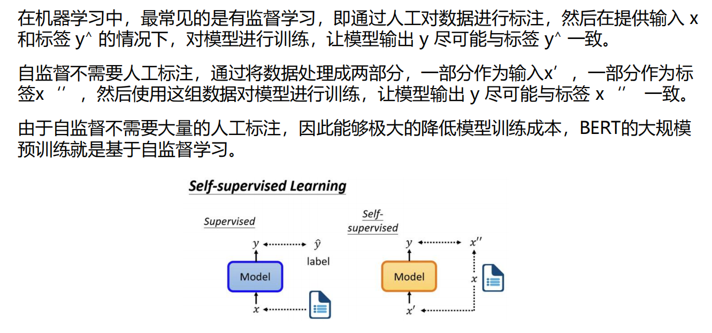

## **BERT — 预训练任务MLM**

### **BERT — 预训练任务MLM**

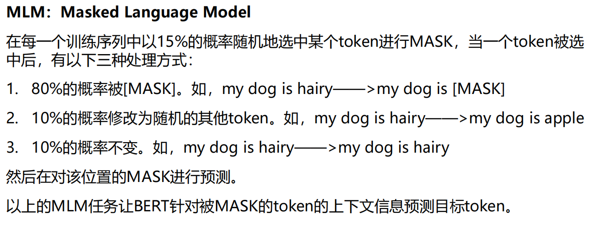

### **BERT — 预训练任务NSP**

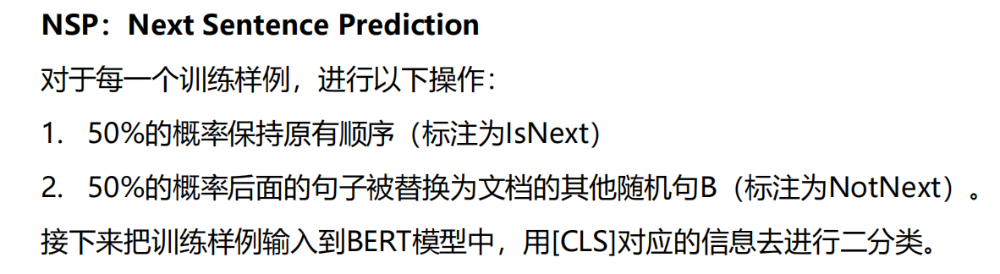

## **BERT — input**

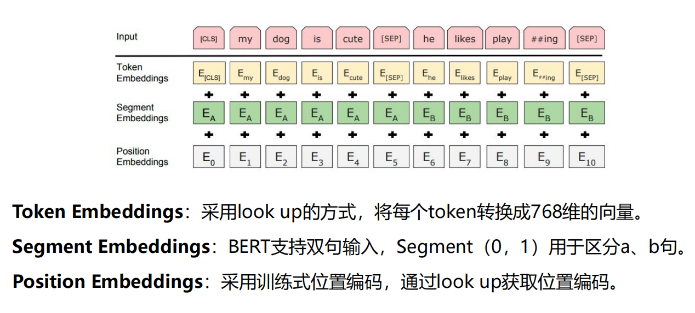

## **BERT — Encoder**

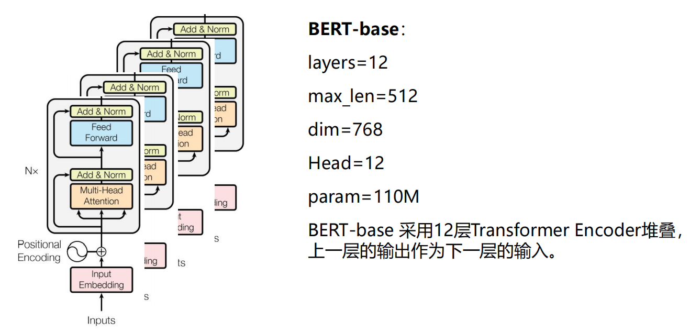

## **BERT — finetune**

## RoBERTa

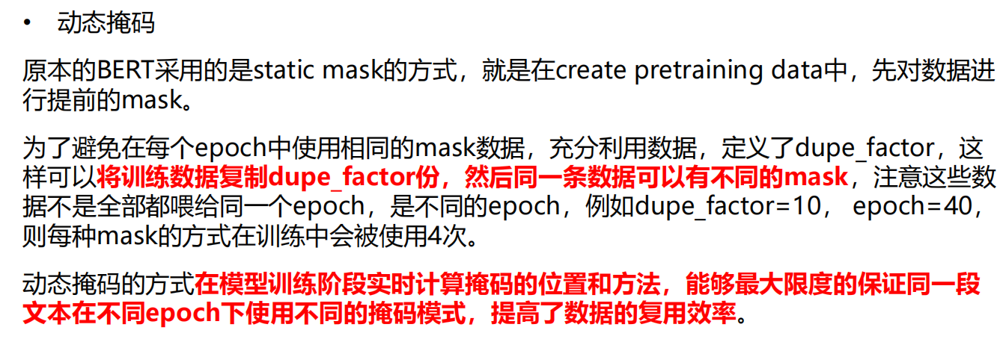

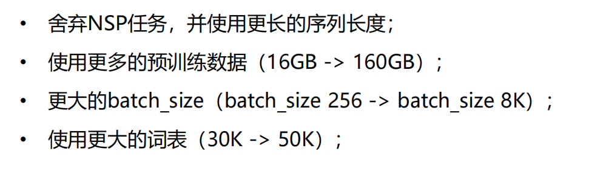

## **ALBERT**

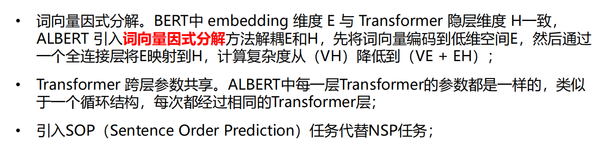

# T5 

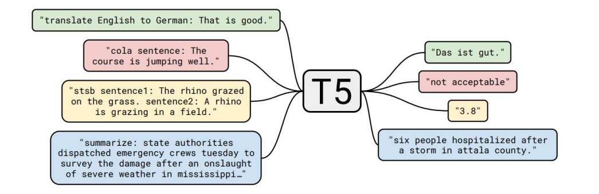

## Archietecture

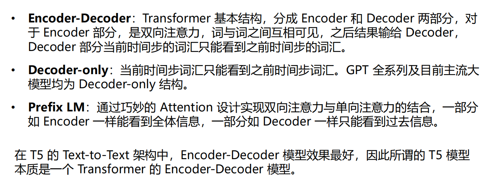

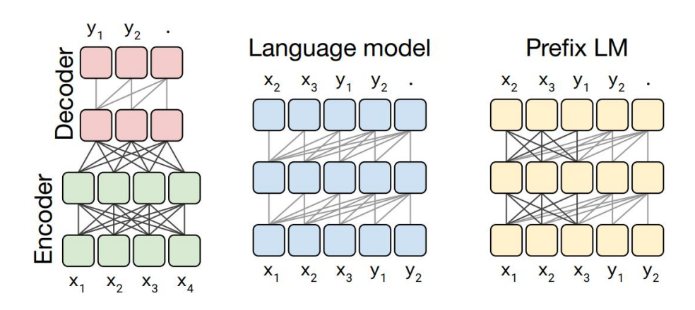

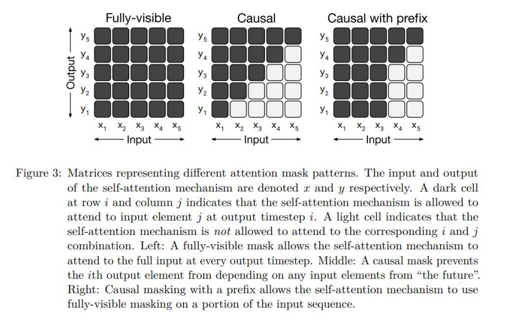

## **T5 — Objectives**

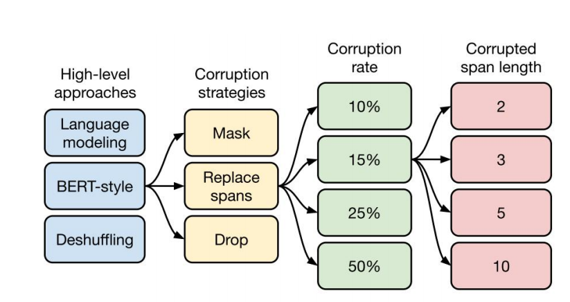

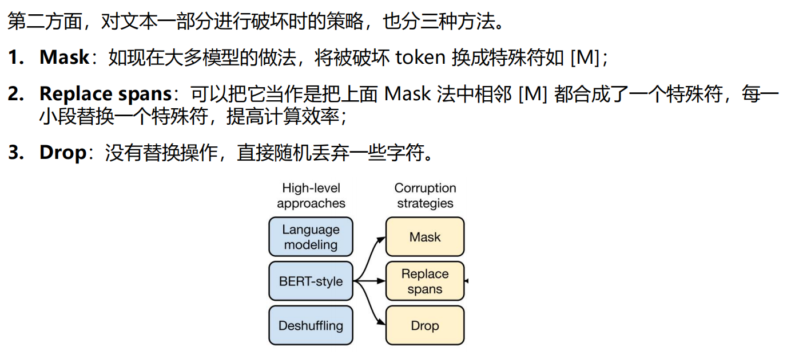

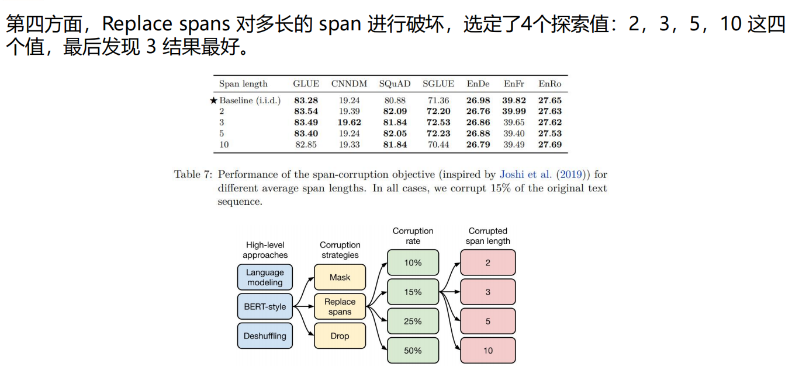

## **T5 — Model**

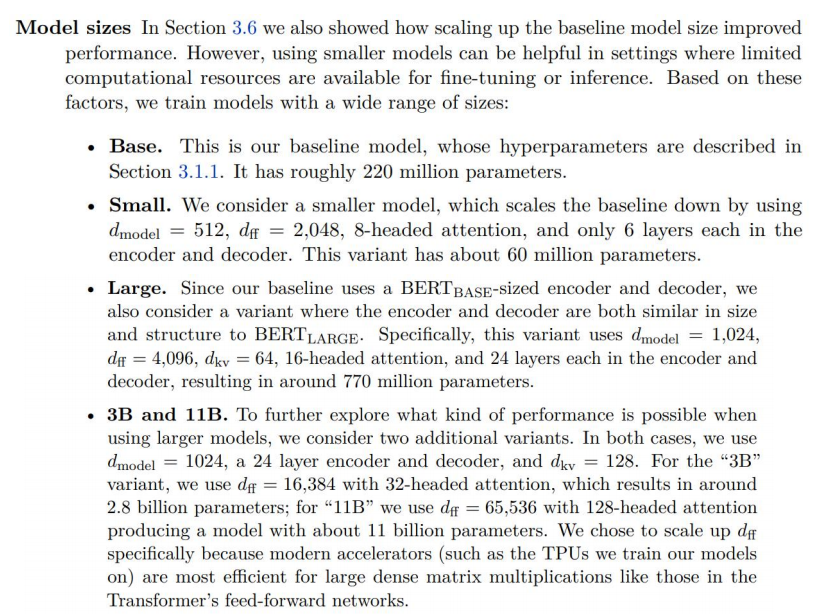

## **T5 — Performance**

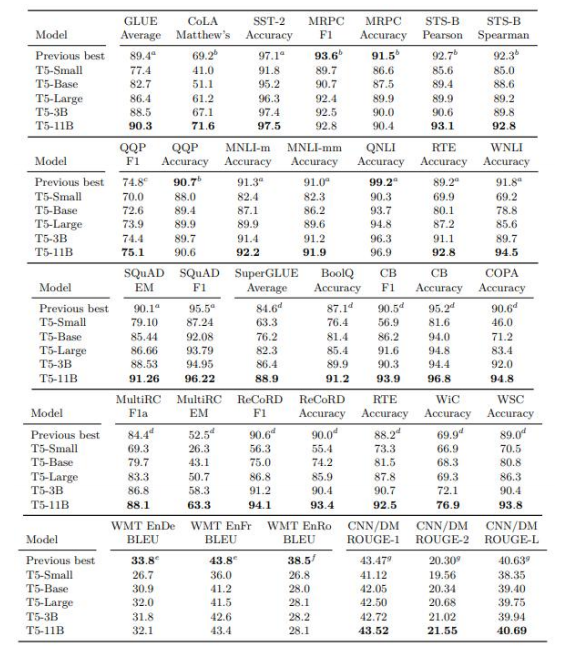

# 隐含词的理解能力

> 人民日报

# 附录

> 大模型做多轮对话的对话管理 —— 无法实现
>
> COT：组织训练
>
> 百度正在将文心一言：作为搜索的入口

### SOTA！模型

[197个经典SOTA模型](https://www.bilibili.com/read/cv26837375/)

