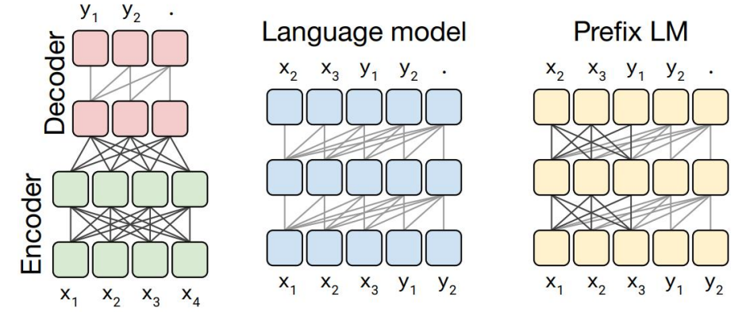
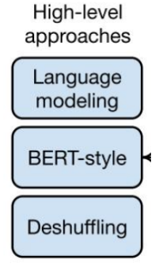
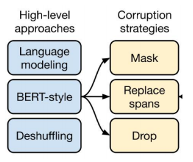
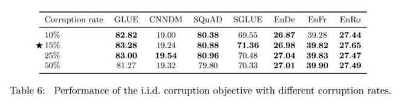
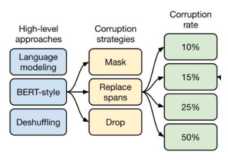
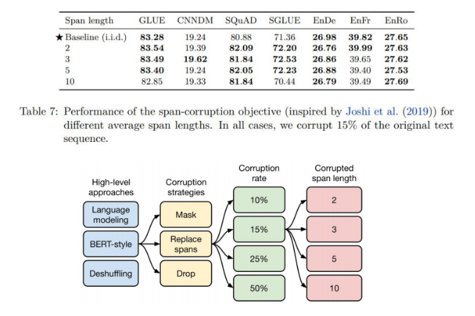

# T5 概述

T5 (Transfer Text-to-text Transformer ) ，将所有NLP任务都转化为Text-to-text(文本到文本)的任务。

> 名字里有5个T，因而得名。

自然语言处理（NLP）是一种用于理解人类语言的计算机科学领域。在过去的几年中，随着深度学习技术的发展，NLP领域也取得了突破性进展。在众多的NLP模型中，T5模型作为一种强大的语言生成模型，在**自然语言理解**、**翻译**和**问答**等任务中表现出色，成为了该领域的研究热点之一。

# T5模型的原理

T5模型（Transformers-based Text-to-Text Transfer Transformer）是由Google Brain团队在2019年提出的一种基于Transformer结构的序列到序列（Seq2Seq）模型，其主要特点是将多种NLP任务（如翻译、摘要、问答等）转化为一个统一的框架下进行训练。

T5模型包括Encoder和Decoder两个部分。Encoder器是一种多层的Transformer的Encoder，用于将输入的自然语言文本进行编码表示。Decoder也是一种多层的Transformer的Decoder，用于将Encoder输出的表示转换为目标自然语言文本。在训练中，T5模型采用了**文本到文本**的框架，即将多种NLP任务转化为对输入文本进行变换，从而得到对应的输出文本的形式进行训练。

与Transformer的encoder-decoder结构大致一致。但与Transformer又有所不同：

**Encoder-Decoder:**  T5使用的就是Transformer标准的基本结构，分成 Encoder 和 Decoder 两部分，但有所区别：对于 Encoder 部分，是双向注意力，词与词之间互相可见，之后结果输给 Decoder,Decoder 部分当前时间步的词汇只能看到之前时间步的词汇。

**Decoder-only:**  当前时间步词汇只能看到之前时间步词汇。GPT 全系列及目前主流大模型均为 Decoder-only 结构。

**Prefix LM:**  通过巧妙的 Attention 设计实现双向注意力与单向注意力的结合，一部分如 Encoder 一样能看到全体信息，一部分如 Decoder 一样只能看到过去信息
在T5的 Text-to-Text 架构中，Encoder-Decoder 模型效果最好，因此所谓的 T5 模型本质是一个 Transformer 的 Encoder-Decoder 模型

在 T5 的 Text-to-Text 架构中，Encoder-Decoder 模型效果最好，因此所谓的 T5 模型

本质是一个 Transformer 的 Encoder-Decoder 模型。

> **上图所示**：
>
> 左侧图：标准的Encoder与Decoder
>
> 中间图：自回归模型，只有Decoder
>
> 右侧：一部分双向注意力，一部分单向注意力

论文上的模型框架图：

> masked multi-head attention = Causal attention

# 目标设计(Objectives)

下图是T5标准结构，是最优的表示：

> 明确的基础结构之后，就开始考虑自监督的组织方式、掩码（方式、比例等）如何设计，上图是一个实验路径，最终探索最优结果：

第一个方面，高层次方法 (自监督的预训练方法) 对比，总共三种方式：

1. Prefix LM: 即有条件文本生成，输入完整文本，输出从左到右预测
2. BERT-style: 就是像 BERT 一样将一部分给破坏掉，然后还原出来
3. Deshuffling: 就是将文本打乱，然后还原出来

第二方面，对文本一部分进行破坏时的策略，也分三种方法

1. Mask: 如现在大多模型的做法，将被破坏 token 换成特殊符如 [M];
2Replace spans: 可以把它当作是把上面 Mask 法中相邻[M] 都合成了一个特殊符，每小段替换一个特殊符，提高计算效率;
3. Drop: 没有替换操作，直接随机丢弃一些字符

第三方面，文本的 Mask 比例，论文中挑了 4 个值，10%，15%，25%，50%，**最后明确BERT 的 15% 是最最优选择**。

第四方面，Replace spans 对多长的 span 进行破坏，选定了4个探索值: 2，3，5，10 这四
个值，最后发现 3 结果最好。

# T5模型的应用案例

T5模型在自然语言处理领域中有着广泛的应用，例如：

- 文本分类任务：GLUE和SuperGLUE。考虑到GLUE和SuperGLUE包含一系列不同类型的子任务（例如情感分类、句子补全等），简单起见，作者将所有的GLUE任务（或SuperGLUE任务）作为一个单独的任务来。作者还在SuperGLUE任务中加入了DPR数据集。
- 摘要总结：CNN/DailyMail，尽管它本身是一个QA任务，但是被改成摘要生成任务。
- 问答系统：SQuAD，输入句子和上下文，逐 token 生成答案。
- 机器翻译：WMT 英语到德语、法语和罗马尼亚语，针对不同的翻译语种，分别选择了不同的训练和验证数据集。

# T5模型的优劣势

**优势**

- 具有可扩展性：T5模型可以处理多种NLP任务，并且可以通过微调来适应不同的应用场景，具有良好的可扩展性。
- 模型参数少：相比其他语言 生成模型（如GPT-2、BERT等），T5模型的参数数量相对较少，训练速度更快，且可以在相对较小的数据集上进行训练。
- 优秀的性能表现：T5模型在多种NLP任务中都表现出了非常优秀的性能，如在GLUE数据集上取得了目前最好的结果。

**劣势**

- 训练时间较长：由于T5模型使用了大量的Transformer结构，在训练时需要大量的计算资源和时间。

- 模型的可解释性不足：T5模型由于结构较为复杂，参数数量庞大，导致其内部机制不够透明，解释性较差，难以理解其决策过程。

  

**结论:**  T5模型是一种基于Transformer架构的预训练语言模型，具有训练效率高、泛化能力强、适应多种自然语言处理任务等优势。然而，该模型也存在训练时间长、模型大小较大、可解释性不足等缺点。在实际应用中，可以根据具体任务需求和数据集情况选择合适的模型，或者对T5模型进行微调，以达到更好的效果。

# 附录

## T5 — Model

**Model sizes** In Section 3.6 we also showed how scaling up the baseline model size improvedperformance. However, using smaller models can be helpful in settings where limitedcomputational resources are available for fine-tuning or inference. Based on thesefactors, we train models with a wide range of sizes:

- Base. This is our baseline model, whose hyperparameters are described inSection 3.1.1. It has roughly 220 million parameters.
- Small. We consider a smaller model, which scales the baseline down by usingdmodel = 512, dr = 2048, 8-headed attention, and only 6 layers each in theencoder and decoder. This variant has about 60 million parameters.
- Large. Since our baseline uses a BERTBASE-sized encoder and decoder, wealso consider a variant where the encoder and decoder are both similar in sizeand structure to BERTLARGE. Specifically, this variant uses dmodel = 1,024d = 4,096, dky = 64, 16-headed attention, and 24 layers each in the encoder anddecoder, resulting in around 770 million parameters.
- 3B and 11B. To further explore what kind of performance is possible whenusing larger models, we consider two additional variants. In both cases, we uselmodel = 1024, a 24 layer encoder and decoder, and dky = 128. For the “3B:variant, we use dg = 16,384 with 32-headed attention, which results in around2.8 billion parameters; for “11B”we use dr = 65,536 with 128-headed attentionproducing a model with about 11 billion parameters. We chose to scale up despecifically because modern accelerators (such as the TPUs we train our modelson) are most efficient for large dense matrix multiplications like those in theTransformer's feed-forward networks.

## T5 — Performance

术语：SOTA   —— 代表当前模型最佳的效果

[197个经典SOTA模型](https://www.bilibili.com/read/cv26837375/)

SOTA生成式模型: 