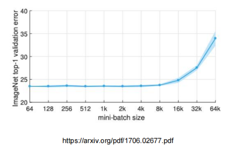
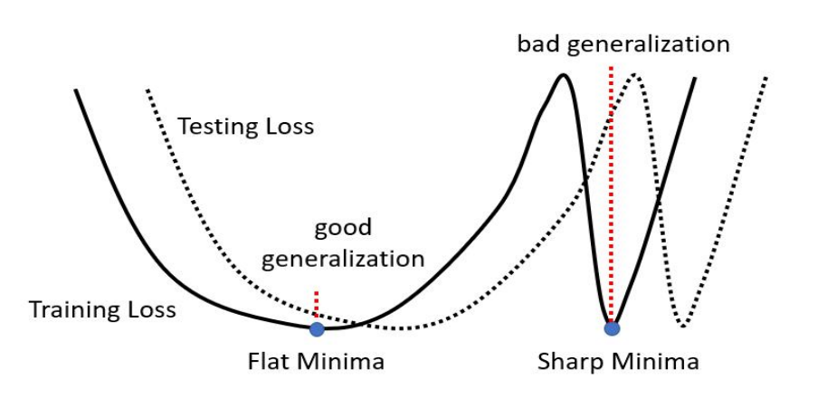
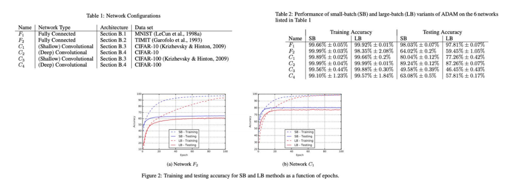
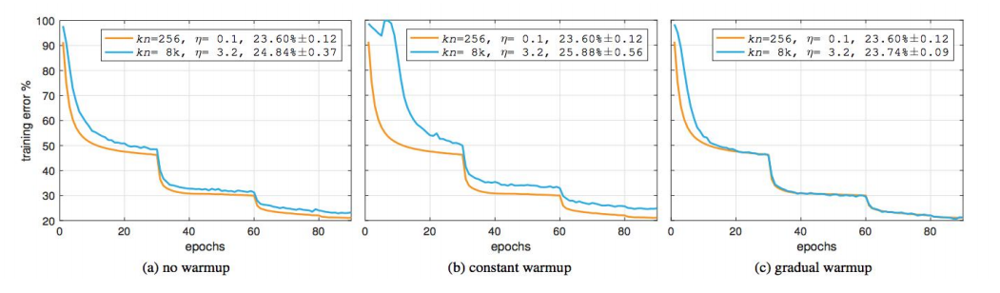
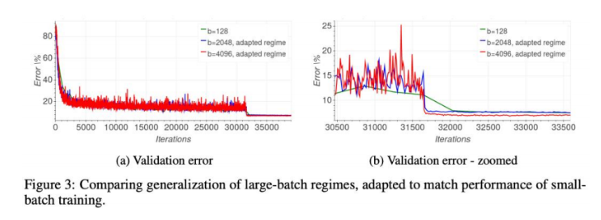
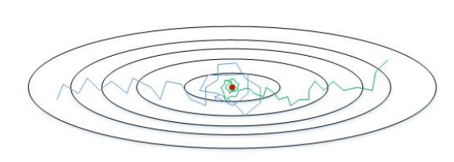
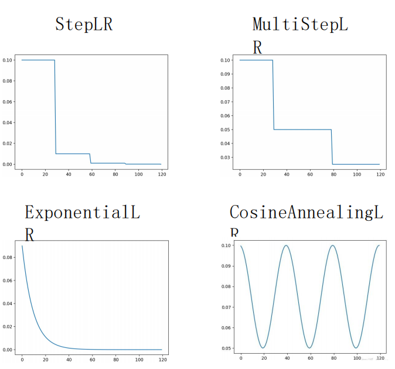
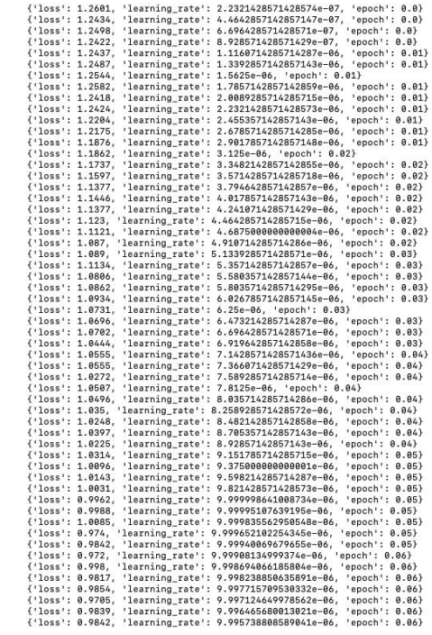

# Batch size

Batch size 需要在合理的范围内设置，如果超出合理范围，Batch size 的增大会导致模型性能下降，泛化能力变差;

有论文指出：大的 Batch size 容易收敛到 sharp minimum，而小的 Batch size 容易收敛到 flatminimum，后者具有更好的泛化能力 (https://arxiv.org/pdf/1609.04836.pdf)

---

Facebook 的研究人员对上面的文章提出了质疑，并基于“Linear Scaling Learning Rate”提出观点 — **Batch_size 扩大多少倍，LR就扩大多少倍**。并且指出，一开始以一个较小的学习率开始训练，逐步将LR提高到目标大小，Large Batch 与 Small Batch 的 trainingcurve几乎一样，并且准确度基本一致。（https://arxiv.org/abs/1706.02677）

有论文指Batch size 过大并不是性能下降的直接原因，直接原因是**迭代次数过少**，因为**Batchsize 越大，每个epoch 执行的迭代次数越少，参数更新次数减少，因此需要更长的迭代次数 **(https://arxiv.org/pdf/1705.08741.pdf)。

# learning rate 与 batch_size

传统模型在训练过程中更容易过拟合，所以需要设置合理的 Batch size，更多情况下较小的 Batch size 会取得更好的效果；

- 大模型不易过拟合，所以大模型建议设置更大的 Batch size，**注意迭代次数**；
-  调整 Batch size 与 lr 的一个常用思路是：调整 batch_size 时 learning rate 要进行等比例的调整，保证收敛稳定性，但是在新的研究中表明这种方式不一定有效（还是得炼丹）；
- 可以通过增加 Batch size 来达到与衰减学习率类似的效果，由于 learning rate 对收敛影响很大，所以可以通过增加 Batch size 代替衰减（https://arxiv.org/pdf/1711.00489.pdf）；
-  对于一个固定的 learning rate，存在一个最优 Batch size 使得性能最优；

# Learning rate scheduler

| --                                                           | --                                                           |
| ------------------------------------------------------------ | ------------------------------------------------------------ |
| 合适的学习率对于模型的快速收敛非常重要，学习率下降策略是模型训练过程中一个非常常用且有效的方法。  在训练初期，可以使用较大的LR来以较大幅度更新参数，然后逐渐降低LR，使网络更容易收敛到最优解。  |  |

# Warm up

在训练开始阶段，模型的权重(weights)是随机初始化或者与当前训练数据分布差异较大，此时若选择一个较大的学习率，模型权重迅速改变，可能带来模型的不稳定(振荡)。

选择 Warm up 预热学习率的方式，可以使得在训练开始阶段学习率较小，在预热的小学习率下，模型可以慢慢趋于稳定，等模型相对稳定后再选择预先设置的学习率进行训练，使得模型收敛速度变得更快，模型效果更佳。

• 有助于**减缓模型在初始阶段对 mini-batch 的提前过拟合现象**，保持分布的平稳。

• 有助于**保持模型深层的稳定性**。

## Warm up & LR decay

下图为在微调 LLaMA-7B 初始阶段的 LR 变化情况。

如下图所示，首先通过 Warm up 策略，从一个非常小的学习率开始，逐步增大，完成 warm up过程后，从预设LR开始，进行基于 LR decay 策略的模型训练

