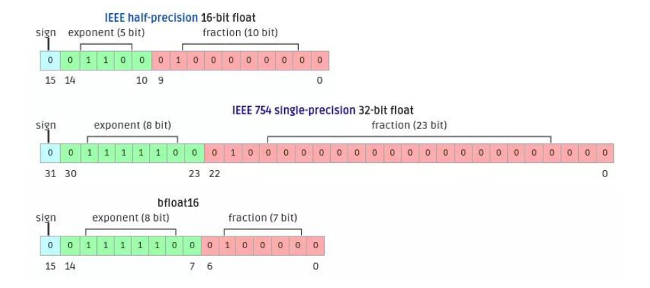
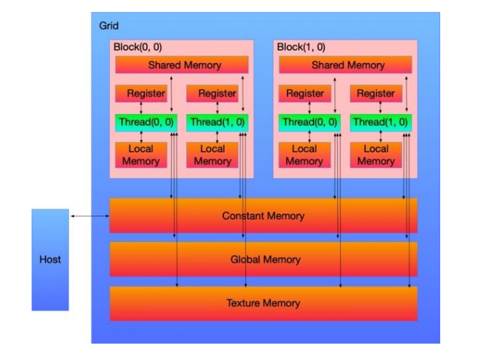
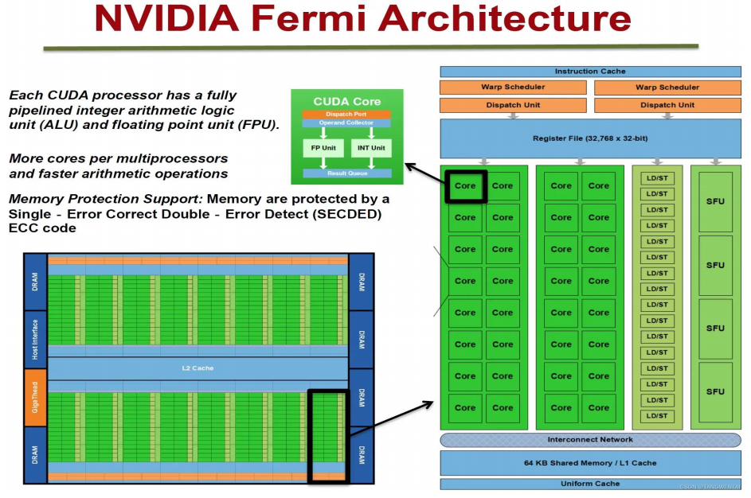
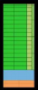
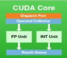
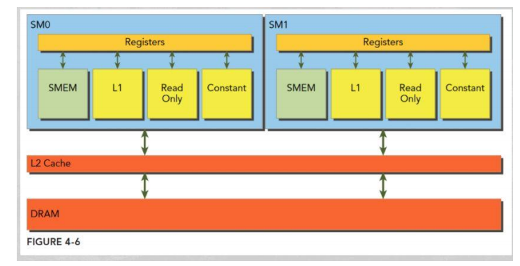

# Deep learning GPU usage priciple - GPU使用原理

> GPU的并行方式：
>
> 1. 训练模型时，在卡富余的情况下，选择数据并行的方式
> 2. 模型太大时，选择模型运行，扔到不同的服务器里Run	

## 数据精度

FP32 是**单精度浮点数**，用8bit 表示指数，23bit 表示小数；

FP16 是**半精度浮点数**，用5bit 表示指数，10bit 表示小数；

BF16 是对FP32单精度浮点数截断数据，即用8bit 表示指数，**7bit** 表示小数。

>  最常见FP32（已不怎么使用了），但目前使用的大部分是 FP16与BF16
>
> 指数位越多，能够表示的数据范围越大
>
> ---
>
> BF16的6bit小数：表示在FP16相同的显存消耗的情况下，能够表示高好几个数量级的小数范围
>
> 目前：百川，千问14B等新模型  BF16，能在成倍的节省显存空间的情况下，依然保持较高的数据表示范围
>
> - 梯度很小，对小数的精度要求较高，FP16会将其丢掉（直接归零，无法表示）
> - 中国企业的痛，封锁的愈演愈烈
> - 华为、升腾
> - Lora 4bit：1块AS180G ，远远的打败了百川23B 

###  为什么聚焦半精度？

**内存占用更少**

FP16 模型占用的内存只需 FP32 模型的一半：

• 模型训练时，可以用更大的batchsize；

• 模型训练时，GPU并行时的通信量大幅减少，大幅减少等待时间，加快数据的流通；

**计算更快**

主流 GPU 都有针对 fp16 的计算进行优化，在这些 GPU 中，**半精度**的计算吞吐量可以是单精度的 2-8 倍；

> 模型占用的内存更少，可以用更大的BatchSize，迭代次数变少，通讯等次数都减少了。

###  半精度的问题

#### 下溢出

FP32的表示范围：1.4 * $10^-45$ ~ 1.7 * $10^38$

FP16的表示范围：6 * $10^-8$ ~ 65504

由于FP16的值区间比FP32的值区间小很多，所以在训练过程中很容易出现**下溢出**( $Underflow, < 6 * 10^-8 $) 的错误。

#### 舍入误差

FP16  Weight = $2^-3$（0.125）

FP16 gradient =$2^-14$（约为0.000061）

$Weight_new$ = Weight + gradient

​							= $2^-3$ +$ 2^-14$

 							= $2^-3$

在[2^-3 ,2^-2]区间，FP16表示的固定间隔为$[2^-13]$，也就是说，FP16表示下，比2^-3]大的下一个数为$[2^-3 + 2^-13]$, 因此，**当梯度小于$[2^-13]$时，会出现舍入误差，梯度被忽略**。

## CUDA

### CUDA - 基础概念

CUDA中线程也可以分成三个层次：**线程**、**线程块 **和 **线程网络**。

> CUDA中的线程用是软件概念
>
> 并行是同时执行；并发指调度（不一定同时执行）

• **线程（Thread）**：CUDA 中基本执行单元，由硬件支持、开销很小，每个线程执行相同代码；

• **线程块（Block）**：若干线程的分组，Block 内一个块至多512个线程、或1024个线程（根据不同的 GPU 规格），线程块可以是一维、二维或者三维的；

• **线程网络（Grid）**：若干线程块 Block 的网格，Grid 是一维和二维的。

> 早期：没有云服务或基建的情况下，tensorflow版本与CUDA版本不一致等，让配置与发展AI变的很困难。

GPU 有很多线程，在 CUDA 里被称为 Thread，同时我们会把**一组 Thread 归为一个Block**，而 Block 又会被组织成一个 Grid。

> Block：一组线程，Grid多组线程；
>
> Block：512个线程或1023个线程；Grid：32组；

### CUDA - 执行

> CUDA的Block操作映射到实际的硬件上，表现为GPU上的SM..

GPU 上有很多计算核心也就是 **Streaming Multiprocessor (SM)**， SM 是一块**硬件**，包含了固定数量的运算单元，寄存器和缓存。

在具体的硬件执行中，**一个 SM 会同时执行一组线程**，在 CUDA 里叫 **warp**，直接可以理解这组硬件线程 warp 会在这个 SM 上同时执行一部分指令，这一组的数量一般为 32 或者64 个线程。

> 一个 SM（Wrap）：（相当于一个Block），会在同一时间执行。会分组执行，一组 32 或者64 个线程。

一个 Block 会被绑定到一个 SM 上，即使这个 Block 内部可能有 1024 个线程，但这些线程组会被相应的调度器来进行调度，在逻辑层面上我们可以认为 1024 个线程同时执行，但实际上在硬件上是一组线程同时执行，这一点其实就和操作系统的线程调度一样。意思就是**假如一个 SM 同时能执行 64个线程，但一个 Block 有 1024 个线程，那这 1024 个线程是分 1024/64=16 次执行**。

**GPU 在管理线程的时候是以 block 为单元调度到 SM 上执行。每个 block 中以warp(一般32个线程或64线程) 作为一次执行的单位(真正的同时执行)**。

1. 一个 GPU 包含多个 SM ，而每个 SM 又包含多个 Core，SM 支持并发执行多达几百的 Thread 。
2. 一个 Block 只能调度到一个 SM 上运行，直到 Thread Block 运行完毕。一个 SM 可以同时运行多个 Block （因为有多个 Core）。

**NVIDIA Fermi Architecture**

> 
>
> 为一个单位的SM
>
> ---
>
> core:  每个SM包含多个core，每个core执行一个线程，多个可并行
>
> core内部结构：在core内部分为管理模型，浮点计算、整数计算和结果队列
>
> 

**GPU 在管理线程的时候是以 block 为单元调度到 SM 上执行。每个 block 中以warp(一般32个线程或64线程) 作为一次执行的单位(真正的同时执行)**。

1. 一个 GPU 包含多个 SM ，而每个 SM 又包含多个 Core，SM 支持并发执行多达几百的 Thread 。

2. 一个 Block 只能调度到一个 SM 上运行，直到 Thread Block 运行完毕。一个 SM 可以同时运行多个 Block （因为有多个 Core）。

写 CUDA kernel 的时候，跟 SM 对应的概念是 Block，每一个 Block 会被调度到某个SM 执行，一个 SM 可以执行多个 block。CUDA 程序就是很多的 Blocks 均匀的喂给若干 SM 来调度执行。

不同的GPU规格参数不一样，执行参数不同，比如 Fermi 架构: 

• 每一个SM上最多同时执行 8 个 Block。(不管 Block 大小) 

• 每一个SM上最多同时执行 48 个 warp。

• 每一个SM上最多同时执行 48*32=1536 个线程

### **内存**

一个 Block 会绑定在一个 SM 上，同时一个 Block 内的 Thread 是共享一块 ShareMemory（一般就是SM的一级缓存，越靠近SM的内存就越快）。

GPU和CPU也一样有着多级 Cache 还有寄存器的架构，把全局内存的数据加载到共享内存上再去处理可以有效的加速。

### Pytorch GPU

#### 【CPU & GPU训练时间对比】

模型：BERT-base
训练数据集：180000
batch_size：32

| 不同配置的执行时间                               | 备注                              |
| ------------------------------------------------ | --------------------------------- |
| CPU（Xeon(R) Gold 5118 2CPU24Core）40:30:00      | 电脑没有GPU，只有CPU时，黄金CPU   |
| CPU（Xeon(R) Platinum 8255C 1CPU40Core）16:25:00 | 电脑没有GPU，只有CPU时，百金的CPU |
| GPU（P40）： 3:00:00                             |                                   |
| GPU（V100）： 1:17:00                            |                                   |

#### CPU训练代码解析

