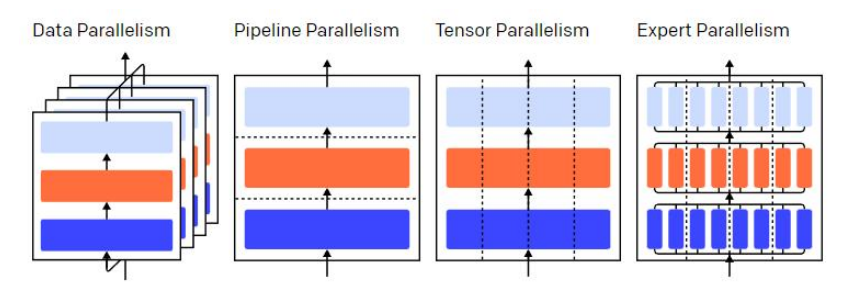
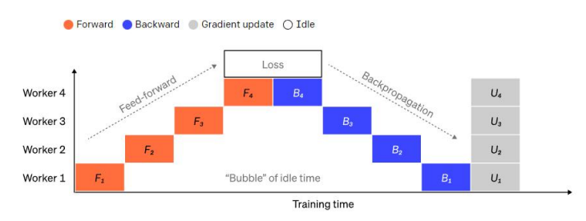
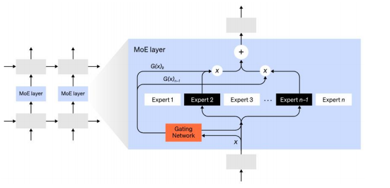
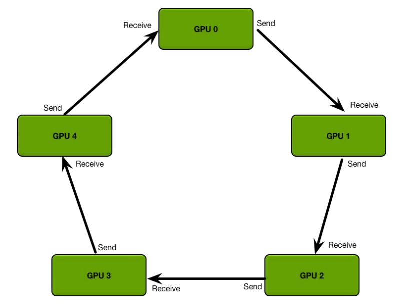
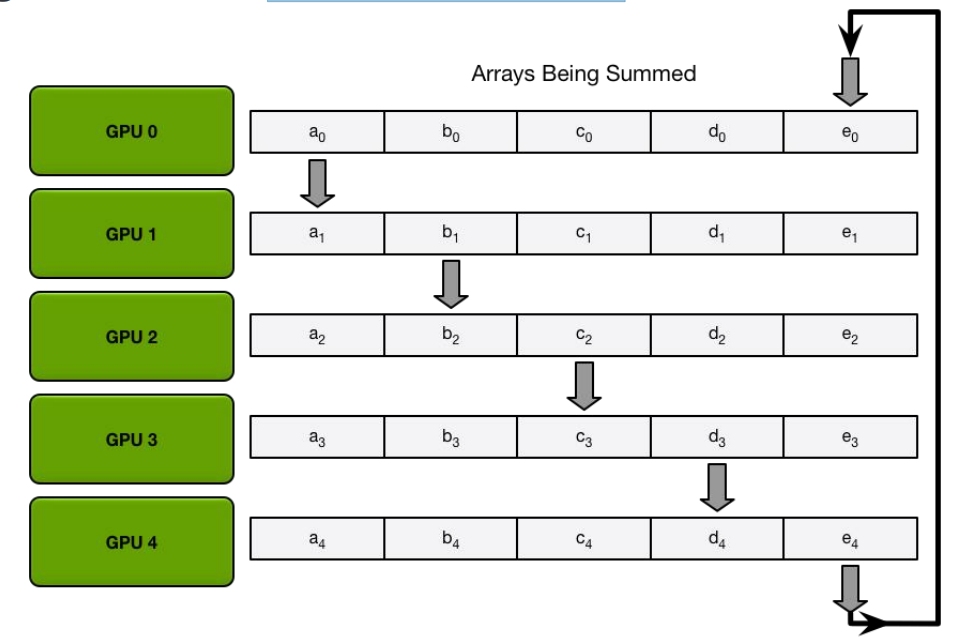
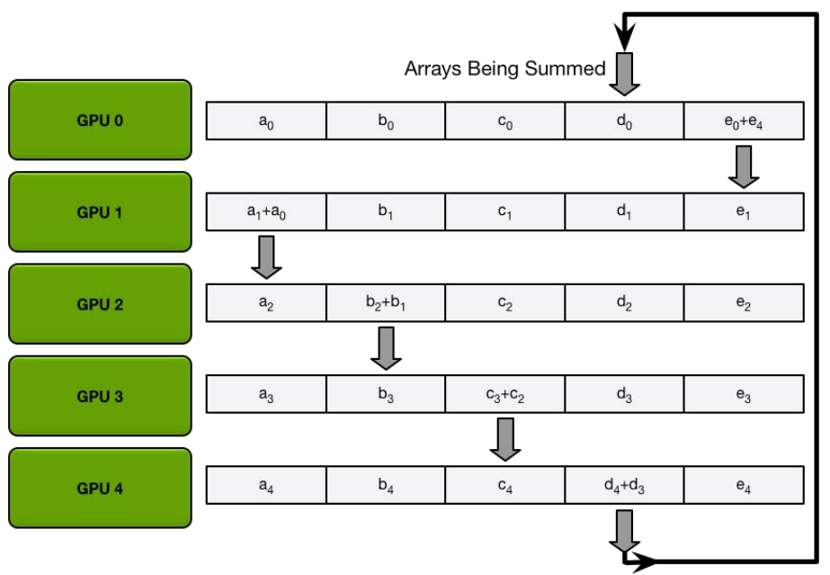
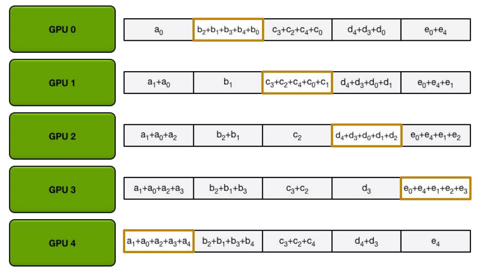
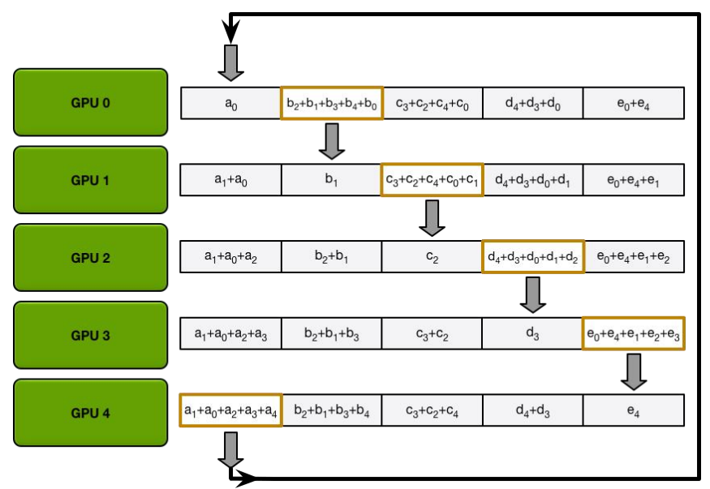
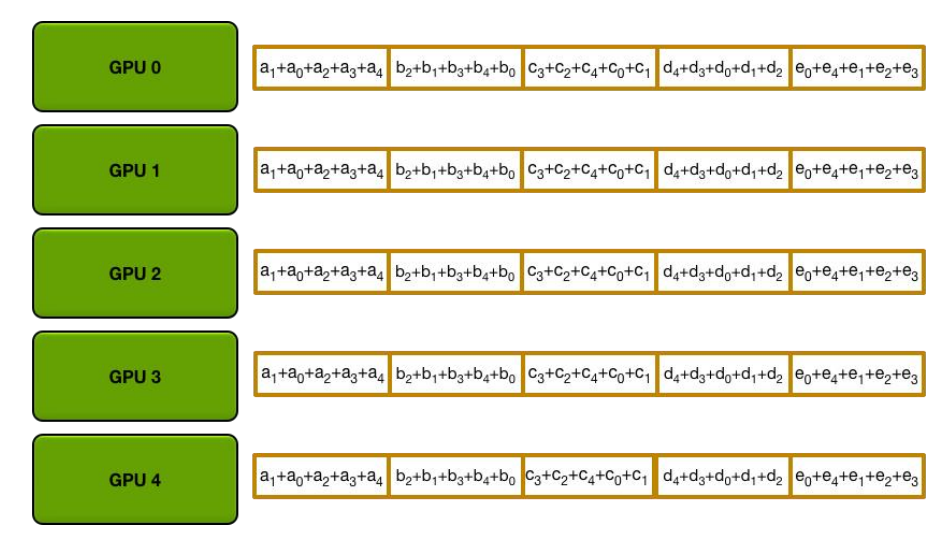

# 深度学习模型训练策略_GPU并行训练策略


# GPU并行方式


## 并行方式概述

• **数据并行（Data Parallelism）**— 在不同的GPU上运行同一批数据的不同子集；

• **流水并行（Pipeline Parallelism）**— 在不同的GPU上运行模型的不同层；

• **张量并行（Tensor Parallelism）**— 将单个数学运算（如矩阵乘法）拆分到不同的GPU上运行；

> 同一层不同维护的

• **混合专家系统（Mixture-of-Experts）** — 只用模型每一层中的一小部分来处理数据




> 目前常用的 数据并行与流水并行。在不缺卡的情况下，使用数据并行；否则用流水并行；
>
> 保证迭代次数的情况下，卡越来越好，训练速度越来越快；
>
> 每个batchSize =2 * 8卡 = 16 ， 几个GPU, batchSize扩大多少倍；
>
> ---
>
> 混合专家系统：https://zhuanlan.zhihu.com/p/572599101


##  数据并行

**将整个模型放在一块GPU里**，再复制到每一块GPU上，同时进行正向传播和反向误差传播，**相当于加大了batch_size**。

每个GPU都加载模型参数，被称为“工作节点(workers)”，为**每个GPU**分配分配不同的数据子集同时进行处理，**分别求解梯度**，然后求解所有节点的平均梯度，每个节点各自进行反向传播。

各节点的同步更新策略：

① 单独计算每个节点上的梯度；（GPU之间再通过ring all reduics进行通信）

② 计算节点之间的平均梯度（阻塞，涉及大量数据传输，影响训练速度）；

③ 单独计算每个节点相同的新参数。

Pytorch对于数据并行有很好的支持，数据并行也是最常用的GPU并行加速方法之一。


> 实践总结：
>
> 不缺卡的情况下，数据并行的方式训练模型
>
> 多卡：pytorch设置 node等参数
>
> 多机：pytorch设置 nn_nodes，指定master _address与port等，可以实现多机间的信息留存与传卡
>
> ---
>
> 具体的硬件组织：可参考open determine


将模型按层分割，不同的层被分发到不同的GPU上运行。每个GPU上只有部分参数，因此每个部分的模型消耗GPU的显存成比例减少，**常用于GPU显存不够，无法将一整个模型放在GPU上**。


layer的输入和输出之间存在顺序依赖关系，因此在一个GPU等待其前一个GPU的输出作为其输入时，朴素的实现会导致出现大量空闲时间。这些空闲时间被称作“**气泡**”，而在这些等待的过程中，空闲的机器本可以继续进行计算。


## 流水线并行(模型并行)

如果在一个layer内“水平”拆分数据，这就是张量并行。许多现代模型（如Transformer）的计算瓶颈是将激活值与权重相乘。


矩阵乘法可以看作是若干对行和列的点积：可以在不同的 GPU 上计算独立的点积，也可以在不同的 GPU 上计算每个点积的一部分，然后相加得到结果。


**无论采用哪种策略，都可以将权重矩阵切分为大小均匀的“shards”，不同的GPU负责不同的部分，要得到完整矩阵的结果，需要进行通信将不同部分的结果进行整合**。


## **混合专家系统**

混合专家系统（MoE）是指，对于任意输入只用一小部分网络用于计算其输出。**在拥有多组权重的情况下，网络可以在推理时通过门控机制选择要使用的一组权重，这可以在不增加计算成本的情况下获得更多参数**。


每组权重都被称为“专家（experts）”，理想情况是，网络能够学会为每个专家分配专门的计算任务。不同的专家可以托管在不同的GPU上，这也为扩大模型使用的GPU数量提供了一种明确的方法。





# DPP

## **Pytorch DDP**

• 在DDP模式下，会有N个进程被启动（一般N=GPU数量），每个进程在一张卡上加载一个模型，这些模型的参数在数值上是相同的。

• 在模型训练时，各个进程通过Ring-Reduce的方法与其他进程通讯，交换各自的梯度，从而获得所有进程的梯度；

• 各个进程用平均后的梯度更新自己的参数，因为各个进程的初始参数、更新梯度是一致的，所以更新后的参数也是完全相同的。


## **Ring Allreduce**




### **The Scatter-Reduce**


### **The Scatter-Reduce**







### **The Scatter-Reduce**




**The Allgather**







###  总结


在上面的过程中，N个GPU中的每一个将分别发送和接收**N-1次scatter reduce值**和**N-** **1次all gather的值**。

每次，GPU将发送K / N个值，其中K是在不同GPU之间求和的数组中值的总数。因此，往返每个GPU的数据传输总量为
$$
DataTransferred = 2(N-1) \frac{K}{N}
$$
由于所有传输都是同步发生的，因此减少的速度受到环中相邻GPU之间最慢（最低带宽）连接的限制。 **如果为每个GPU选择了正确的邻居，则该算法是带宽最佳的**，并且是减少带宽的最快算法（假设与带宽相比，延迟成本可以忽略不计）。

通常，**如果一个节点上的所有GPU在环中彼此相邻，则该算法的效果最佳**。 这样可以最大程度地减少网络争用的数量，否则可能会大大降低GPU-GPU连接的有效带宽。


# GPU训练实战


## **Pytorch GPU 数据并行原理**

```
模型：BERT-base
训练数据集：180000
batch_size：32
GPU（1 V100）： 1:17:00
GPU（2 V100）： 0:39:00
GPU（3 V100）： 0:18:00
GPU（4 V100）： 0:07:00
```


## Pytorch GPU 代码


