# 深度学习模型训练策略_GPU并行训练策略


# GPU并行方式


## 并行方式概述

• **数据并行（Data Parallelism）**— 在不同的GPU上运行同一批数据的不同子集；

• **流水并行（Pipeline Parallelism）**— 在不同的GPU上运行模型的不同层；

• **张量并行（Tensor Parallelism）**— 将单个数学运算（如矩阵乘法）拆分到不同的GPU上运行；

> 同一层不同维护的

• **混合专家系统（Mixture-of-Experts）** — 只用模型每一层中的一小部分来处理数据


> 目前常用的 数据并行与流水并行。在不缺卡的情况下，使用数据并行；否则用流水并行；
>
> 保证迭代次数的情况下，卡越来越好，训练速度越来越快；
>
> 每个batchSize =2 * 8卡 = 16 ， 几个GPU, batchSize扩大多少倍；
>
> ---
>
> 混合专家系统：https://zhuanlan.zhihu.com/p/572599101


##  数据并行

**将整个模型放在一块GPU里**，再复制到每一块GPU上，同时进行正向传播和反向误差传播，**相当于加大了batch_size**。

每个GPU都加载模型参数，被称为“工作节点(workers)”，为**每个GPU**分配分配不同的数据子集同时进行处理，**分别求解梯度**，然后求解所有节点的平均梯度，每个节点各自进行反向传播。

各节点的同步更新策略：

① 单独计算每个节点上的梯度；（GPU之间再通过ring all reduics进行通信）

② 计算节点之间的平均梯度（阻塞，涉及大量数据传输，影响训练速度）；

③ 单独计算每个节点相同的新参数。

Pytorch对于数据并行有很好的支持，数据并行也是最常用的GPU并行加速方法之一。


> 实践总结：
>
> 不缺卡的情况下，数据并行的方式训练模型
>
> 多卡：pytorch设置 node等参数
>
> 多机：pytorch设置 nn_nodes，指定master _address与port等，可以实现多机间的信息留存与传卡
>
> ---
>
> 具体的硬件组织 (多集群管理的框架）：可参考OpenPipe/[Determined
>
> [OpenPipe开源：将昂贵的提示转化为廉价的微调模型](https://www.chinaz.com/2023/0922/1561545.shtml)
>
> [Determined AI：用免费的「分布式深度学习系统」加速NLP训练](https://zhuanlan.zhihu.com/p/269364479)


## 流水线并行(模型并行)

将模型按层分割，不同的层被分发到不同的GPU上运行。每个GPU上只有部分参数，因此每个部分的模型消耗GPU的显存成比例减少，**常用于GPU显存不够，无法将一整个模型放在GPU上**。


layer的输入和输出之间存在顺序依赖关系，因此在一个GPU等待其前一个GPU的输出作为其输入时，**朴素的实现会导致出现大量空闲时间**。这些空闲时间被称作“**气泡**”，而在这些等待的过程中，空闲的机器本可以继续进行计算。优化方式（如下图）:

1. 是将将一个batch($F_1)  分成四个MiniBatch ($F_1$(1)~$F_1$(4））

2. 等F1(1~4)执行完，再F2..~F4，等全部计算结束，再统一开始反向传播。

   > 保证在miniBatch执行完前没有空闲时间
   >
   > 下图（GPipe) 进一步优化（PipeDream) ，F1(1) ~ F4(1) 计算结束就开始进入反向传播，同时对第四层参数进行更新，再计算第二个Minibatch(F2(2) ~ F4(2))... 白色区域的空闲时间降到的最低 —— PipeDream可节省35%~40%的GPU成本

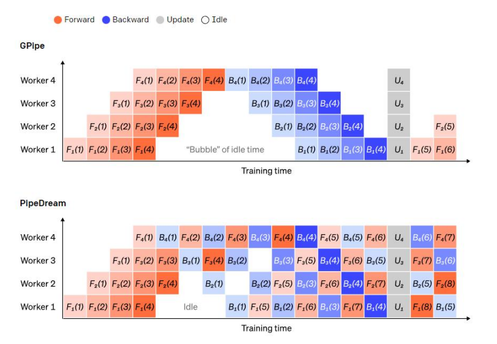

>  理想GUP使用方式：有一个巨大的GPU，将所有的任务全干了(无网络传输）--》 多卡GPU --》流水线并行 --》 
>
>  —— 英传达推出一款上T的GPU的工显机。


## 张量并行

如果在一个layer内“水平”拆分数据，这就是张量并行。许多现代模型（如Transformer）的计算瓶颈是将激活值与权重相乘。

矩阵乘法可以看作是若干对行和列的点积：可以在不同的 GPU 上计算独立的点积，也可以在不同的 GPU 上计算每个点积的一部分，然后相加得到结果。

**无论采用哪种策略，都可以将权重矩阵切分为大小均匀的“shards”，不同的GPU负责不同的部分，要得到完整矩阵的结果，需要进行通信将不同部分的结果进行整合**。


## 混合专家系统

> 传闻GPT4使用的模型

**早期：**

混合专家系统（MoE）是指，对于任意输入只用一小部分网络用于计算其输出。**在拥有多组权重的情况下，网络可以在推理时通过门控机制选择要使用的一组权重，这可以在不增加计算成本的情况下获得更多参数**。

> 权重可以指不同的模型或同一个模型不同的模块，在前端预置一个门控，通过门控选择某一模型或某组参数，在不增加计算成本的情况下，通过该系统将不同的模型关联起来，每个模型负责不同垂域的数据，组织成这样的一个系统 。


每组权重都被称为“专家（experts）”，理想情况是，网络能够学会为每个专家分配专门的计算任务。不同的专家可以托管在不同的GPU上，这也为扩大模型使用的GPU数量提供了一种明确的方法。


**现在：**

混合专家系统（MoE）是一种人工智能系统，**结合了多个专家系统的优点和能力，以解决复杂问题和提供高质量决策的方法**。它基于集成多个专家系统的思想，每个专家系统都是针对特定领域或任务进行优化和训练的。

> 前端有一个管理系统，后面有n个不同垂域的大模型 —— 类似于分布式中的横向扩容...但是模型是按不同的领域划分


混合专家系统的核心思想是将多个专家系统的输出进行融合，以得到更准确、全面的结果。每个专家系统都有其独特的知识和规则，可以处理特定领域的问题。通过将这些专家系统集成在一起，MoE可以利用各个专家系统的优势，提供更全面、准确的决策和解决方案。


混合专家系统通常包括以下组成部分：

- 知识库：存储专家系统所需的知识和规则。每个专家系统都有自己的知识库，根据不同领域的专业知识进行优化。
- 推理引擎：负责根据用户输入和知识库中的规则进行推理和决策。推理引擎可以根据不同的情况调用适当的专家系统进行处理。
- 融合模块：用于整合多个专家系统的输出。融合模块可以采用各种技术和方法，如加权平均、投票、模型融合等，以得到最终的决策或解决方案。


混合专家系统的优势在于可以充分利用每个专家系统的专业知识和经验，解决复杂问题时可以提供更准确、全面的结果。它还可以根据实际情况动态选择和调整专家系统，以适应不同的问题和场景。

总之，**混合专家系统（MoE）**是一种集成多个专家系统的人工智能系统，通过融合各个专家系统的输出，可以提供更准确、全面的决策和解决方案。它的设计目的是解决复杂问题和提供高质量决策


> 学术界：Agent


# Pytorch DDP

当你只有两个GPU和以兆字节数据衡量的参数时，这些GPU的通信方式可能并不重要。然而，当你的模型有数十亿个参数时，梯度可能需要几十亿字节的空间(因为每个参数都有一个梯度值)，并且你正在协调几十个GPU，通信机制变得至关重要。


当将神经网络的训练并行化到许多GPU上时，你必须选择如何将不同的操作分配到你可用的不同GPU上。Pytorch DDP要以用来解决这个问题。


## 什么是DDP

**DDP（Distributed Data Parallel分布式数据并行）**是PyTorch中用于分布式模型并行训练的一种策略。它的主要作用是在多个GPU或多台机器上分布式地进行模型的训练，以加快训练速度和提高模型性能。在深度学习中，模型通常需要大量的计算资源，而单个GPU可能无法满足需求。为了解决这个问题，可以使用多个GPU并行地训练模型，将数据划分为多个部分，每个部分分配给不同的GPU进行计算，然后将梯度进行聚合来更新模型参数。DDP就是实现这种分布式数据并行的方法之一。

> 分布式数据并行时，模型（model parameters）/优化器（optimizer states）每张卡都会拷贝一份（replicas）
> DDP 始终在卡间维持着模型参数和优化器状态的同步一致性在整个训练过程中；
> Data Parallel，batch input，通过 **DistributedSampler** split & 分发到不同的 gpus 上
> 此时虽然模型/optimizer 相同，但因为数据输入不同，导致 loss 不同，反向传播时计算到的梯度也会不同
> 此时 ddp 如何保证卡间，model/optimizer 的同步一致性呢：可以使用ring all-reduce algorithm


## 使用举例 - Python-Pytorch代码

- 导入相关模型 -  需要导入PyTorch和`torch.nn.parallel`库。

```python
import torch
import torch.distributed as dist
import torch.multiprocessing as mp
import torch.nn as nn
import torch.nn.functional as F
```

- 定义模型 - 定义你的神经网络模型，通常与单GPU训练的模型定义方式相同。

```python
class Net(nn.Module):
    def __init__(self):
        super(Net, self).__init__()
        # 模型的定义...
    
    def forward(self, x):
        # 前向传播...
        return x

```

- **设置并行训练：** 在你的训练代码中，你需要设置多进程环境，创建进程，初始化DDP环境，并将模型包装在DDP中。

```python
def main(rank, world_size):
    # 设置DDP环境
    dist.init_process_group(backend='nccl', init_method='env://')

    # 创建模型
    model = Net()
    model = nn.parallel.DistributedDataParallel(model)

    # 加载数据并训练
    # ...

if __name__ == '__main__':
    # 设置多进程
    world_size = 4  # 根据你的需求设置进程数量
    mp.spawn(main, args=(world_size,), nprocs=world_size)
```

- **训练代码：** 在`main`函数中，你可以加载数据并进行训练，DDP会自动处理数据的分发和梯度的聚合。

  

> 注意，DDP需要在支持分布式训练的环境中运行，通常是在多GPU或多台机器上。上面的示例是一个简化的框架，实际中需要根据你的数据和模型进行适当的调整。


总结来说，DDP是PyTorch中用于实现分布式数据并行训练的策略，通过在多个GPU或机器上分发数据和计算梯度来加速训练过程。它可以提高训练速度、内存效率和模型扩展性，但需要在适当的环境下使用，并根据实际情况进行配置和调整。


## Pytorch DDP算法


• 在DDP模式下，会有N个进程被启动（一般N=GPU数量），每个进程在一张卡上加载一个模型，这些模型的参数在数值上是相同的。

• 在模型训练时，各个进程通过Ring-Reduce的方法与其他进程通讯，交换各自的梯度，从而获得所有进程的梯度；

**• 各个进程用平均后的梯度更新自己的参数**，因为各个进程的初始参数、更新梯度是一致的，所以更新后的参数也是完全相同的。


### Ring Allreduce - 环allreduce算法

> 环allreduce算法的通信成本是恒定的，与系统中gpu的数量无关，完全由系统中gpu之间最慢的连接决定;事实上，如果您只考虑带宽作为通信成本的一个因素(并忽略延迟)，那么环allreduce是一种最优通信算法（当您的模型很大，并且您需要发送大量数据的次数很少时，这是一个很好的通信成本估算。）。


环中的gpu都被安排在一个逻辑环中。每个GPU应该有一个左邻和一个右邻;它只会向它的右邻居发送数据，并从它的左邻居接收数据。

该算法分两个步骤进行: 首先是scatter-reduce，然后是allgather。在scatter-reduce步骤中，GPU将交换数据，使每个GPU可得到最终结果的一个块。在allgather步骤中，gpu将交换这些块，以便所有gpu得到完整的最终结果。


> 只接受左向传递，构成一个环形。


#### The Scatter-Reduce 

为简单起见，让我们假设目标是对一个浮点数的大数组求和; 系统中有N个GPU，每个GPU都有一个相同大小的数组，并且在allreduce的末尾，每个GPU都应该有一个相同大小的数组，其中包含原始数组中数字的总和。


- 首先，gpu将数组划分为N个更小的块(其中N是环中的gpu数)。

  >  每一个GPU都有一个完整的梯度, 并梯度按GPU的个数平均分成几分


- 接下来，GPU将进行N-1次 Scatter-Reduce 迭代；在每次迭代中，GPU将向其右邻居发送一个块，并从其左邻居接收一个块并累积到该块中。每个GPU发送和接收的块在每次迭代中都是不同的；第n个GPU从发送块N和接收块N - 1开始，然后从那里向后进行，每次迭代都发送它在前一次迭代中接收到的块。

  > 每次传递每GPU发送 1/5 的梯度，到下一个GPU

  例如，在第一次迭代中，上图中的五个GPU将发送和接收以下区块：

  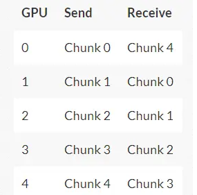


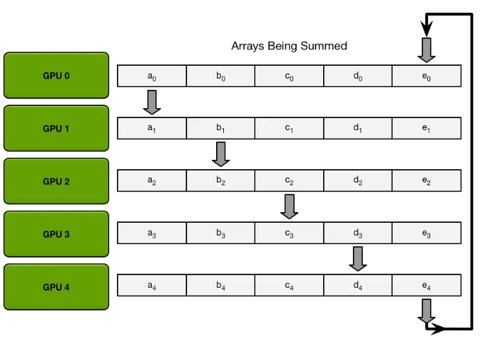

在第一次发送和接收完成之后，每个GPU将拥有一个块，该块由两个不同GPU上相同块的和组成。例如，第二个GPU上的第一个块将是该块中来自第二个GPU和第一个GPU的值的和。

> 第一次传递之后（每次只进行1/5的传递，第一轮结束，被传递的那些参数被更新），上图变成下图：


在下一次迭代中，该过程继续进行，到最后，每个GPU将有一个块，该块包含所有GPU中该块中所有值的总和。下图展示了所有数据传输和中间结果，从第一次迭代开始，一直持续到Scatter-Reduce完成。

>  最后GPU0里会有 1/5的参数是完整的，最后GPU1里会有 1/5的参数是完整的....以此类似

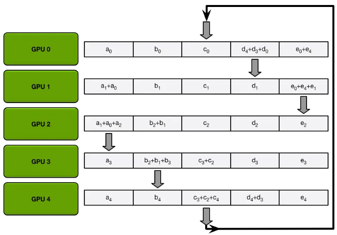


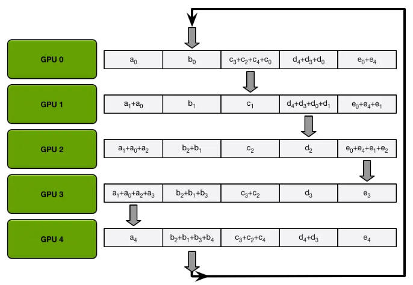

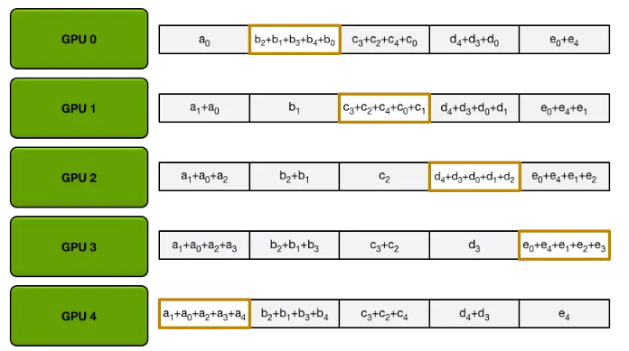


#### The Allgather 

> 每个GPU都得到相同的参数，进行各自的计算

在scatter-reduce步骤完成之后，每个GPU都有一个值数组，其中一些值(每个GPU一个块)是最终的值，其中包括来自所有GPU的贡献。为了完成allreduce, gpu必须交换这些块，以便所有gpu都具有所有必需的值。


环的收集过程与scatter-reduce是相同的(发送和接收的N-1次迭代)，只是gpu接收的值没有累加，而是简单地覆盖块。第n个GPU首先发送第n+1个块并接收第n个块，然后在以后的迭代中总是发送它刚刚接收到的块。


例如，在我们的5 - gpu设置的第一次迭代中，gpu将发送和接收以下块

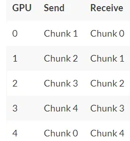


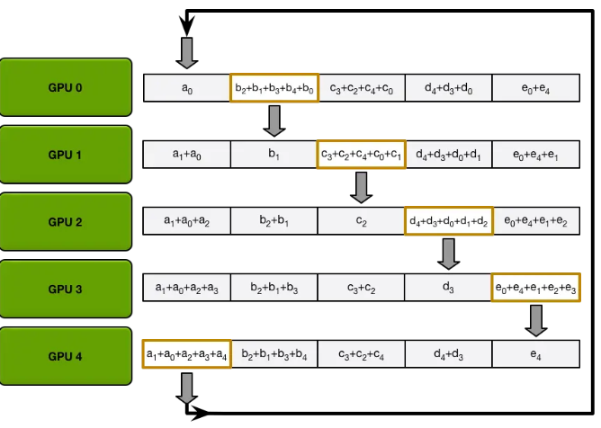

第一次迭代完成后，每个GPU将拥有最终数组的两个块。

在下一个迭代中，该过程将继续，到最后，每个GPU将拥有整个数组的完整累积值。下面的图像演示了所有数据传输和中间结果，从第一次迭代开始，一直到allgather完成。

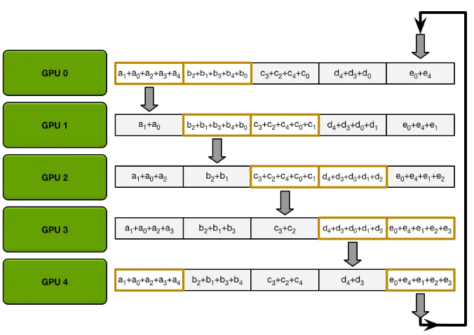


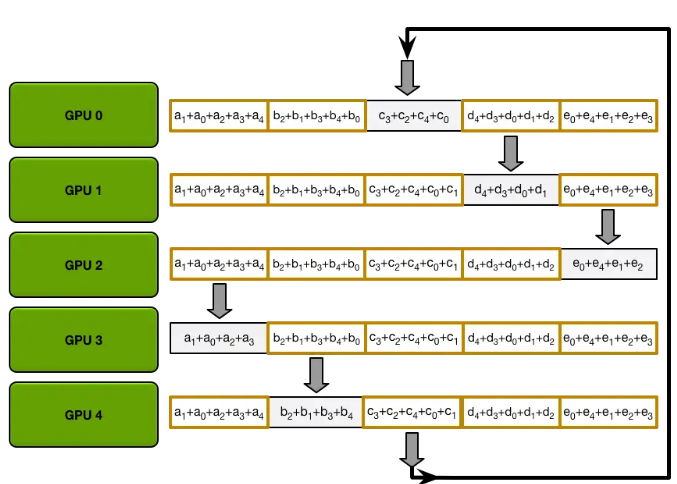

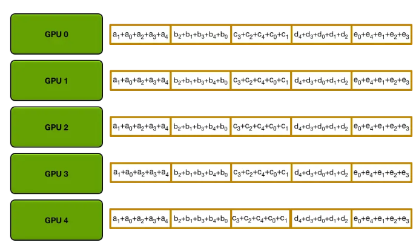

####  Allreduce Communication Cost


在上面的过程中，N个GPU中的每一个将分别发送和接收**N-1次scatter reduce值**和**N-** **1次all gather的值**。

每次，GPU将发送K / N个值，其中K是在不同GPU之间求和的数组中值的总数。因此，往返每个GPU的数据传输总量为
$$
DataTransferred = 2(N-1) \frac{K}{N}
$$
> 重要的是，这与GPU的数量无关。


由于所有传输都是**同步**发生的，因此减少的速度受到环中相邻GPU之间最慢（最低带宽）连接的限制。 **如果为每个GPU选择了正确的邻居，则该算法是带宽最佳的**，并且是减少带宽的最快算法（假设与带宽相比，延迟成本可以忽略不计）。


通常，**如果一个节点上的所有GPU在环中彼此相邻，则该算法的效果最佳**。 这样可以最大程度地减少网络争用的数量，否则可能会大大降低GPU-GPU连接的有效带宽。

## 


[参考]

https://zhuanlan.zhihu.com/p/650825818

https://www.jianshu.com/p/8c0e7edbefb9


# GPU训练实战


## **Pytorch GPU 数据并行原理**

```
模型：BERT-base
训练数据集：180000
batch_size：32
GPU（1 V100）： 1:17:00
GPU（2 V100）： 0:39:00
GPU（3 V100）： 0:18:00
GPU（4 V100）： 0:07:00
```


## Pytorch GPU 代码


