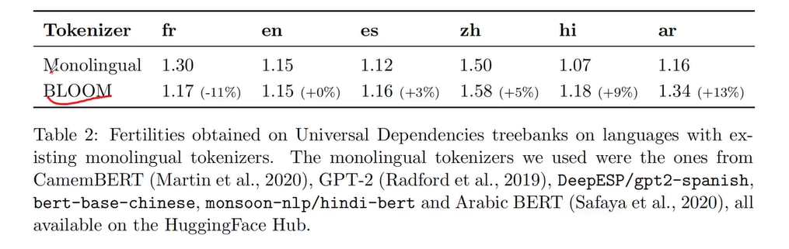
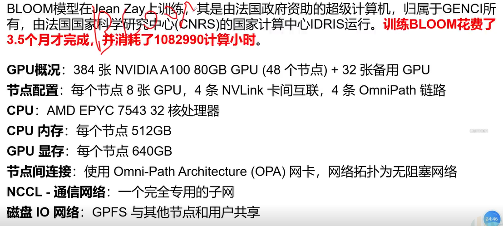
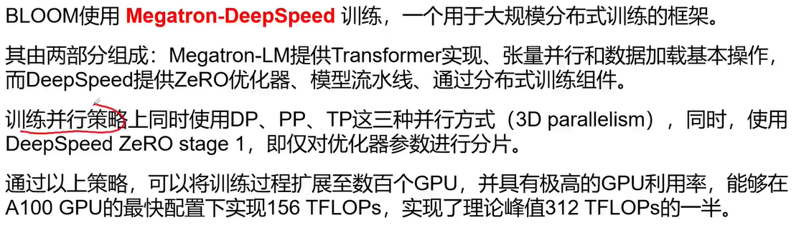
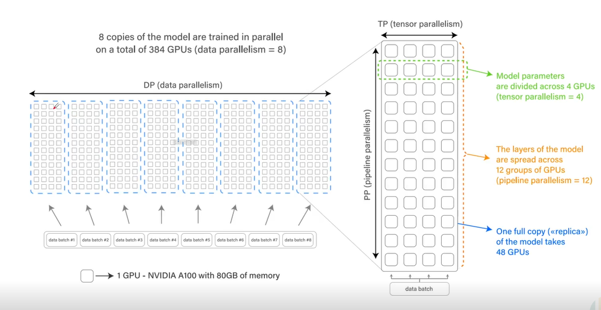
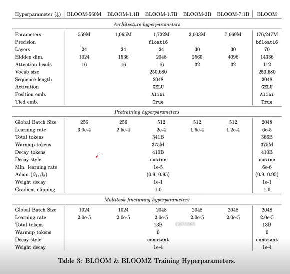
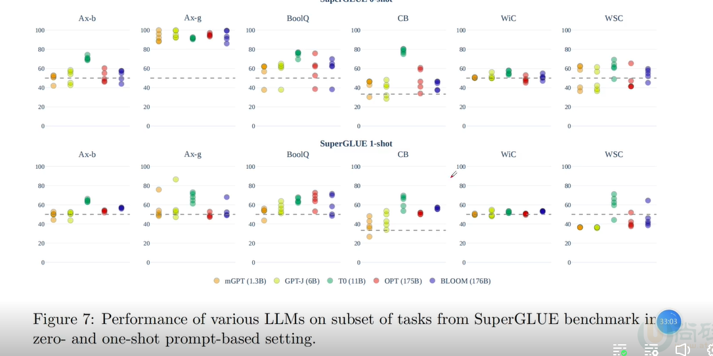
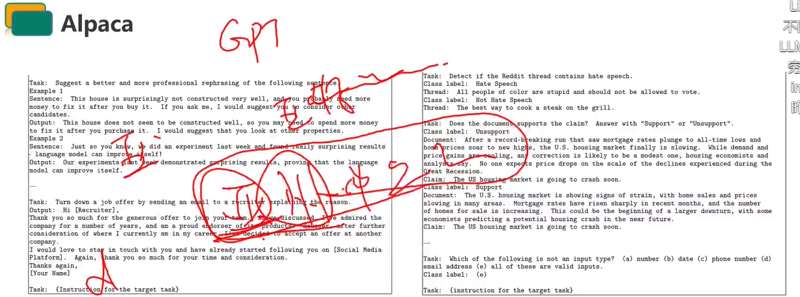
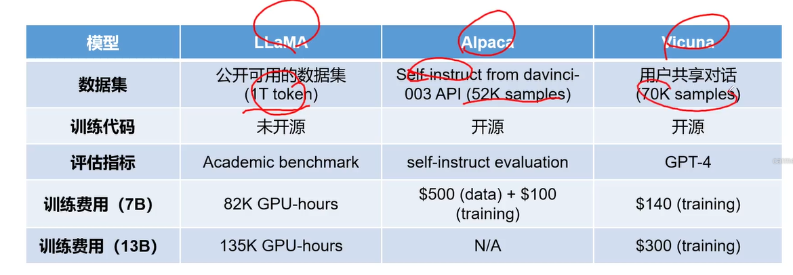
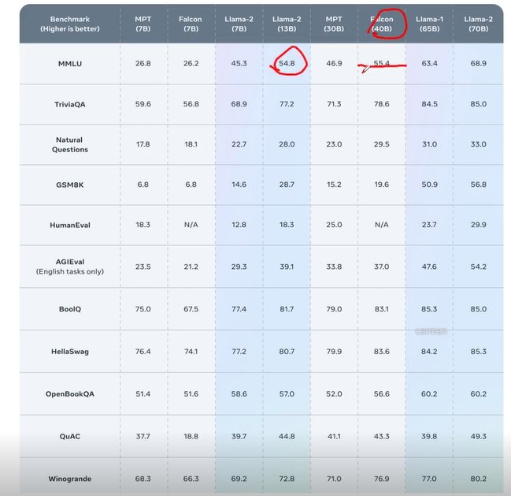

# 主流大模型

## Tuning技术

### NLP发展的四大范式

P1. 非神经网络时代的完全监督学习 (Fully Supervised Learning,Non-Neural Network )

P2.基于神经网络的完全监督学习(Fully Supervised Learning,Neural Network)

P3. 预训练，精调范式(Pre-train,Fine-tune)

P4. 预训练，提示，预测范式 (Pre-train,Prompt,Predict)

#### P1. 非神经网络时代的完全监督学习 (Fully Supervised Learning,Non-Neural Network )

### Prompt-Tuning 

 - 什么是Prompt Tuning

### Instruction-Tunning

论文中使用60多个NLP任务组成的数据集训练了一个 137B 的模型，称之为 FLAN。在我们评估的25个数据集中的20个上超越了 zero-shot 175B GPT-3。FLAN 甚至在ANLIRTE、BoolQ、A12-ARC、OpenbookQA和StoryCloze 上大幅优于few-shot GPT-3。

This paper expolores a simple method for improving the zero-shot learning abilities of lanauade modelsWe show that instruction tuning--finetuning language models on a collection of datasets described viainstructions-substantially improves zeroshot performance on unseen tasks.

通过多样化的任务，让模型能够具体理解指令的能力。

### Instruction-Tunning 和 prompt tuning的区别

 

# GPT系列模型核心原理

The core principle of GPT series models

# BLOOM-模型细节之Tokenization

1. 准备足够大的训练语料
2. 确定期望的subword词表大小
3. 将单词拆分为字符序列并在末尾添加后缀“</w>”，统计单词频率。 本阶段的subword的粒度是字符。例如，“low”的频率为5，那么我们将其改写为“low</w>”:5
4. 统计每一个连续字节对的出现频率，选择最高频者合并成新的subword，新subword依然可以参与后续的融合
5. 重复第4步直到达到第2步设定的subword词表大小或下一个最高频的字节对出现频率1停止符"</w>"的意义在于表示subword是词后缀。举例来说:"st字词不加“</w>"可以出现在词首如“star”，加了"</w>"表明该字词位于词尾，如“wide st</w>"，二者意义截然不同。

## 5.Pre-tokenizer

预分词是对文本进行第一次切分，从而给出tokenizer训练结束时token长度的上限。一个好的思路是，预分词器将把文本拆分成“单词”，然后，最终tokens将是这些单词的一部分 **?[AASI[,!?....BLOOM的 pre-tokenization 使用的是的正则表达式、])+？？**
通过正则表达式将单词分开，同时保留所有的字符，特别是对编程语言至关重要的空格和换行符。
BLOOM不使用在其他tokenizers中常见的以英文为中心的划分，也没有在数字上使用划分否则将导致Arabic和code的编码问题

## 6. 评估

我们使用 **fertility** (fertility被定义为每个单词或者每个数据集被tokenizer 创造的subword数量)对本文使用的tokenizer(Acs,2019)与现有的单语言tokenizer进行比较我们使用目标语言的 Universal Dependencies 2.9 和OSCAR 子集来衡量。

**在一个语言上有非常高的 fertility 时，意味着相比于单语言 tokenizer 在下游多语言上的性能下降**。

我们的目标是在将我们的多语言 tokenizer 与对应单语言tokenizer 进行比较时，确保每种语言的fertility能力较低不超过10个百分点对比

## BLOOM-工程架构

> DP：
>
> PP：
>
> TP：

- NVLink：单节点之间的通讯

- AutoDel

## BLOOM-模型评估SuperGLUE

