标志开源大模型领域的开始

> 之前全是羊驼，让国内厂商看到了希望

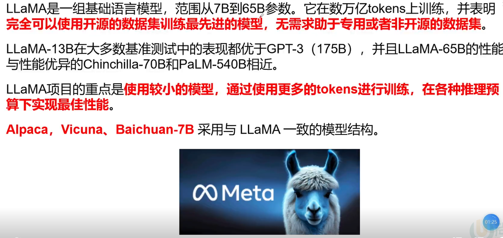

> 重点在于使用更小的模型，有足够多的token（更多有效的数据）进行训练，也能达到相近的效果
>
> 百川、Akamai等都是使用LLaMA为基础

## 预测训练

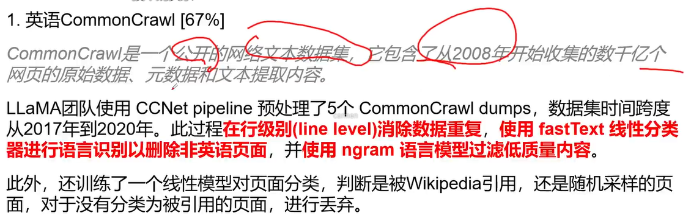

> 60%与 70%来自爬虫数据

### 2. C4【15%】 

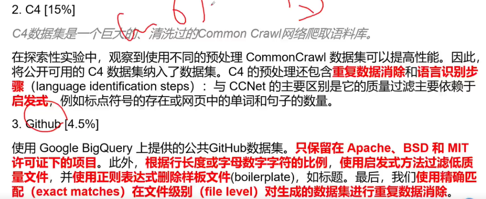

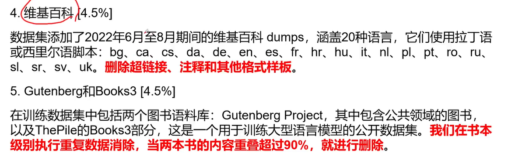

## 数据构成

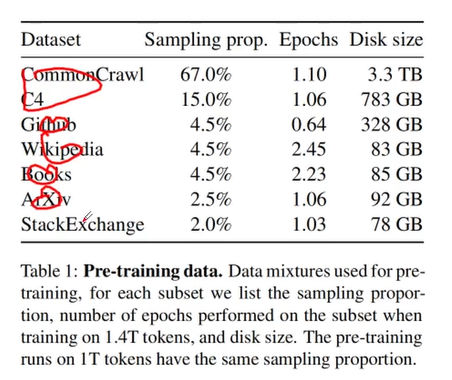

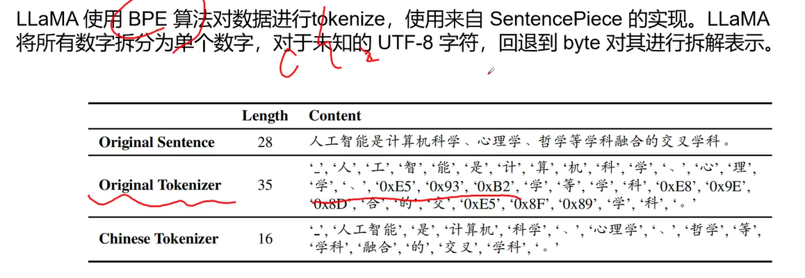

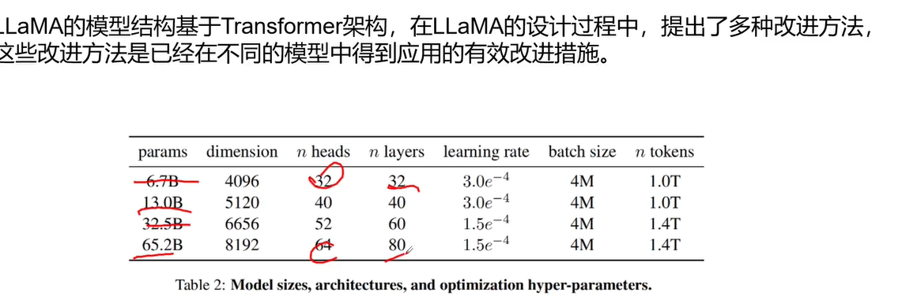

---

---

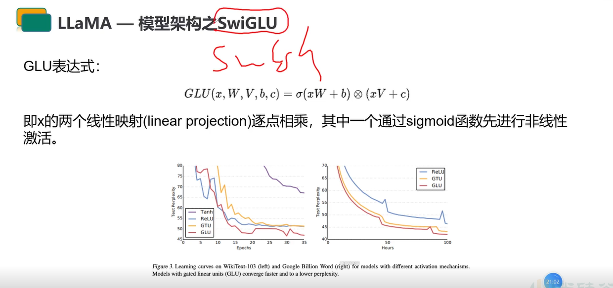

----

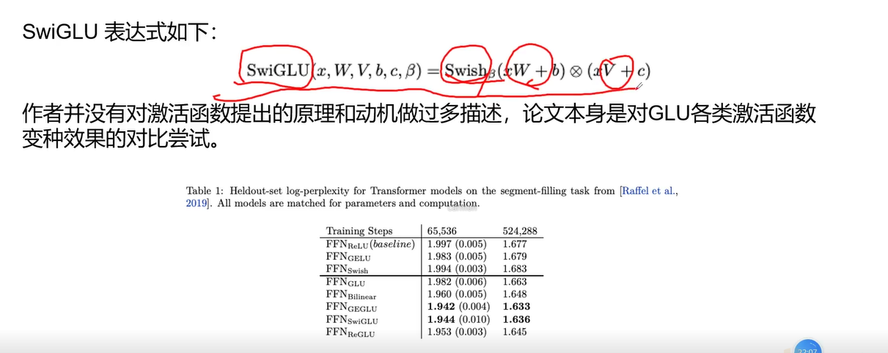

---

>...

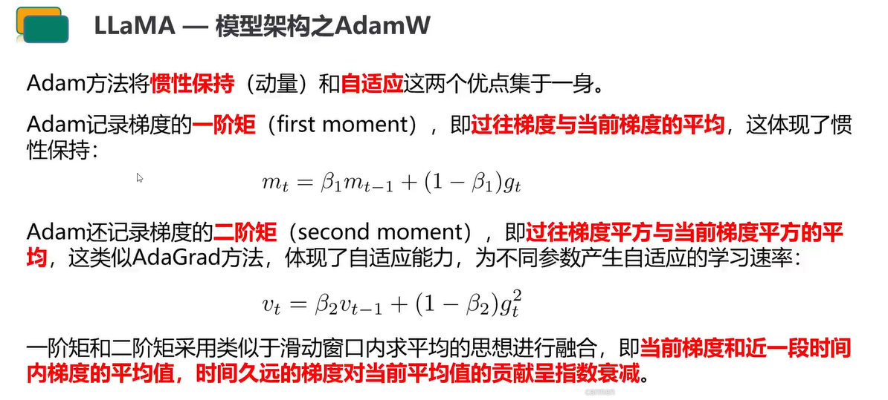

---

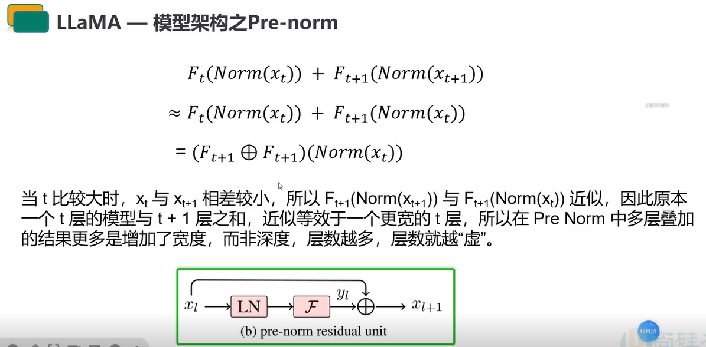

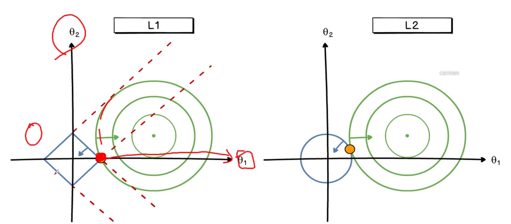