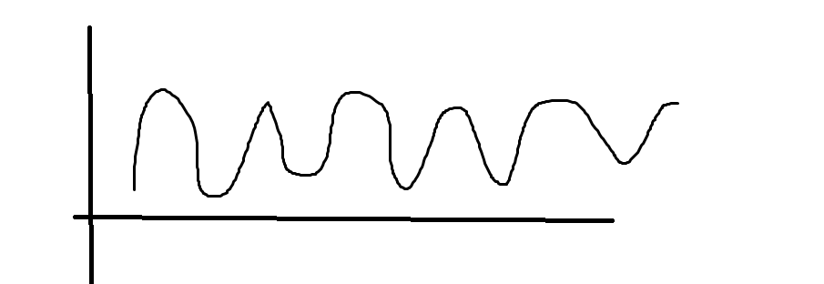
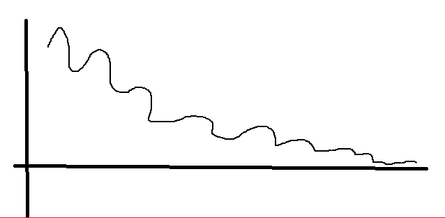
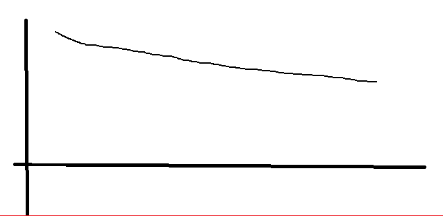

# New March 11th, 2020: Smaller BERT Models


24个较小的BERT模型（仅限英语，未封顶，使用WordPiece掩码进行训练）详见作者发表的 [Well-Read Students Learn Better: On the Importance of Pre-training Compact Models](https://arxiv.org/abs/1908.08962). (阅读良好的学习学得更好，关于预训练紧凑型的重要性)


我们已经展示了标准的BERT配置 (包含: 模型架构与训练目标 - model architecture and training objective)  对各种模型尺寸的模型都是有效的，从BERT-base到BERT-large。 更小的BERT模型被用于计算资源有限的环境中。他们可以按照原始的BERT模型相同的方式进行微调。然而，他们在知识提炼的上下的背景下是最有效， 在知识提炼中，微调标签由更大的、更准备的老师产生。


我们的目标是能够在机构里用更少的计算资源做研究，并且鼓励社区寻求创新的方向而不是增加模型能力。

所有24种较小模型的源码可以从这里下载： https://storage.googleapis.com/bert_models/2020_02_20/all_bert_models.zip

|      | H=128                                                        | H=256                                                        | H=512                                                        | H=768                                                        |
| ---- | ------------------------------------------------------------ | ------------------------------------------------------------ | ------------------------------------------------------------ | ------------------------------------------------------------ |
| L=2  | [**2/128 (BERT-Tiny)**](https://storage.googleapis.com/bert_models/2020_02_20/uncased_L-2_H-128_A-2.zip) | [2/256](https://storage.googleapis.com/bert_models/2020_02_20/uncased_L-2_H-256_A-4.zip) | [2/512](https://storage.googleapis.com/bert_models/2020_02_20/uncased_L-2_H-512_A-8.zip) | [2/768](https://storage.googleapis.com/bert_models/2020_02_20/uncased_L-2_H-768_A-12.zip) |
| L=4  | [4/128](https://storage.googleapis.com/bert_models/2020_02_20/uncased_L-4_H-128_A-2.zip) | [**4/256 (BERT-Mini)**](https://storage.googleapis.com/bert_models/2020_02_20/uncased_L-4_H-256_A-4.zip) | [**4/512 (BERT-Small)**](https://storage.googleapis.com/bert_models/2020_02_20/uncased_L-4_H-512_A-8.zip) | [4/768](https://storage.googleapis.com/bert_models/2020_02_20/uncased_L-4_H-768_A-12.zip) |
| L=6  | [6/128](https://storage.googleapis.com/bert_models/2020_02_20/uncased_L-6_H-128_A-2.zip) | [6/512](https://storage.googleapis.com/bert_models/2020_02_20/uncased_L-6_H-512_A-8.zip) | [2/512](https://storage.googleapis.com/bert_models/2020_02_20/uncased_L-2_H-512_A-8.zip) | [6/768](https://storage.googleapis.com/bert_models/2020_02_20/uncased_L-6_H-768_A-12.zip) |
| L=8  | [8/128](https://storage.googleapis.com/bert_models/2020_02_20/uncased_L-8_H-128_A-2.zip) | [8/256](https://storage.googleapis.com/bert_models/2020_02_20/uncased_L-8_H-256_A-4.zip) | [**8/512 (BERT-Medium)**](https://storage.googleapis.com/bert_models/2020_02_20/uncased_L-8_H-512_A-8.zip) | [8/768](https://storage.googleapis.com/bert_models/2020_02_20/uncased_L-8_H-768_A-12.zip) |
| L=10 | [10/128](https://storage.googleapis.com/bert_models/2020_02_20/uncased_L-10_H-128_A-2.zip) | [10/256](https://storage.googleapis.com/bert_models/2020_02_20/uncased_L-10_H-256_A-4.zip) | [10/512](https://storage.googleapis.com/bert_models/2020_02_20/uncased_L-10_H-512_A-8.zip) | [10/768](https://storage.googleapis.com/bert_models/2020_02_20/uncased_L-10_H-768_A-12.zip) |
| L=12 | [12/128](https://storage.googleapis.com/bert_models/2020_02_20/uncased_L-12_H-128_A-2.zip) | [12/256](https://storage.googleapis.com/bert_models/2020_02_20/uncased_L-12_H-256_A-4.zip) | [12/512](https://storage.googleapis.com/bert_models/2020_02_20/uncased_L-12_H-512_A-8.zip) | [**12/768 (BERT-Base)**](https://storage.googleapis.com/bert_models/2020_02_20/uncased_L-12_H-768_A-12.zip) |


以下是测试集上相应的GLUE分数：

<table width='50%'>
<thead>
<tr>
<th>Model</th>
<th align="center">Score</th>
<th align="center">CoLA</th>
<th align="center">SST-2</th>
<th align="center">MRPC</th>
<th align="center">STS-B</th>
<th align="center">QQP</th>
<th align="center">MNLI-m</th>
<th align="center">MNLI-mm</th>
<th align="center">QNLI(v2)</th>
<th align="center">RTE</th>
<th align="center">WNLI</th>
<th align="center">AX</th>
</tr>
</thead>
<tbody>
<tr>
<td>BERT-Tiny</td>
<td align="center">64.2</td>
<td align="center">0.0</td>
<td align="center">83.2</td>
<td align="center">81.1/71.1</td>
<td align="center">74.3/73.6</td>
<td align="center">62.2/83.4</td>
<td align="center">70.2</td>
<td align="center">70.3</td>
<td align="center">81.5</td>
<td align="center">57.2</td>
<td align="center">62.3</td>
<td align="center">21.0</td>
</tr>
<tr>
<td>BERT-Mini</td>
<td align="center">65.8</td>
<td align="center">0.0</td>
<td align="center">85.9</td>
<td align="center">81.1/71.8</td>
<td align="center">75.4/73.3</td>
<td align="center">66.4/86.2</td>
<td align="center">74.8</td>
<td align="center">74.3</td>
<td align="center">84.1</td>
<td align="center">57.9</td>
<td align="center">62.3</td>
<td align="center">26.1</td>
</tr>
<tr>
<td>BERT-Small</td>
<td align="center">71.2</td>
<td align="center">27.8</td>
<td align="center">89.7</td>
<td align="center">83.4/76.2</td>
<td align="center">78.8/77.0</td>
<td align="center">68.1/87.0</td>
<td align="center">77.6</td>
<td align="center">77.0</td>
<td align="center">86.4</td>
<td align="center">61.8</td>
<td align="center">62.3</td>
<td align="center">28.6</td>
</tr>
<tr>
<td>BERT-Medium</td>
<td align="center">73.5</td>
<td align="center">38.0</td>
<td align="center">89.6</td>
<td align="center">86.6/81.6</td>
<td align="center">80.4/78.4</td>
<td align="center">69.6/87.9</td>
<td align="center">80.0</td>
<td align="center">79.1</td>
<td align="center">87.7</td>
<td align="center">62.2</td>
<td align="center">62.3</td>
<td align="center">30.5</td>
</tr>
</tbody>
</table>


For each task, we selected the best fine-tuning hyperparameters from the lists below, and trained for 4 epochs:

每一个任各，我们从下列列表中选择最好的微调超参数，并训练4个epochs。

- batch sizes: 8, 16, 32, 64, 128
- learning rates: 3e-4, 1e-4, 5e-5, 3e-5

If you use these models, please cite the following paper:

```
@article{turc2019,
  title={Well-Read Students Learn Better: On the Importance of Pre-training Compact Models},
  author={Turc, Iulia and Chang, Ming-Wei and Lee, Kenton and Toutanova, Kristina},
  journal={arXiv preprint arXiv:1908.08962v2 },
  year={2019}
}
```


# 标准版本 - 源码说明

源码路径：https://github.com/google-research/bert

> 源码上只包括模型训练相关的功能，本程序作为体系化的工程


# 程序结构

python版本：3.8.5+

## common

 - constant.py   常量配置
 > 本项目只包括BERT的预训练模型的路径 - BERT_PATH
 > 代码里不包含hard-code，会将常量定义在constant.py里
 >
 > 文件名大写+下划线

##  config

- multi_gpu.conf  多卡训练的代码配置

  ```shell
  {
      "model_type": "bert",   # 模型类型，比如项目支持多种模型，那么通过model_type来指定训练一种模型，百川、千问、文心一言还是其他的？
      "model_name_or_path": "./pretrain_model/bert",     # 模型位置
      "train_data_path": "data/cnews.train.txt",         # 训练数据位置
      "eval_data_path": "data/cnews.val.txt",            # 评估数据的位置, 一个epoch之后，拿评估集来评估训练情况。
      "output_dir": "trained_models/bert_model_base.pkl",# 输出目录
      "batch_size": 16,      # 批次大小(行数）, 一次要加载的数据(条数)，2块的360的话，
      "num_epochs": 2,       # epoch次数
      "learning_rate": 5e-6  # 学习率, 决定了参数在经过每一个batch之后，计算出其梯度后，梯度作用到现有的权重的参数上的步长或幅度。learning_rate傎越大，batch计算完梯度之后，梯度对于之前参数的变化幅度就会越大, 其训练过程就会越激进; learning_rate越小，过程会更柔和；learning_rate需要适当，太小lost(损失率)既便epoch经过10次了也会降多少，因为learning_rate太小，参数的更新幅度太小，看不到效果。至于多少算是合理的，一般要经过多次偿试。
  }
  ```

> 结果测试：当两个epoch训练结束之后，整个模型训练完，需要额外再找2w条或数据来做评估整个模型的执行情况，该数据不包含在train_data_path和eval_data_path中 —— 这样的结论就是给甲方或向上汇报时用的评估结论


### learning_rate不同失失率的情况

| learning_rate太不合理时，损失率的波动                        | learning_rate合理时，损失率的情况                            | learning_rate太小时，损失率过缓，感觉不到太大变化            |
| ------------------------------------------------------------ | ------------------------------------------------------------ | ------------------------------------------------------------ |
|  |  |  |

### 观察变化

1e-4或 1e-3时的情况  5e-6的情况  5e-8等

多训练几个epoch时的情况，少训练的情况。


## data

实际的训练数据

*.debug.txt：结尾的作为调试时用，数据较小。

*.train.txt：训练集

*.val.txt：评估信

*.test.txt：测试集

 *.vocab.txt：所有数据所形成的词汇表

## pretrain_modal

三个版本

### bert - 基础版

### chinese_bert_wwm_ex1_pytorch 

使用中文的文基百科等数据针对中文领域的预训练，支持了更多的中文

### chinese_roberta_wwm_ex1_pytorch

1. 变种roberta的训练方式
2. 动态mask
3. 使用更大的预训练数据集160G

### trained_models

>  模型训练好后，会设置checkpoint

训练后的模型模型的保存路径 


 ## 根目录文件

```python
# 日志
1020_0933.log: OOM的例子 - 记录所有的训练过程，快结束时OOM了
1020_1052.log: 完整的训练日志
------------------------------------------------------------
# 安装
install_req.sh 与 requirements.txt  安装需要的依赖包
# pip install -i http://.../ torch==x.x.x #单包安装 
# requirements.txt上可限定版本号
torch==2.0.0
transformers
tqdm
numpy
scikit-learn
------------------------------------------------------------
model.py 	 #要使用的模型的定义
multi_gpu.py #多卡训练的执行命令
train_multi_gpu.py  #多卡训练
------------------------------------------------------------
train.py   #单卡或CPU时使用
- python train.py --model_config_file config/multi_gpu.config  
# 如果单卡训练没有config/multi_gpu.config内容，可去掉
------------------------------------------------------------
train.sh   #启动单间卡训练

```


# 源码解读

## CPU训练的代码

### train.py - 见代码注解

```
1. epoch: 2  batch_size: 4  learning_rate=5e-6  device: 'cpu'
2. 数据集：训练集、评估集

```

> 此次训练的是一个分类任务


# 附加信息


## 国内开源模型平台介绍

- [Modelscope](https://www.modelscope.cn/home)

  

## 显存占用情况计算

**显存占用 = 模型显存占用 + batch_size × 每个样本的显存占用**


今天用多GPU训练模型时发现了一个有趣的现象。使用2块GPU卡，做数据分布式训练模型，当每个GPU卡的batchsize数设为16时，训练过程中每个卡的显存占用是11G左右，比较均衡。当每个GPU卡的batchsize数设为24时，主GPU卡的显存占用达到16G左右，另一块的只有8G左右，两块卡的显存占用明显不均衡。这是什么原因呢？为什么主GPU卡的显存占用比另一块的多了将近一倍？

> 猜想1： 多GPU分布式训练时batchsize数设为16更有利于均衡训练。


## 问题

- 这些源都是从哪里来的？