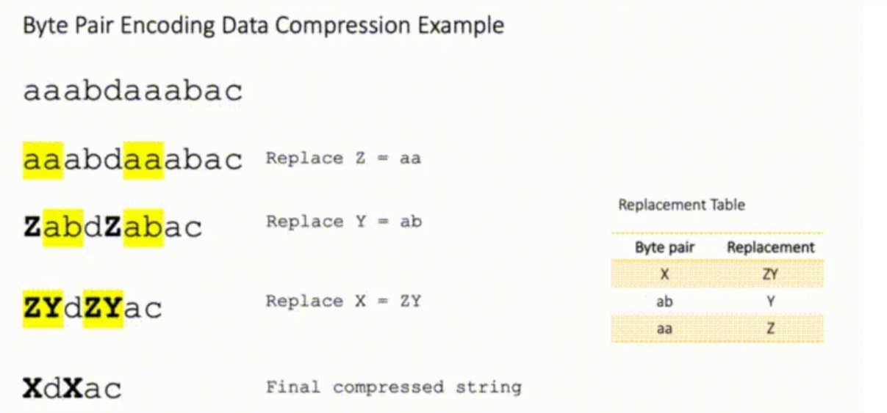

[NLP 中的Tokenizer：BPE、BBPE、WordPiece、UniLM 理论](https://zhuanlan.zhihu.com/p/649030161)


[教你用PyTorch玩转Transformer英译中翻译模型！](https://zhuanlan.zhihu.com/p/347061440)


# Tokenizer 作用

在之前的自然语言处理（NLP）的任务中，词（Word）是最小的能独立使用的音义结合体，因此一段文本中最基础的处理单元就是词（Word）粒度。


进入Pre-Train时代后模型处理文本的粒度从Word更细分到Token粒度，Token可以是一个字、词、标识符等等。那如何从一段文本、句子中得到切割、分好的以Token粒度表示的Token序列呢？


答案是需要一个**Tokenizer**——**分词器**去将文本处理成Token的序列，例如当BertTokenizer的输入文本是 "I love NLP." 会被切分为：['i', 'love', 'n', '##lp', '.']；当输入文本是: "我喜欢自然语言处理"时， 则会被切分为：['我', '喜', '欢', '自', '然', '语', '言', '处', '理', '。']。


# 分词粒度

这里主要有三种粒度的分词方式,从粗到细：Word(词) > Subword(子词) > Character(简称char, 单个字母)。


## 什么是BPE

字节对编码（BPE, Byte Pair Encoder），又称 digram coding 双字母组合编码，是一种**数据压缩** 算法，用来在固定大小的词表中实现可变⻓度的子词。该算法简单有效，因而目前它是最流行的方法。

> Byte-Pair-Encoding是用于解决未登录词的一种方法。

BPE 首先将词分成单个字符，然后依次用另一个字符替换频率最高的**一对字符** ，直到循环次数结束。




## 未登录词

未登录词可以理解为训练语料库中没有出现的，但是在测试语料库中出现的词。

我们在处理NLP任务时，通常会根据语料生成一个词典，把语料中词频大于某个阈值的词放入词典中，而低于该阈值的词统统编码成"#UNK"。这种处理方法的好处是简单，但是问题也很大，在测试语料库中如果出现了未登录词，那么我们的模型很难处理这种词。由于本文并不是为了解释NLP中如何处理未登录词的，因此其他的废话不多说，我们只说BPE算法是怎么解决未登录词的。

- 通常我们的词典都是**word-level**的，也就是说词典是以单词或者短语为基本单位的，但这就无可避免的会遇到未登录词的问题，因为不可能设计一个非常大的能涵盖所有单词的词典。
- 此外另一种词典是**character-lever**，即以单个字母或汉字(中文)为基本单词设计词典，这种方法理论上可以解决未登录词的问题，因为所有的词都是由字母组成的，但是这样做的缺点是模型粒度太细，缺少语义信息，实际也有人做过实验证明这种方法不好。


## BPE原理

后来2016年rich等人提出了**基于subword**来生成词典的方法，这种方法**综合了word-level和charater-level的优势**，从语料中学习所有单词里频次高的字符子串，然后把这些频次高的字符子串合并为一个词典。在这个词典里，既存在word-level级别的子串，也存在charater-level的子串。其中，用于寻找高频子串的方法，就是本文即将解释的BPE算法。


BEP算法很简单，它**主要是用来寻找字符串中的高频子串的方法**。具体来说，我们把语料库中的**每个单词结尾添加一个stop token “”**。然后我们将每个单词拆分成字母的形式。例如，起初我们有如下的words：

```
{'low': 5, 'lower': 2, 'newest': 6, 'widest': 3}
```


添加stop token并拆分后，变成了下面的形式：

```
{'l o w </w>': 5, 'l o w e r </w>': 2, 'n e w e s t </w>': 6, 'w i d e s t </w>': 3}
```


接下来我们计算相邻两字母出现的频率，选择频率最高的一对进行合并，在上面的例子中，'e’与’s’共出现了9次，频率最高，我们将其合并：

```
{'l o w </w>': 5, 'l o w e r </w>': 2, 'n e w es t </w>': 6, 'w i d es t </w>': 3}
```

继续重复刚刚的方法，发现’es’与’t’共出现了9次，频率最高，将其合并：

```
{'l o w </w>': 5, 'l o w e r </w>': 2, 'n e w est </w>': 6, 'w i d est </w>': 3}
```


以此类推，迭代n次，直到达到预设的subwords词表大小或下一个最高频的字节对出现频率为1。


## 算法过程

1. 准备语料库，确定期望的 subword 词表大小等参数
2. 通常在每个单词末尾添加后缀 `</w>`，统计每个单词出现的频率，例如，`low` 的频率为 5，那么我们将其改写为 `"l o w </ w>”：5`
   注：停止符 `</w>` 的意义在于标明 subword 是词后缀。举例来说：`st` 不加 `</w>` 可以出现在词首，如 `st ar`；加了 `</w>` 表明该子词位于词尾，如 `we st</w>`，二者意义截然不同
3. 将语料库中所有单词拆分为单个字符，用所有单个字符建立最初的词典，并统计每个字符的频率，本阶段的 subword 的粒度是字符
4. **挑出频次最高的符号对** ，比如说 `t` 和 `h` 组成的 `th`，将新字符加入词表，然后将语料中所有该字符对融合（merge），即所有 `t` 和 `h` 都变为 `th`。
   注：新字符依然可以参与后续的 merge，有点类似哈夫曼树，BPE 实际上就是一种**贪心算法** 。
5. 重复遍历 2 和 3 操作，直到**词表中单词数达到设定量** 或**下一个最高频数为 1** ，如果已经打到设定量，其余的词汇直接丢弃


# 分词发展


## 1. 古典分词方法的缺点

- 对于**未在词表中出现的词（Out Of Vocabulary, OOV** ），模型将无法处理（未知符号标记为 `[UNK]`）。
- 词表中的低频词/稀疏词在模型训无法得到训练（因为词表大小有限，太大的话会影响效率）。
- ⭐️ 很多语言难以用空格进行分词，例如英语单词的多形态，"look"衍生出的"looks","looking", "looked"，其实都是一个意思，但是在词表中却被当作不同的词处理，模型也无法通过 `old, older, oldest` 之间的关系学到 `smart, smarter, smartest` 之间的关系。这一方面增加了训练冗余，另一方面也造成了大词汇量问题。


## 2.拆分为单个字符

这种方法称为 Character embedding，是一种更为极端的分词方法，直接把一个词分成一个一个的字母和特殊符号。虽然能解决 OOV 问题，也避免了大词汇量问题，但缺点也太明显了，粒度太细，训练花费的成本太高，但这种思想或许我们后面会用到。


## 3. Subword Tokenization


### BERT 的出现

我们都知道，随着 BERT 算法的横空出世，NLP 中的很多领域都被颠覆性的改变了，BERT 也称为了一个非常主流的 NLP 算法。由于 BERT 的特性（具体请移步学习 BERT），要求分词方法也必须作出改变。这就对应提出了 **Subword 算法** （或成为 WordPiece），该算法已经成为一种标配。


### 基于子词的分词方法（Subword Tokenization）

可见不论是传统分词算法的局限性，还是 BERT 的横空出世，都要求我们提出新的分词算法，下面就轮到本文的主角登场：**基于子词的分词方法（Subword Tokenization）** ，简称为 Subword 算法，意思就是把一个词切成更小的一块一块的子词。如果我们能使用将一个 token 分成多个 subtokens，[上面的问题](https://link.zhihu.com/?target=https%3A//www.wolai.com/heU7bADzdRaJje1jdeoVLp%23vFA25b5i9XhnafxdBEhtX1)就能很好的解决。


这种方法的目的是通过**一个有限的词表** 来解决所有单词的分词问题，同时尽可能将结果中 token 的数目降到最低。例如，可以用更小的词片段来组成更大的词，例如：

```
“unfortunately ” = “un ” + “for ” + “tun ” + “ate ” + “ly ”。
```

可以看到，有点类似英语中的词根词缀拼词法，其中的这些小片段又可以用来构造其他词。可见这样做，既可以降低词表的大小，同时对相近词也能更好地处理。


## Subword 与传统分词方法的比较

- 传统词表示方法无法很好的处理未知或罕见的词汇（OOV 问题）。
- 传统词 tokenization 方法不利于模型学习词缀之间的关系，例如模型学到的“old”, “older”, and “oldest”之间的关系无法泛化到“smart”, “smarter”, and “smartest”。
- Character embedding 作为 OOV 的解决方法粒度太细。
- Subword 粒度在词与字符之间，能够较好的平衡 OOV 问题。


目前有三种主流的 Subword 算法，它们分别是：Byte Pair Encoding (BPE)、WordPiece 和 Unigram Language Model。


# NLP三大Subword模型

https://zhuanlan.zhihu.com/p/191648421

## WordPiece

## ULM - Unigram Language Model

# SentencePiece

SentencePiece，它是谷歌推出的子词开源工具包，其中集成了BPE、ULM子词算法。除此之外，SentencePiece还能支持字符和词级别的分词。更进一步，为了能够处理多语言问题，sentencePiece将句子视为Unicode编码序列，从而子词算法不用依赖于语言的表示。


