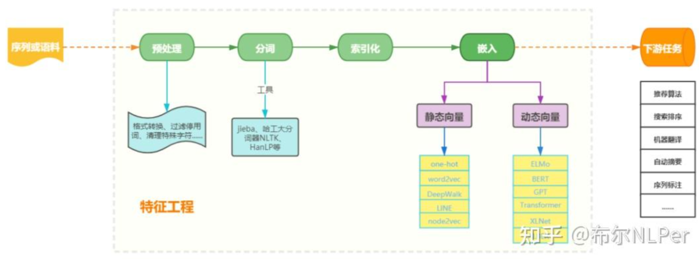

# 论文

word2vec Parameter Learning Explained:  https://arxiv.org/pdf/1411.2738.pdf

用词向量处理文本序列的大致流程

# word2vec的缺点

- word2vec存在最大的问题就是由于它是静态词向量表示导致不能表示一词多义的情况

  举个例子“苹果”一词，在果蔬的句子中表示的就是水果的含义，要是在高科技产品句子中表示的就是“苹果”公司。但是word2vec的静态词向量表示只能表示同一种形式，不能很好的表示上下文语义，这也是为什么ELMO,GPT，bert问世之后word2vec就不再有以前的光环了，因为ELMO ,GPT，bert都是用的动态词向量表示，可以很好的表示上下文语义,

  > ELMo：语义表示模型：https://aistudio.baidu.com/projectdetail/124374
  >
  > GPT： Generative Pre-Trained Transformer（生成式预训练Transformer模型），是一种基于互联网的、可用数据来训练的、文本生成的深度学习模型。
  >
  > [BERT](https://zhuanlan.zhihu.com/p/509244050?utm_id=0)是一种**语言表示模型**，BERT代表来自Transformer的双向编码器表示（Bidirectional Encoder Representations from Transformers）。

## word2vec实现方式

word2vec主要通过两种方式：

- 一种是给定上下文词，需要我们来预测中间目标词，这种模型叫做连续词袋模型（CBOW）：上下文-->预测中间目标词
- 另一种是给**定一个词语**，我们来根据这个词预测它的上下文，这种模型叫做 skip-gram 模型：   词语-->预测上下文

## Skip-Gram模型

skip-gram 模型的应用场景是要根据中间词预测上下文词，所以我们的输入X 是任意单词，输出 Y 为给定词汇表中每个词作为上下文词的概率。

在skip-gram模型中，我们用一个词来预测它在文本序列的周围词。

> 假设文本序列是“我”、“爱”、“中国”、“这片”和“土地”。以“中国”作为中心词，设时间窗口⼤小为 2，跳字模型所关心的是，给定中心词“中国”生成与它距离不超过2个词的背景词“我”、“爱”、“这片”和“土地”的条件概率。

### 数学描述

假设词典索引集 V 的大小为 |V|，且 V={0,1,…,|V|−1}。给定一个长度为T 的文本序列中，时间步 t 的词为 w(t)。当时间窗口大小为 m 时，跳字模型需要最大化给定任一中心词生成所有背景词的概率：

## CBOW模型

CBOW 模型的应用场景是要根据上下文预测中间词，所以我们的输入便是上下文词，输出 Y 为给定词汇表中每个词作为目标词的概率。

CBOW模型与Skip-Gram模型类似。与Skip-Gram模型最大的不同是， CBOW模型用一个中心词在文本序列前后的背景词来预测该中心词。

> 假设文本序列是“我” 、“爱” 、“中国” 、“这片”和“土地”。以“中国”作为中心词，设时间窗口⼤小为 2。连续词袋模型所关⼼ 的是，给定与中心词距离不超过 2 个词的背景词“我” 、“爱” 、“这片”和“土地”生成中心词“中国”的条件概率。

## word2vec的两种训练策略

### 负采样

词典的大小决定了我们的Skip-Gram神经网络将会拥有大规模的权重矩阵，所有的这些权重需要通过我们数以亿计的训练样本来进行调整，这是非常消耗计算资源的，并且实际中训练起来会非常慢。

负采样（negative sampling）解决了这个问题，它是用来提高训练速度并且改善所得到词向量的质量的一种方法。不同于原本每个训练样本更新所有的权重，负采样每次让一个训练样本仅仅更新一小部分的权重，这样就会降低梯度下降过程中的计算量。

### 层序化softmax

基本思想就是把多分类softmax变成多级二分类sigmoid。分层softmax的作用和在CBOW中相似，利用树降低复杂度，从N降到logN，需要计算w的概率，是指从root结点开始随机走，走到w的概率。

# Tensorflow实战word2vec

## 读取停用词

## 读取处理数据语料

## 构建词表和索引序列

## 构建数据迭代器

## 模型训练

## 可视化

# Gensim实战word2vec

> 注意这里的gensim版本是4.1.2，低版本的gensim在用法上有变动，具体可以查看官方api

## 读取停用词

## 数据预处理 

### 读取处理数据语料

### 构建词表和索引序列

### 构建数据迭代器

## 模型训练

# 附

## 时间窗口

时间窗口有两个含义：

1. 指时间周期运行到一定的阶段时，便会发生转折；
2. 指在时间周期中的某一关键时间段，如果对特定事物施加影响或采取某种行动，成功几率将增加;

股票分析里说的时间窗口是周期的一种应用方法，周期的使用，不同的学说和不同的技术分析工具都有不同的使用方法，波浪理论中应用的周期是以菲波纳奇数列为基础的，而江恩理论里面，周期的划分和应用又有他独特的界定。

### Flink的窗口分类

Flink 是一种流式计算引擎，主要是来处理无界数据流的，数据源源不断、无穷无尽。想要更加方便高效地处理无界流，其中的一种方式是**将无限数据切割成有限的“数据块”进行处理**，这就是所谓的“窗口”（Window）

#### 按照驱动类型分类

以什么标准来开始和结束数据的截取，我们把它叫作窗口的“驱动类型”

##### 时间窗口

   时间窗口以时间点来定义窗口的开始（start）和结束（end），所以截取出的就是某一时间段的数据。到达结束时间时，窗口不再收集数据，触发计算，输出结果，并将窗口关闭销毁。

##### 计数窗口 

  数窗口基于元素的个数来截取数据，到达固定的个数时就触发计算并关闭窗口。

#### 按照窗口分配数据的规则分类

滚动窗口 、滑动窗口 、会话窗口、全局窗口

## 时间切片 - TimeSlice

时间切片是指将一个时间段分为更小的间隔，通常用于计算机科学和数据分析中。

- 在操作系统中，进程或线程的时间片是其中一个管理策略来优化系统资源的使用效率。每个进程都有一段特定的运行时长被分配给该任务执行，当这段时长结束后，进程会被暂停一小段时间再由下一个进程继续执行。
- 此外，“时间切片”这个概念也常常用在数据库查询性能分析上：通过记录并比较不同“时间切片”（如一天、一周等）的数据统计信息（例如CPU使用率），可以找出哪些操作或者数据集占用了大量的处理能力。这种技术对于改进系统的效率和响应速度非常有帮助。

