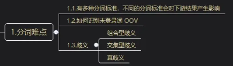
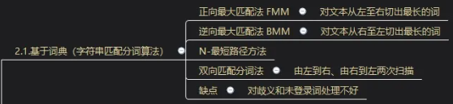
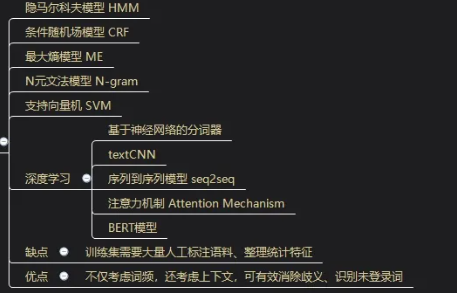
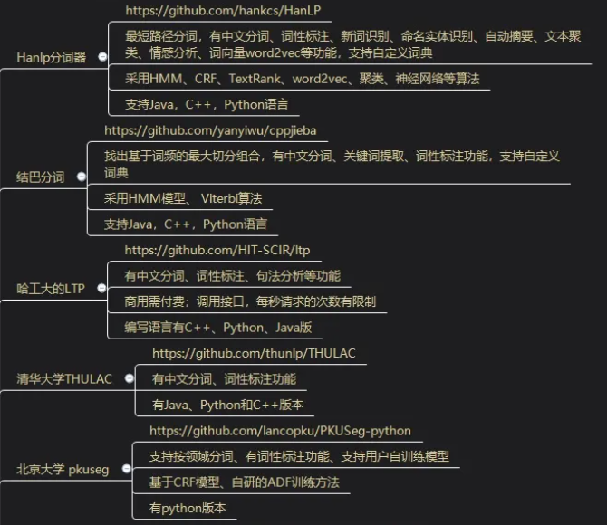
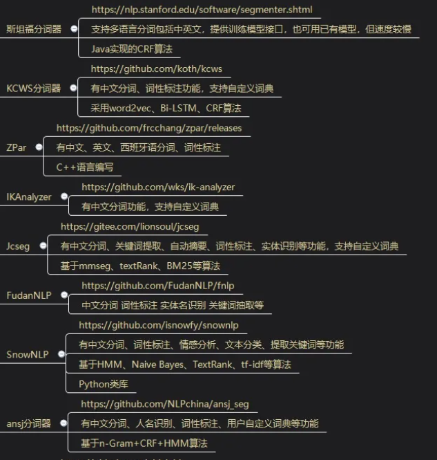
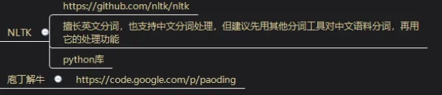
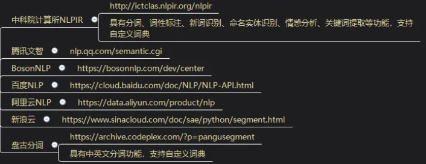
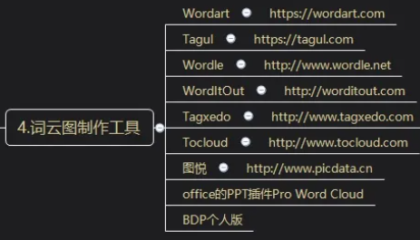

# 分词工具CWS

## 分词难点

1. 有多种不同的分词标准，不同的分词标准会对下游结果产生影响
2. 如何识别未登录词OOV
3. 歧义
   1. 组合型定义
   2. 交集型歧义
   3. 真歧义

## 分词处理方法

### 基于词典 - 字符匹配分词算法

### 机器学习

- 隐马尔科夫模型 HMM

- 条件随机场模型 CRF

- 最大熵模型 ME
- N元文法模型 N-gram
- 支持向量机SVM
- 深度学习
  - 基于神经网络的分词器
  - textCNN
  - 序列倒序列模型 seq2seq
  - 注意力机制 Attention Mechanism
  - BERT模型
- 缺点：训练集需要大量人工标注语料，整理统计标注
- 优点：不仅考察词频，还考虑上下文，可有效消除歧义、识别未登录词

## 分词工具

### 免费开源

### 商用

## 词云图制作工具

# 分词难点

**1.1，分词算法**

有多种分词算法，会得到不同的分词结果，会对下游的软件产生影响

**1.2，未登录词识别**

如何识别未登录词 OOV

**1.3，歧义**

- 组合型歧义；
- 交集型歧义；
- 真歧义；

# 分词方法

**2.1，基于词典**

（1）正向最大匹配法 FMM：对文本从左至右切出最长的词

（2）逆向最大匹配法 BMM：对文本从右至左切出最长的词

（3）N-最短路径方法

（4）双向匹配分词法：由左到右、由右到左两次扫描

​	缺点：对歧义和未登录词处理不好。

**2.2，机器学习**

（1）隐马尔科夫模型 HMM

（2）条件随机场模型 CRF

（3）最大熵模型 ME

（4）N元文法模型 N-gram

（5）支持向量机 SVM

（6）深度学习

- 基于神经网络的分词器
- textCNN
- 序列到序列模型 seq2seq
- 注意力机制 Attention Mechanism
- BERT模型

缺点：训练集需要大量人工标注语料、整理统计特征。

优点：不仅考虑词频，还考虑上下文，可有效消除歧义、识别未登录词

**2.3，其他相关知识**

（1）词向量转换/特征降维

- 词嵌入 Word2Vec
- 连续词袋模型 CBOW
- Skip-gram
- 子词嵌入 FastText
- 全局向量词嵌入 GloVe

（2）TF-IDF

TF 表示某个词语在一个语料中出现的频次；DF 表示在全部语料中，共有多少个语料出现了这个词，IDF 是DF的倒数(取log)；TF- IDF 越大，表示这个词越重要。

常用于关键词提取。

（3）TextRank

根据词语之间的邻近关系构建网络，通过PageRank迭代计算出词语的排名；

常用于关键词提取、自动摘要提取。

# 分词软件和云服务

## 3.1，开源或者免费

### （1）Hanlp分词器

http://github.com/hankcs/HanLP
最短路径分词，有中文分词、词性标注、新词识别、命名实体识别、自动摘要、文本聚类、情感分析、词向量word2vec等功能，支持自定义词典；

采用HMM、CRF、TextRank、word2vec、聚类、神经网络等算法；

支持Java，C++，Python语言；

### （2）结巴分词

http://github.com/yanyiwu/cppjieba

找出基于词频的最大切分组合，有中文分词、关键词提取、词性标注功能，支持自定义词典；

采用HMM模型、 Viterbi算法；

支持Java，C++，Python语言；

### （3）哈工大的LTP

http://github.com/HIT-SCIR/ltp

有中文分词、词性标注、句法分析等功能；

商用需付费；调用接口，每秒请求的次数有限制；

编写语言有C++、Python、Java版；

### （4）清华大学THULAC

http://github.com/thunlp/THULAC

有中文分词、词性标注功能；

有Java、Python和C++版本；

### （5）北京大学 pkuseg

http://github.com/lancopku/PKUSeg-python

支持按领域分词、有词性标注功能、支持用户自训练模型；

基于CRF模型、自研的ADF训练方法；

有python版本；

### （6）斯坦福分词器

The Stanford Natural Language Processing Group
http://nlp.stanford.edu/software/segmenter.shtml
支持多语言分词包括中英文，提供训练模型接口，也可用已有模型，但速度较慢；

Java实现的CRF算法；

### （7）KCWS分词器

http://github.com/koth/kcws

有中文分词、词性标注功能，支持自定义词典；

采用word2vec、Bi-LSTM、CRF算法；

### （8）ZPar

http://github.com/frcchang/zpar/releases

有中文、英文、西班牙语分词、词性标注；

C++语言编写；

### （9）IKAnalyzer

http://github.com/wks/ik-analyzer

有中文分词功能，支持自定义词典；

### （10）狮子的魂/jcseg

http://gitee.com/lionsoul/jcseg
有中文分词、关键词提取、自动摘要、词性标注、实体识别等功能，支持自定义词典；

基于mmseg、textRank、BM25等算法；

### （11）FudanNLP

http://github.com/FudanNLP/fnlp

中文分词 词性标注 实体名识别 关键词抽取等；

### (12）SnowNLP

http://github.com/isnowfy/snownlp

有中文分词、词性标注、情感分析、文本分类、提取关键词等功能；

基于HMM、Naive Bayes、TextRank、tf-idf等算法；

Python类库；

### (13）ansj分词器

http://github.com/NLPchina/ansj_seg

有中文分词、人名识别、词性标注、用户自定义词典等功能；

基于n-Gram+CRF+HMM算法；

### (14）NLTK

http://github.com/nltk/nltk

擅长英文分词，也支持中文分词处理，但建议先用其他分词工具对中文语料分词，再用它的处理功能；

python库；

（15）庖丁解牛

## 3.2，其他

（1）中科院计算所NLPIR

具有分词、词性标注、新词识别、命名实体识别、情感分析、关键词提取等功能，支持自定义词典；

（2）腾讯文智

（3）BosonNLP

（4）百度NLP

（5）阿里云NLP

（6）新浪云

（7）盘古分词

具有中英文分词功能，支持自定义词典；

# 词云图制作工具

（1）Wordart

（2）Tagul

（3）Wordle

（4）WordItOut

（5）Tagxedo

（6）Tocloud

（7）图悦

（8）office的PPT插件Pro Word Cloud

（9）BDP个人版

