# 安装指南

视频链接：https://www.bilibili.com/video/BV1hE411t7RN/?p=1&vd_source=ffe29668e0a2e15974a3e4de41359bf1

> PyTorch深度学习环境配置主流环境：Anaconda+PyTorch+PyCharm, 引文不包含Pycharm安装


## Python

> 别安装python3.7，有时会有问题
>
> 如果之前没python，conda在创建pytorch环境时一起安装，不用专门安装

查看python版本

```shell
python -v
- 
# Python 3.11.0 (main, Oct 24 2022, 18:26:48) [MSC v.1933 64 bit (AMD64)] on win32
```


## Anaconda安装

> 安装了Anaconda就将大部分的Pytorch功能安装了，同时安装了虚拟环境conda。
>
> 官网：https://www.anaconda.com/
>
> 中文：https://anaconda.org.cn/
>
> 仓库：https://repo.anaconda.com/
>
> 所有版本的Anaconda: https://repo.anaconda.com/archive/


### 下载 - for windows： 

安装指南： https://anaconda.org.cn/anaconda/install/windows/       

下载： https://www.anaconda.com/download#downloads


### 安装

笔者下载的版本是“Anaconda3-2023.09-0-Windows-x86_64.exe”, 点击安装即可(过程略）。

> 从文件名看py对应的版本 ： Anaconda3... 后的‘3’代表对应的python的大版本是3，Anaconda2... 则python2。


### 验证

搜索 Anaconda Powershell Prompt ，打开对话框，如果出现如下界面，则说明安装成功。

```shell
(base) PS C:\Users\carmen-x13>
# base代表是 "基础环境"，后面会用到
```

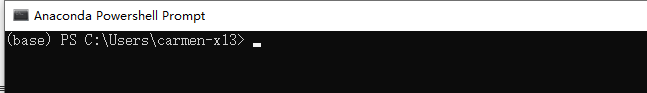


## conda虚拟环境

conda可完成pytorch与python的多版本切换。

conda随Anaconda一起安装。


## PyTorch安装

### 显卡配置

#### 基本信息


深度学习离不开显卡，现在一些tensflow、pytorch等都只支持NVIDA的显卡，但是否有显卡对于学习pytorch并没有影响，前者只是起到训练加速的作用。

显卡配置主要涉及以下内容

1. 驱动
2. CUDA Toolkit

> CUDA Toolkit 现在随着pytorch一起安装，需要手工检查的是CUDA驱动安装的情况


#### 检查显卡安装情况

For windows ： 

任务管理器  - 性能  -GPU 0 : 如果能正常显示型号，意味着显卡驱动正式安装了

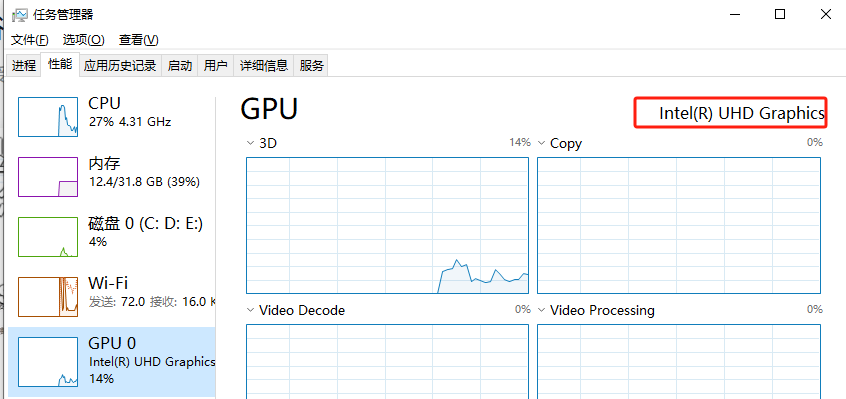


先可查看当前主机是硬件型号与查看GPU对应的型号，方法如下：

- 通过“软件管理、鲁大师”
- 或 打开''设备管理器'': Intel(R) UHD Graphics
- 或任务管理器:  右上角
- dxdiag

再进入 https://www.geforce.cn/hardware/technology/cuda/supported-gpus

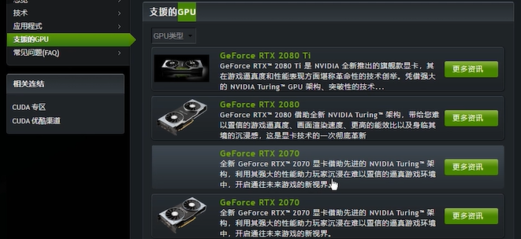


#### 查看 driver版本 

> 后面在安装pytorch时选CUDA版本时用会出

运行如下命令-

```
nvidia-smi 
```

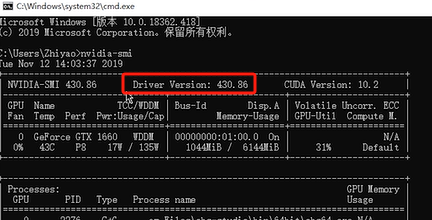

CUDA对驱动版本有要求，CUDA9.x 只支持驱动版本>396.26


#### 升级驱动版本

利用电脑管理，或进入英伟 达的驱动官网，下载对应的驱动


### pytorch安装

进入Anaconda Powershell Prompt命令提示行

#### 创建环境

```shell
conda create -n pytorch python=3.11.0
```

#### 激活环境

```
conda activate pytorch
```

#### 查看当前环境已安装的包与pytorch

```
pip list
pip list | findstr pytorch
```

没有，则需要安装pytorch


#### pytorch安装

> 官网：https://pytorch.org
>
> 源码：https://github.com/pytorch/pytorch


1、访问官网首页，找到 "INSTALL PYTORCH" 楼层，根据以下信息选择对应的版本，


上述图片选择如下

- PyTorch Build：选 Stable

- Package: 选conda（在windows推荐使用conda,  linux推荐pip）

- Language:  选Python

- Compute Platform: 

  - 如果发现电脑上没有对应的NVIDA，选"CPU"，有NVIDA时可选CUDA11.8或CUDA12.1(主要是根据驱动对应的版本）

  - CUDA 11.8还是CUDA 12.1，我们要保证我们的CUDA driver版本 >= CUDA Runtime版本。

  - [CUDA最新版本安装](https://developer.nvidia.com/cuda-downloads?target_os=Windows&target_arch=x86_64&target_version=10&target_type=exe_local)  CUDA 12.2可自动检查系统的兼容性。

    > CUDA 12.2 Relase 与 download:  https://docs.nvidia.com/cuda/cuda-toolkit-release-notes/index.html#major-components

  - 查看NVIDA的显示是否支持CUDA（见显卡配置章节）


2、打开Anaconda Powershell Prompts 窗口，输入上述图片中  **Running this Common** 对应的指令

> 点  [install previous versions of PyTorch](https://pytorch.org/get-started/previous-versions)  可看到看有的安装包

```shell
#没有NVIDIA运行下方命令
#conda install pytorch torchvision torchaudio cpuonly -c pytorch
conda install pytorch==2.0.1 torchvision==0.15.2 torchaudio==2.0.2 cpuonly -c pytorch

# 如下条信息安装结束
# Downloading and Extracting Packages
# ................
#Preparing transaction: done
#Verifying transaction: done
#Executing transaction: done

# 如果之前就已安装，会提示'# All requested packages already installed'

```

3、查看安装情况

```shell
pip list |findstr torch

# 如下信息说明安装上了
# torch                         2.1.0
# torchaudio                    2.1.0
# torchvision                   0.16.0
```

> 也可手工下载 cudatoolkit-x.x.x.bz与pytorch-x.x.x-......bz 复制到初始安装Anaconda的安装目录 ```C:\Users\[用户]\anaconda3\pkgs\ ```下并解压，再运行。


#### 验证安装

```shell
python  # 进入python环凌晨
>> import torch  # 如果该步骤没有报错(或不输出任何信息)说明安装成功
>> import torchvision
>> torch.cuda.is_available()  # 如果返回True意味着torch是否可使用GPU，输出为False - 集成显卡 - ComputerPlatform选CPU时也是。
   Flase  
```


### 本地这装pytorch

```
conda install --use-local xxx
```


进入https://pytorch.org，在首页的“INSTALL PYTORCH"中 点击 “ [install previous versions of PyTorch](https://pytorch.org/get-started/previous-versions)”找到以前的版本，找到以下两个包对应的合适版本，

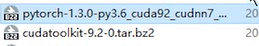

用```conda install --use-local xxx```进行安装。


## Pycharm安装 （略)


## 第一个项目: helloworld

### 新建项目

打开pycharm，New Project - > PurePython

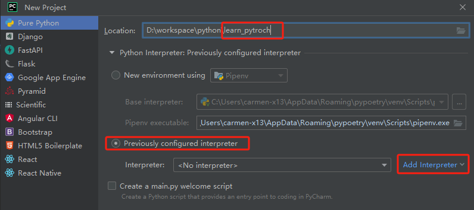

如果在Previously configured interpreter  -->  Interpreter的下拉框中是否存在

"C:\Users\[user]\anaconda3\envs\pytorch"

如果存在，选择该环境，点”创建“即可。如果不存在，则按如下方式创建pytorch环境


### pycharm中pytorch环境创建

点上图中Previously configured interpreter  -->  Interpreterd右则的 “Add Interpreter"按钮，进入创建一个环境。

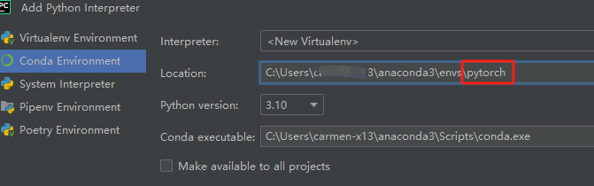

选Conda Environment，并在右则的Location输入pytorch，点”OK“按钮完成环境创建


### 导入pytorch包

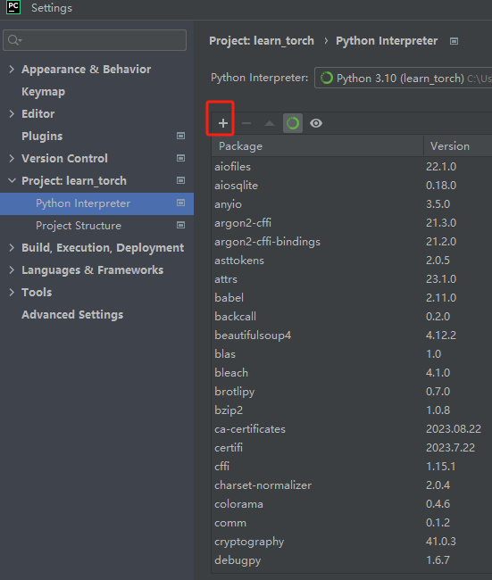

如果上图中不存在pytorch，点”+“号添加pytorch

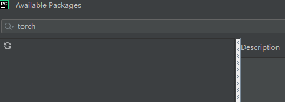

以下是添加好的Python Interpreter的界面

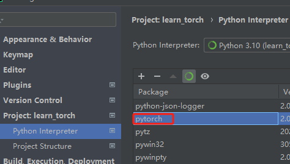


### 验证配置情况


进入PythonConsole，输入

```
>> import torch    # 如果该步骤没有报错(或不输出任何信息)说明安装成功
>> import torchvision
>> torch.cuda.is_available()  # 如果返回True意味着torch是否可使用GPU，输出为False - 集成显卡 - ComputerPlatform选CPU时也是。
   Flase  
```

虚拟环境激活情况

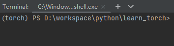

> 上图是激活的状态，如果没有激活或没有进入torch，则需要Anconda Powershell Promots下运行```conda activate torch```激活


### 创建fist_demo.py文件

```
print("Start")
a = 'hello world'
b = 2019
c = a + str(b)
print(c)
```

### 为fist_demo.py配置编译环境

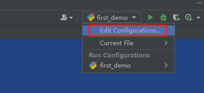

点"Edit Configrations"进入的对话框

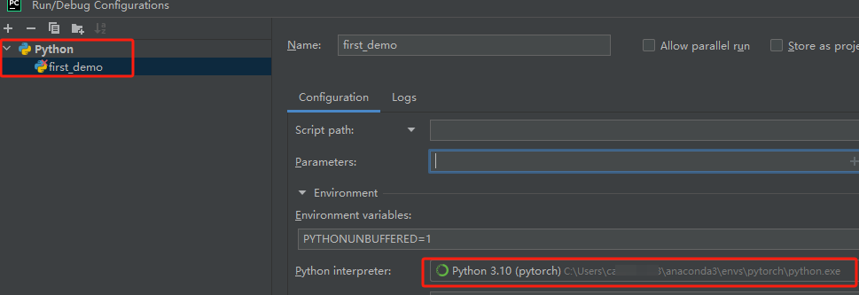


下拉框 中的文件指向first_demo，点 绿色三角按钮，运行。

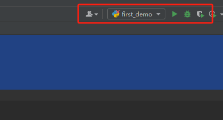

输出如下为正常

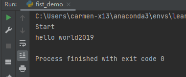


## Jupyter

### 在pytorch环境中安装jupyter

>  Anaconda安装时将jupyter安装在bash环境下，但在刚刚创建的pytorch并没有安装，现的手工安装如下

在Anaconda Powershell Prompt

```shell
conda activate pytorch            #进入pytorch环境
conda list | findstr ipykernel    #查看当前环境是否安装
conda install nb_conda            #安装jupyter的时间，可以让jupyter实现环境切换
#conda install jupyter notebook    #没有则安装
# conda install jupyter notebooklab #桌面的界面工具
```

### 启动jupyter

```
jupyter notebook
# 默认端口：8888
```

控制台出现如下界面

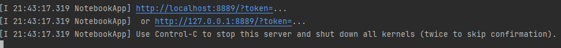

在浏览器地址上输入http://localhost:8889/tree?token=123456（会自动打开），打开如下界面：

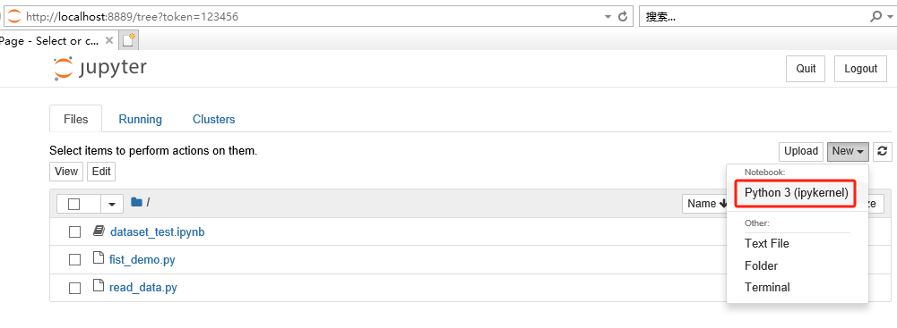

打开.ipynb或点右侧的"new --> Pyton3(ipykernel)"进入控制台，同样可以输入如下指令验证torch在jupyter中的加载情况。

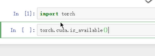

输入指令后按shift+回加，直接运行或点”运行"按钮。


### 查看pytorch包

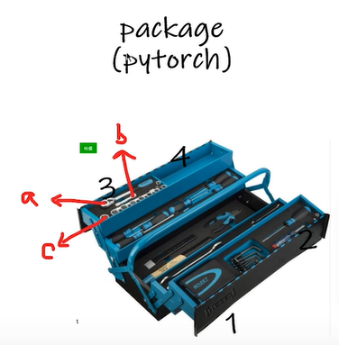


#### 打开jupyter

```
jupyter notebook
```


#### 用help与dir 查看torch的内容

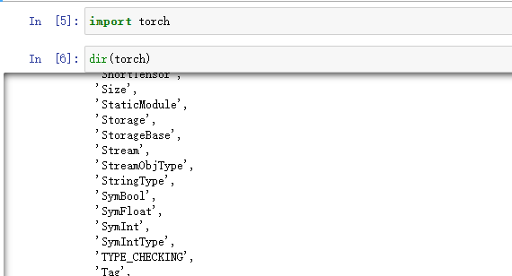

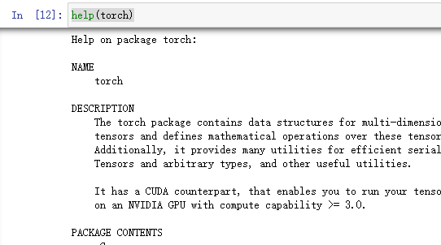

#### 查看torch.cuda

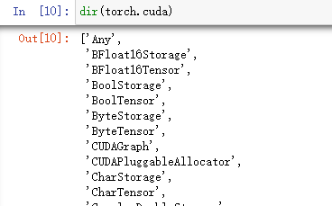

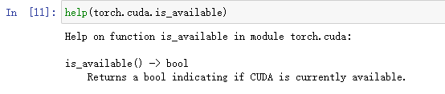


## Pycharm  vs  Python Console  vs  Jupyter


| ---  | Pycharm                      | Python Console                            | Jupyter                     |
| ---- | ---------------------------- | ----------------------------------------- | --------------------------- |
|      | python文件的块是所有行代码   | 每任意行为块（shift+回车 来换行），运行。 | 以任意行为块的方式运行。    |
| 优   | 通用，传播方便，适用于大项目 | 显示变量属性。                            | 利于代码的阅读与修改。      |
| 缺   | 需要从头运行                 | 不利于代码阅读与修改                      | 需要专门为jupyter做环境配置 |


# 附录


## 查询pytorch安装

```shell
where Python
python
>> import torch
>> torch.__version__ #查看版本
>> otrch.__path__    #查看路径
```


## CUD是什么

 CUDA(Compute Unified Device Architecture)，是显卡厂商NVIDIA推出的运算平台。 CUDA是一种由NVIDIA推出的通用并行计算架构，该架构使GPU能够解决复杂的计算问题。

整个CUDA涉及到三个方面的内容：硬件显卡（算力）、显卡驱动（cuda driver version）、cuda runtime version（上图中要选择的内容）。一定要让它们三个之间互相匹配，pytorch的GPU版本才能够运用显卡。

CUDA官网：[链接](https://developer.nvidia.com/zh-cn/cuda-toolkit)。


google搜索cuda，点进Wikipedia后往下翻可以看到一张表格，找到上面显卡型号对应的算力（[这个网站](https://link.zhihu.com/?target=https%3A//www.xincanshu.com/)里面输入显卡型号也可以查询）(6.1)


## python虚拟环境

### Conda、Miniconda、Anaconda

Conda是一个包和环境管理的工具。支持[Windows](https://so.csdn.net/so/search?q=Windows&spm=1001.2101.3001.7020)、macOS和Linux。Conda可以快速的安装、运行和更新包和相关的依赖。Conda也可以轻易地创建、保存、加载和转换环境。

Anaconda 是一个用于科学计算的 Python 发行版，支持 [Linux](https://so.csdn.net/so/search?q=Linux&spm=1001.2101.3001.7020), Mac, Windows, 包含了conda、conda-build、Python和众多科学计算的包及其依赖。

Miniconda 是一个 Anaconda 的轻量级替代，默认只包含了 conda，Python 和一些它们所以依赖的包。


### 常用的python虚拟环境管理工具

1. Virtualenv
2. Conda
3. pipenv
4. venv


通过使用这些工具，我们可以很容易的创建虚拟环境。

安装: 安装anaconda时自动安装conda

使用：通过 Anconda Prompt(conda) 使用conda


### conda 常用命令


升级

 ```conda update -n base-c defaults conda```

配置代理

```
conda config --add channels https://mirrors.tuna.tsinghua.edu.cn/anaconda/pkgs/free/
conda config --add channels https://mirrors.tuna.tsinghua.edu.cn/anaconda/pkgs/main/
conda config --set show_channel_urls yes
conda config --add channels https://mirrors.tuna.tsinghua.edu.cn/anaconda/cloud/pytorch/
```


## stable diffusion安装

由于很多商务本没有独立显卡，只有Intel的集成显卡，在配置安装stable diffusion 时候需要特殊对待，参考不少帖子，各取部分现稍加整合。


- 第一步是先配置环境，主要是安装Anaconda + Pytorch

Win10+非英伟达显卡+Anaconda+Pytorch安装

https://blog.csdn.net/zcsdn1996/article/details/112476263


- 第二步是安装 stable diffusion

访问链接:  https://zhuanlan.zhihu.com/p/578233719， 参考stable diffusion的安装过程

- 最后在执行 

  ```
  webui-user.bat 
  ```


时一直失败，报错是 RuntimeError: Couldn't install gfpgan，于是又是各种搜索，目前参照 https://www.bilibili.com/read/cv19991459/ 这个帖子的第一个办法改动，在每个前面添加 https://ghproxy.com/ , 安装成功了。


生成图片的时候，竟然又报错了 RuntimeError: "LayerNormKernelImpl" not implemented for 'Half'，解决办法是这个帖子 https://www.bilibili.com/read/cv19132184?from=articleDetail 里面提的如下改动：

编辑stable-diffusion-webui目录下的./repositories/stable-diffusion/ldm/models/diffusion/ddim.py

将第21、22行的cuda改成cpu

修改后重新启动根目录的 webui-user.bat 文件，浏览器运行 http://127.0.0.1:7860/ ，成功绘图！


