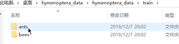
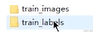
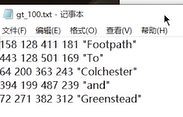
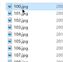
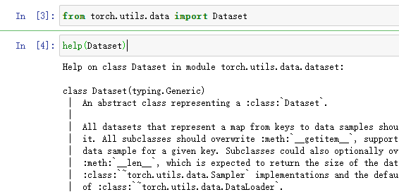
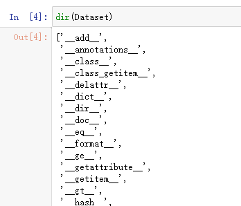
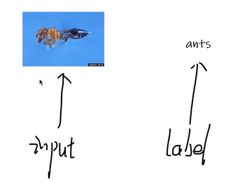

https://www.bilibili.com/video/BV1hE411t7RN/?p=6&spm_id_from=pageDriver&vd_source=a3e33b16e38dc56e09800cef21a19c4b

# 加载数据入门


---
theme: cyanosis
---

# 数据加载过程 


- 原始数据(无规则，也可以称之为垃圾）

- Dataset  

  提供数据获取的一种方式及其Label 

  - 如何获取每一个数据及其Label
  - 告诉我们总共有多少数据

- Dataloader 


  - 为后面的网络提供不同数据集

    

## Dataset

### 数据组织的方式

#### 数据组织的方式一

> 文件夹名即为标签名



#### 数据组织的方式二

> 按训练需要的图片，与训练需要的标签分类存储




标签文件格式



####  数据组织的方式三

> label名即为图片名




## Dataset使用

打开Anaconda Powershell Prompts窗口，并激活pytorch

```
conda activate pytorch
```


### 用jupyter查看dataset的帮助

启动

```
jupyter node
```

New -> Python3(ipykernel) 打开一下窗品


分别输入

```
from torch.utils.data import Dataset
# shift + 回车 或按 运行按钮
```

再输入

```
help(Dataset)
# shift + 回车 或按 运行按钮
```

再输入

```
dir(Dataset)
```






### 在pycharm中创建read_data.py

#### 数据结构



#### 代码

```
from torch.utils.data import Dataset

from PIL import Image

class MyData(Dataset):
    def __init__(self):
        pass

    def __getitem__(self, item):
        """
        item=idx
        """
        pass


```

> PIL: 图像处理
>
> opencv: 图像处理


【参考】  

https://www.bilibili.com/video/BV1hE411t7RN/?p=6&spm_id_from=pageDriver&vd_source=a3e33b16e38dc56e09800cef21a19c4b