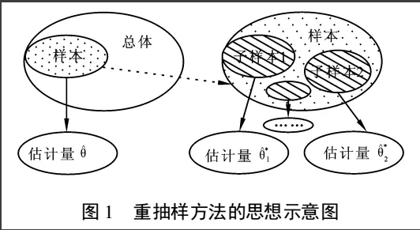
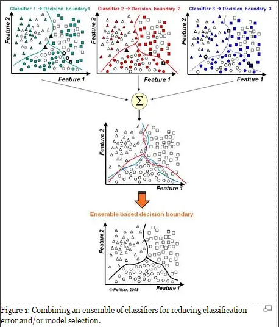
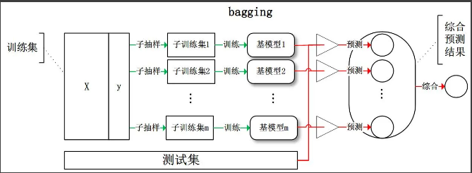
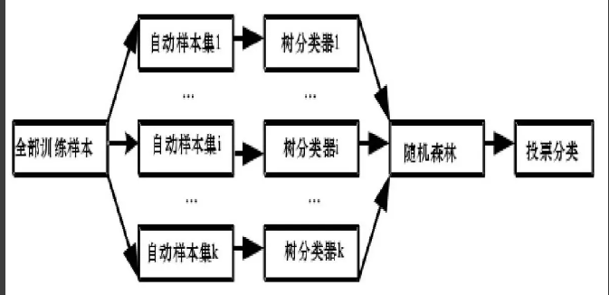
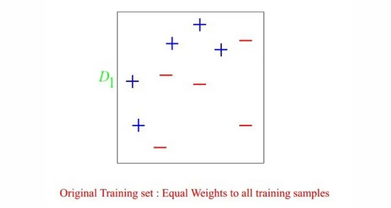
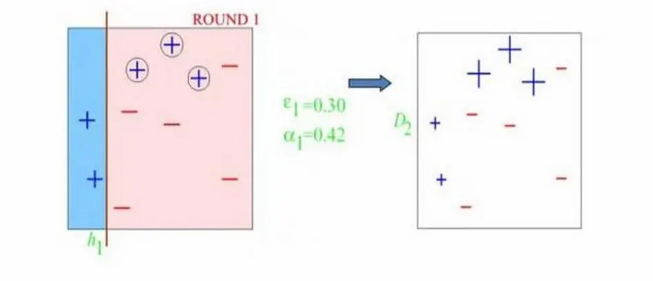
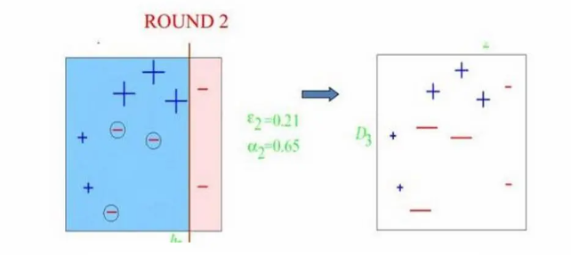
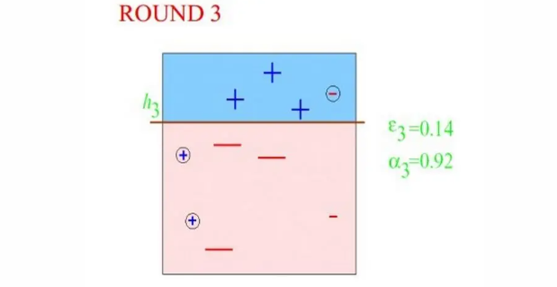
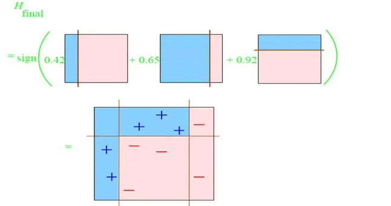

> Bootstrap(自助法)，Bagging，Boosting(提升) 

# bootstrap

Bootstrap方法是非常有用的一种统计学上的估计方法，是斯坦福统计系的教授Bradley Efron在总结、归纳前人研究成果的基础上提出一种新的非参数统计方法。Bootstrap是一类非参数Monte Carlo方法,其实质是对观测信息进行再抽样，进而对总体的分布特性进行统计推断。


**bootstrap：**是一种统计方法，也是一种思想，简单说就是在所有样本集中进行有放回地抽样，抽取n个样本。如果不清楚样本的分布，bootstrap是一种合适的方法。




***子样本之于样本，可以类比样本之于总体\***

## 例子

我要统计鱼塘里面的鱼的条数，怎么统计呢？假设鱼塘总共有鱼1000条，我是开了上帝视角的，但是你是不知道里面有多少。

**步骤 **

1. 承包鱼塘，不让别人捞鱼(规定总体分布不变)。
2. 自己捞鱼，捞100条，都打上标签(构造样本)
3. 把鱼放回鱼塘，休息一晚(使之混入整个鱼群，确保之后抽样随机)
4. 开始捞鱼，每次捞100条，数一下，自己昨天标记的鱼有多少条，占比多少(一次重采样取分布)。
5. 重复3，4步骤n次。建立分布。


**解题思路**   

假设一下，第一次重新捕鱼100条，发现里面有标记的鱼12条，记下为12%，放回去，再捕鱼100条，发现标记的为9条，记下9%，重复重复好多次之后，**假设取置信区间95%，你会发现，每次捕鱼平均在10条左右有标记，所以，我们可以大致推测出鱼塘有1000条左右**。

>  其实是一个很简单的类似于一个比例问题。这也是因为**提出者Efron给统计学顶级期刊投稿的时候被拒绝的理由**--**"太简单"**。这也就解释了，为什么**在小样本的时候，bootstrap效果较好**，你这样想，如果我想统计大海里有多少鱼，你标记100000条也没用啊，因为实际数量太过庞大，你取的样本相比于太过渺小，最实际的就是，你下次再捕100000的时候，发现一条都没有标记，，，这特么就尴尬了。。。


## Bootstrap经典语录

- Bootstrap是现代统计学较为流行的一种统计方法，在小样本时效果很好。通过方差的估计可以构造置信区间等，其运用范围得到进一步延伸。
- 就是一个在自身样本重采样的方法来估计真实分布的问题
- 当我们不知道样本分布的时候，bootstrap方法最有用。
- 整合多个弱分类器，成为一个强大的分类器。这时候，集合分类器(Boosting, Bagging等)出现了。


# 什么是集成学习（ensemble learning）

> 了解boosting和bagging之前，先了解一下什么是集成学习，一句话，三个臭皮匠顶个诸葛亮，一箭易折十箭难折，千里之堤溃于蚁穴...。在分类的表现上就是，多个弱分类器组合变成强分类器。



> 假设各弱分类器间具有一定差异性（如不同的算法，或相同算法不同参数配置），这**会导致生成的分类决策边界不**同，也就是说它们在决策时会犯不同的错误。将它们结合后能得到更合理的边界，减少整体错误，实现更好的分类效果。


# Bagging(bootstrap aggregation)

> 首先：bagging和boosting都是集成学习（ensemble learning）领域的基本算法。


**bagging**：从训练集从进行子抽样组成每个基模型所需要的子训练集，对所有基模型预测的结果进行综合产生最终的预测结果,***至于为什么叫bootstrap aggregation，因为它抽取训练样本的时候采用的就是bootstrap的方法！\***


***Bagging策略过程\***



- 从样本集中用Bootstrap采样选出n个训练样本(放回，因为别的分类器抽训练样本的时候也要用)
- 在所有属性上，用这n个样本训练分类器（CART or SVM or ...）
- 重复以上两步m次，就可以得到m个分类器（CART or SVM or ...）
- 将数据放在这m个分类器上跑，最后投票机制(多数服从少数)看到底分到哪一类(分类问题)


## 代表算法-RF(随机森林)

***RF:Random Forest\***

***其中的Random就是指\***

1.*训练样本选择方面的Random：*

```
Bootstrap方法随机选择子样本
```

2.*特征选择方面的Random：*

```
属性集中随机选择k个属性，每个树节点分裂时，从这随机的k个属性，选择最优的(如何选择最优又有各种最大增益的方法，不在本文讨论范围内)。
```

***RF构造流程\***



> 1.用Random(训练样本用Bootstrap方法，选择分离叶子节点用上面的2)的方式构造一棵决策树(CART)
>  2.用1的方法构造很多决策树,每棵决策树都最大可能地进行生长而不进行剪枝，许多决策树构成一片森林，决策树之间没有联系
>  3.测试数据进入每一棵决策树，每棵树做出自己的判断，然后进行投票选出最终所属类别(默认每棵树权重一致)


**RF优点**

```shell
1.不容易出现过拟合，因为选择训练样本的时候就不是全部样本。
2.可以既可以处理属性为离散值的量，比如ID3算法来构造树，也可以处理属性为连续值的量，比如C4.5算法来构造树。
3.对于高维数据集的处理能力令人兴奋，它可以处理成千上万的输入变量，并确定最重要的变量，因此被认为是一个不错的降维方法。此外，该模型能够输出变量的重要性程度，这是一个非常便利的功能。
4.分类不平衡的情况时，随机森林能够提供平衡数据集误差的有效方法
```

**RF缺点**

```shell
1.随机森林在解决回归问题时并没有像它在分类中表现的那么好，这是因为它并不能给出一个连续型的输出。当进行回归时，随机森林不能够作出超越训练集数据范围的预测，这可能导致在对某些还有特定噪声的数据进行建模时出现过度拟合。
2.对于许多统计建模者来说，随机森林给人的感觉像是一个黑盒子——你几乎无法控制模型内部的运行，只能在不同的参数和随机种子之间进行尝试。
```


# **boosting**

Boosting是一种框架算法，用来提高弱分类器准确度的方法，这种方法通过构造一个预测函数序列，然后以一定的方式将他们组合成为一个准确度较高的预测函数，还有就是，Boosting算法更加关注错分的样本，这点和Active Learning的寻找最有价值的训练样本有点遥相呼应的感觉


## 算法代表--Adaboost(Adaptive Boosting)

一种迭代算法，针对同一个训练集训练不同的分类器(弱分类器)，然后进行分类，对于分类正确的样本权值低，分类错误的样本权值高（通常是边界附近的样本），最后的分类器是很多弱分类器的线性叠加（加权组合），分类器相当简单。实际上就是一个简单的弱分类算法提升(boost)的过程。


**结合图形来过一遍Adaboost算法**




算法开始前，需要将每个**样本的权重**初始化为1/m,这样一开始每个样本都是等概率的分布，每个分类器都会公正对待。




Round1，因为样本权重都一样，所以分类器开始划分，根据自己分类器的情况，只和分类器有关。划分之后发现分错了三个"+"号，那么***这些分错的样本，在给下一个分类器的时候权重就得到提高,也就是会影响到下次取训练样本的分布\***，就是提醒下一个分类器，“诶！你注意点这几个小子，我上次栽在他们手里了！”




Round2,第二代分类器信誓旦旦的对上一代分类器说"我知道了，大哥！我一定睁大眼睛好好分着三个玩意！"ok，这次三个上次分错的都被分出来了，但是并不是全部正确，这次又栽倒在左下角三个"-"上了，然后临死前，第二代分类器对下一代分类器说"这次我和上一代分类器已经把他们摸得差不多了，你再稍微注意下左下角那三个小子，也别忘了上面那三个(一代错分的那三个"+")！"




Round3:有了上面两位大哥的提醒，第三代分类器表示，我差不多都知道上次大哥们都错哪了，我只要小心这几个，应该没什么问题！只要把他们弄错的我给整对了，然后把我们收集的信息一对，这不就行了么！ok，第三代分类器不负众望，成功分对上面两代分类器重点关注的对象，至于分错的那几个小的，以前大哥们都分对了，我们坐下来核对一下就行了！





最后，三个分类器坐下来，各自谈了谈心得，分配了下权重，然后一个诸葛亮就诞生啦！是不是道理很简单！至于权重如何计算，不在本文讨论范围内。


**Adaboost优点\****

1. 可以使用各种方法构造子分类器，Adaboost算法提供的是框架
2. 简单，不用做特征筛选
3. 相比较于RF，更不用担心过拟合问题


**Adaboost缺点**

1. 从wiki上介绍的来看，adaboost对于噪音数据和异常数据是十分敏感的。Boosting方法本身对噪声点异常点很敏感，因此在每次迭代时候会给噪声点较大的权重，这不是我们系统所期望的。
2. 运行速度慢，凡是涉及迭代的基本上都无法采用并行计算，Adaboost是一种"串行"算法.所以GBDT(Gradient Boosting Decision Tree)也非常慢。


# 总结

1. Bagging： 树"并行"生成 ,如RF;Boosting：树"串行"生成,如Adaboost

2. boosting中的基模型为弱模型，而RF中的基树是强模型(大多数情况)

3. boosting重采样的不是样本，而是样本的分布，每次迭代之后，样本的分布会发生变化，也就是被分错的样本会更多的出现在下一次训练集中

4. 明确一点，我们迭代也好(Adaboost),并行(RF)也好，只和训练集有关，和测试集真的一毛钱关系都没有好么！我们先把原始数据分类测试集和训练集，然后测试集放一边，训练集里面再挑子集作为迭代算法用的训练集！这个和K-fold思想很像。

